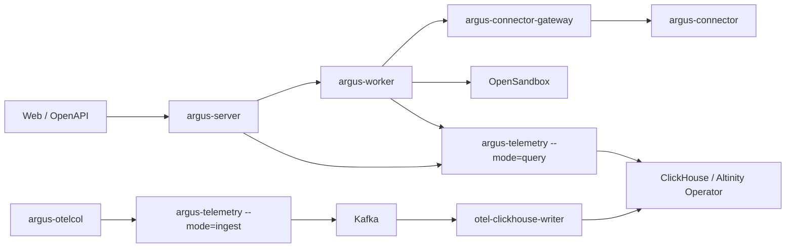
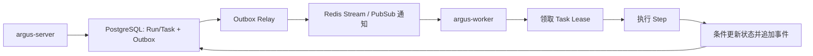

# 产品定位与总体架构

## 1. 产品定位

Argus 的目标是构建一个 AI 原生的 AIOps SaaS 控制平面，而不是在传统运维后台上增加一个聊天入口。

用户进入系统后，默认看到类似 Chatbox 的界面：

- 左侧为会话历史。
- 右侧为当前会话记录和输入区。
- 左侧底部提供“管理”入口。
- 管理入口进入传统菜单式管理界面，用于确定性地管理 Connector、主机、Kubernetes、监控接入、权限、卡片和审计数据。

Chatbox 支持自然语言、附件、`@Connector` 引用和 `/Card Skill` 引用。用户可以在会话中完成查询、配置、诊断和受控变更，但实际能力全部通过工具和领域服务完成。

Argus 同时存在两个隔离的管理域：

- 平台超级管理员门户：企业、企业管理员和平台 OpenSandbox 基座。
- 企业门户：Chatbox、企业模型、Agent、权限、Connector、主机、Kubernetes、OpenTelemetry 监控、Card Skill 和审计。

平台超级管理员不进入企业业务门户，也不默认拥有企业资源读取权限。

## 2. 产品目标

- 为租户提供完整的身份、RBAC 和数据权限体系。
- 通过统一 Connector 连接 Windows、Linux、macOS、内网主机和 Kubernetes API Server。
- 同时提供 Chatbox 与传统管理界面，且两者能力一致。
- 允许 Model Agent 使用 MCP Tool 完成多步骤 AIOps 工作流。
- 通过 OpenSandbox 安全处理附件、脚本、代码生成和临时计算。
- 允许 AI 选择或动态生成 Card Skill，以丰富 UI 展示工具数据。
- 对所有查询、变更、审批和执行建立完整审计链路。
- 通过 Direct/Leaf/Edge Gateway Collector 模式接入主机和 Kubernetes 遥测，并统一写入 Kafka/ClickHouse。

## 3. 非目标与边界

第一版不以“AI 可以任意操作生产环境”为目标，也不让通用 Sandbox 直接持有生产凭证。

以下能力必须位于确定性服务端边界内：

- 租户隔离和授权判断。
- Secret 的读取与使用。
- Pending Action 的创建、确认、取消和过期。
- Connector 命令下发。
- Tool 参数校验、幂等、重试和审计。
- Card Skill 安全校验与运行时能力控制。

AI 负责决策和编排，但不能成为权限边界或状态唯一保存位置。

## 4. 服务组件架构

第一版不按 IAM、MCP、Card、资源管理等领域模块拆微服务，只维护四个 Argus 服务端程序。同一个程序可以根据部署参数以不同角色运行，但代码和发布物仍保持收敛。



### 4.1 自研服务

| 服务 | 主要职责 | 不负责 |
| --- | --- | --- |
| `argus-server` | Web/API、IAM、企业、RBAC、模型配置、资源、MCP Registry、Card Skill、Pending Action、Telemetry Control | 长时间 Agent 执行、Connector 长连接、OTLP 数据接收 |
| `argus-worker` | Agent Harness、模型调用、异步 Tool/Run、安装配置任务、OpenSandbox 会话编排 | 对外 Web API、Connector 连接终止、遥测查询 API |
| `argus-connector-gateway` | Connector mTLS 长连接、命令流、心跳、Artifact Tunnel | 业务权限决策、AI 编排、遥测数据接收 |
| `argus-telemetry` | `ingest` 模式接收 OTLP 并写 Kafka；`query` 模式查询 Metrics/Logs/Traces | Connector 控制、资源变更、Agent 执行 |

`otel-clickhouse-writer` 使用标准 OpenTelemetry Collector 发行物，配置 Kafka Receiver 和 ClickHouse Exporter，不作为 Argus 自研服务。企业侧只部署 `argus-connector` 和 `argus-otelcol`。

### 4.2 运行角色

```text
argus-server
argus-worker
argus-connector-gateway
argus-telemetry --mode=ingest
argus-telemetry --mode=query
otel-clickhouse-writer
```

`argus-telemetry` 复用代码与镜像但使用不同 Deployment、ServiceAccount、网络策略和数据库权限。不能为了减少 Pod 而把 ingest 与 query 运行在同一进程中。

Web 静态资源第一版可以嵌入 `argus-server` 或由同一 Release 中的静态服务器托管，不因此增加一个业务后端服务。

### 4.3 状态与任务分发

所有可恢复业务状态保存在 PostgreSQL。`argus-server` 在同一数据库事务中创建 Run/Task 和 Outbox Event，`argus-worker` 通过持久化 Lease 领取任务；Redis Stream/PubSub 只用于降低扫描延迟，通知丢失时 Worker 仍可从 PostgreSQL 恢复任务。



Redis 不参与 PostgreSQL 的原子提交，也不保存唯一 Run 状态。跨进程并发通过数据库条件更新、Fence Token 和幂等键保证，不能依赖普通分布式锁作为唯一正确性边界。

## 5. 核心平面

### 5.1 交互平面

由 Chatbox、管理后台和 Card Host 组成。

- Chatbox 负责意图表达、会话、工具执行过程和丰富结果展示。
- 管理后台负责资源配置、权限配置、批量管理和审计查询。
- Card Host 负责渲染 Card Skill，并将用户交互转化为受控事件。

### 5.2 控制与 Agent 编排平面

控制入口位于 `argus-server`，异步编排位于 `argus-worker`，Connector 通道位于 `argus-connector-gateway`。

- Model Agent 理解需求、选择 MCP Tool、收集参数并生成执行计划。
- Presentation Agent 根据用户需求、Tool Result 和 Card Skill 目录生成 Render Plan。
- Run 保存多步骤任务状态，支持暂停等待用户输入、恢复、失败重试和取消。

Presentation Agent 可以由独立子 Agent 承担，但其输出必须是可校验的声明式计划，不能直接拥有越权能力。

### 5.3 工具与领域模块

MCP Tool 是 AI 可发现的能力接口，领域服务是业务逻辑的唯一实现。领域模块首先作为 `argus-server`/`argus-worker` 内部模块存在，不等同于独立部署服务。

```text
Chatbox / Admin / OpenAPI / Automation
                 ↓
             领域服务
                 ↓
     数据库 / Connector / 第三方系统
```

MCP Tool 不应直接形成一套与管理后台不同的数据库逻辑。

### 5.4 连接平面

Connector 主动向服务端建立长连接，服务端通过 Connector 访问目标网络。它既可以管理本机，也可以作为进入内网的跳板连接其他主机和 Kubernetes。

### 5.5 遥测推送与查询平面

控制、推送和查询链路严格分开：

```mermaid
flowchart TB
    subgraph Control["控制链路"]
        C1["Web"] --> C2["argus-server"] --> C3["argus-worker"] --> C4["argus-connector-gateway"] --> C5["argus-connector"]
    end

    subgraph Push["遥测推送链路"]
        P1["argus-otelcol"] --> P2["argus-telemetry ingest"] --> P3["Kafka"] --> P4["otel-clickhouse-writer"] --> P5["ClickHouse"]
    end

    subgraph Query["遥测查询链路"]
        Q1["Web / AI"] --> Q2["argus-server / argus-worker"] --> Q3["argus-telemetry query"] --> Q4["ClickHouse"]
    end
```



- 控制链路故障不应阻止 Collector 继续推送数据。
- 遥测写入积压不应占用 Connector 命令通道。
- Query Service 使用只读 ClickHouse 账号并强制注入企业条件。
- Ingest Service 不向用户提供查询接口，也不持有控制面 Secret。

### 5.6 安全与治理平面

授权、Secret、审计、策略、审批、风险等级和卡片沙箱是横切能力，必须覆盖管理后台、MCP Tool、Card Action 和后台任务。

## 6. OpenSandbox 定位

OpenSandbox 用于：

- 解析用户附件。
- 生成和试运行脚本。
- 数据分析与临时计算。
- 生成代码和 Card Skill。
- 对不可信输入进行隔离处理。

基础设施执行链路应为：

```text
Sandbox 生成计划或脚本
→ 用户确认（需要时）
→ 受控 MCP Tool
→ Connector
→ 目标环境
```

不建议让通用 Sandbox 直接读取生产凭证并访问生产环境。

## 7. 关键领域对象

- Enterprise、User、Membership、Group、Role、Permission、Policy。
- Connector、Host、KubernetesCluster、Credential、SecretRef。
- TelemetryGroup、CollectorInstance、CollectorConfigRevision、TelemetryCredential、IngestionPolicy。
- Conversation、Message、Run、ToolCall、ToolResult。
- RunStep、TaskLease、OutboxEvent、ConnectorCommand。
- PendingAction、UserConfirmation、ApprovalRequest、Execution、ActionBinding、AuditEvent。
- CardSkill、CardVersion、CardInstance、RenderPlan。

后续数据库和接口设计应围绕这些对象明确生命周期、租户归属和审计字段。

第一版中 Enterprise 是唯一业务隔离边界，旧文档或外部协议中的 Tenant 必须在入口适配为 `enterprise_id`，内部领域对象不得同时维护两套隔离 ID。

## 8. Kubernetes 部署边界

Argus 提供一键 Kubernetes 部署，但“一键”由安装器编排多个有序阶段，而不是一个不可恢复的超大 Helm Release。默认完整部署包括：

- 四个 Argus 自研服务及前端。
- PostgreSQL、Redis 和 S3 兼容 Artifact Store。
- OpenSandbox 服务及其 Kubernetes Runtime。
- Kafka。
- Altinity ClickHouse Operator、ClickHouseInstallation 和 Keeper。
- `otel-clickhouse-writer`、Ingress/Gateway、Migration 和初始化 Job。

详细安装拓扑、Helm Values、升级与备份策略见[服务组件与 Kubernetes 一键部署](./10-service-components-and-kubernetes-deployment.md)。
