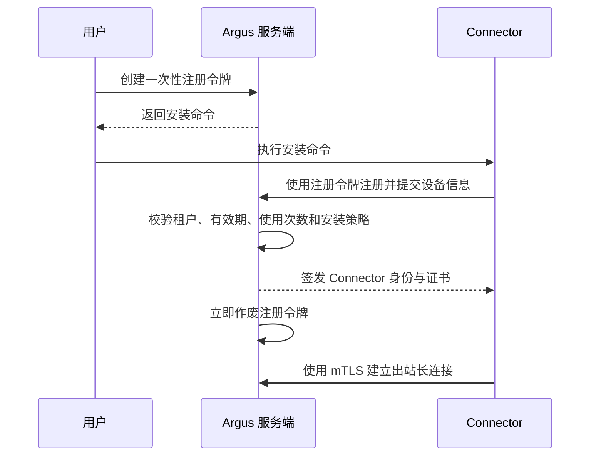
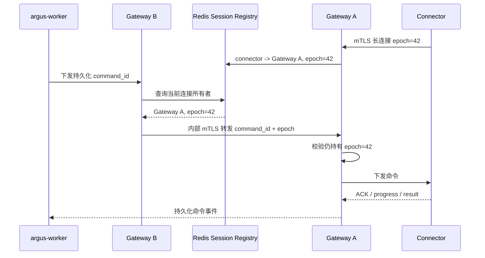
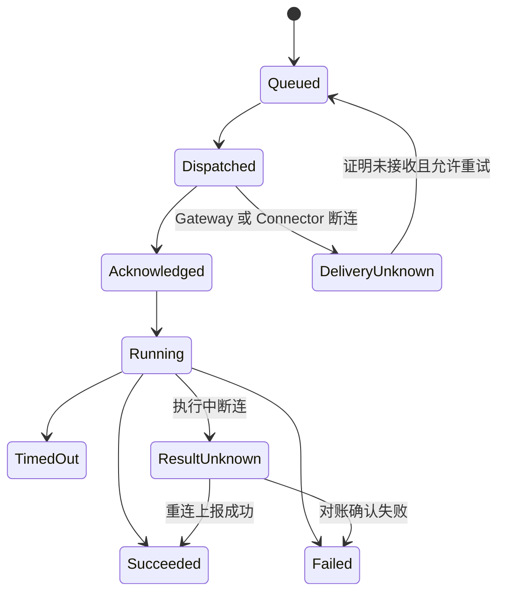

# Connector、主机与 Kubernetes 资源管理

## 1. Connector 定位

“代理”在 Argus 中统一定义为 Connector：部署在目标机器或目标网络中的连接节点。它与 Model Agent 是不同概念。

Connector 支持：

- 管理安装它的本机。
- 通过 SSH 或 WinRM 管理同一网络中的其他主机。
- 转发到私有 Kubernetes API Server。
- 作为多个资源共享的网络入口。
- 后续组成 Connector Pool，实现高可用和调度。

## 2. 安装和注册

用户在管理界面生成一次性安装命令，并在 Windows、Linux 或 macOS 执行。



安装命令中不能包含永久访问令牌。一次性注册令牌应绑定：

- enterprise_id。
- 创建用户。
- Connector 名称或安装策略。
- 允许注册次数。
- 有效期。
- 可选网络或标签限制。

注册完成后使用独立设备身份和可轮换证书。

Connector 必须在本地生成私钥和 CSR，私钥不得出现在安装命令或服务端。服务端签发的证书绑定 enterprise_id、connector_id、设备公钥、证书序列号和允许能力；证书轮换采用新旧短窗口重叠，并支持按设备吊销。

## 3. 连接通道

Connector 主动连接服务端，以便穿越 NAT 和防火墙：

```text
Connector
→ TLS/mTLS
→ Connector Gateway
→ Session Registry
→ Command Dispatcher
```

建议分离：

- Control Channel：心跳、能力协商、命令控制和状态。
- Data Channel：命令输出、文件、日志流和端口转发。

命令必须带 enterprise_id、目标资源、Run、过期时间和幂等标识。Connector 只能执行服务端签名或经认证连接下发且满足本地策略的命令。

每次长连接建立时 Gateway 分配单调递增的 `connection_epoch`，Session Registry 保存：

```text
connector_id
enterprise_id
gateway_instance_id
connection_epoch
capabilities
connected_at / last_heartbeat_at
draining
```

PostgreSQL 保存最后已知连接和命令事实，Redis 保存带 TTL 的在线 Session Registry 和 Gateway 路由加速。Redis 丢失后 Connector 心跳会重建 Registry；命令不会因为 Registry 丢失而丢失。

### 3.1 Gateway 多副本路由



内部转发必须使用服务身份认证并校验 enterprise_id 和 connection_epoch。旧 Gateway 或旧连接不能给新连接下发命令。Gateway 进入滚动升级时先标记 draining，停止接受新连接，等待现有命令结束并通知 Connector 主动重连；长连接不能依赖 Kubernetes Service 的会话粘滞保证正确路由。

### 3.2 Connector Command 状态机



Command 保存 command_id、execution_id、enterprise_id、connector_id、connection_epoch、目标资源、计划哈希、幂等键、有效期、当前 Fence Token 和结果摘要。`DeliveryUnknown`/`ResultUnknown` 不能直接作为普通失败自动重试；重启、删除、执行命令等操作可能已经产生副作用，必须先向 Connector 本地幂等日志或目标系统对账。

## 4. 主机管理

主机接入方式：

- Connector 管理本机。
- 直接 SSH。
- 直接 WinRM。
- SSH/WinRM + Connector 转发。
- 后续扩展云厂商实例身份或 SSM 类通道。

“直接 SSH/WinRM”表示由部署在可达网络中的受控执行节点连接目标，并不表示 SaaS Worker 可以默认穿透客户内网。第一版推荐统一通过 Connector 执行 SSH/WinRM；仅私有化部署且 Worker 网络明确可达目标时，才允许启用受策略控制的 Direct Executor。两种执行方式复用相同 Tool、授权、Pending Action、Execution 和审计协议。

主机对象与 Credential 分离：

```text
Host
├── address / hostname
├── platform
├── connection_method
├── connector_id（可选）
├── credential_ref（可选）
├── environment / tags / owner
└── connection_status
```

用户名、密码、私钥不保存到 Host 表中，只保存 `credential_ref`。

新增主机时先执行连接测试和预览，再由用户确认写入。聊天中不应鼓励用户把密码作为普通消息发送；应优先生成受控 Secret 表单。如果用户粘贴疑似凭证，Chatbox 必须在发送模型前拦截并切换到 Secret 表单。如果凭证已经发送给外部模型，不能声称能够可靠撤回；系统应阻止继续回显、记录安全事件并建议立即轮换该凭证。

## 5. Kubernetes 管理

支持：

- kubeconfig 直接连接 API Server。
- kubeconfig + Connector 访问私有 API Server。
- 集群内 Connector 使用 ServiceAccount。
- 后续扩展托管集群身份和临时凭证。

KubernetesCluster 保存：

```text
enterprise_id
name
api_server
connector_id（可选）
credential_ref
default_namespace（可选）
environment
tags
connection_status
```

kubeconfig 应作为 Secret 处理。进入模型的内容只保留必要的非敏感摘要，例如 context、cluster name 和 server 地址。

第一版管理能力建议覆盖：

- 集群增删改查和连接测试。
- Namespace、Node、Pod、Deployment、StatefulSet、DaemonSet、Service 查询。
- Pod 日志查询。
- 对变更操作使用两阶段确认。

### 5.1 列表、过滤和详情能力

主机和 Kubernetes 领域服务本身提供过滤、稳定排序、游标翻页和详情查询，Card Skill 只负责展示和收集白名单过滤条件，不能在卡片中模拟跨页数据库过滤。

主机基础 Tool：

```text
host.list(filter, sort, page)
host.get(host_id)
host.test_connection(host_id 或临时连接引用)
```

主机过滤覆盖名称/地址模糊查询、在线状态、平台、连接方式、Connector、环境、团队、标签和 Telemetry 状态。排序字段使用白名单并始终追加唯一 `id` 保证 Cursor 稳定。

Kubernetes 基础 Tool：

```text
kubernetes.cluster.list(filter, sort, page)
kubernetes.cluster.get(cluster_id)
kubernetes.resource.list(cluster_id, resource_type, filter, sort, page)
kubernetes.resource.get(cluster_id, resource_type, namespace, name)
kubernetes.pod.logs(cluster_id, namespace, pod, container, options)
```

资源过滤覆盖 Namespace、名称、Label Selector、允许的 Field Selector、Phase/状态、Node、Owner 和最小重启次数。服务端先求授权 Namespace Scope 与请求过滤的交集，再调用 Kubernetes API；无权限对象和不存在对象对外使用不会泄漏资源存在性的统一错误语义。

所有列表返回 `items`、`next_cursor`、`has_more`、`applied_filter`、稳定排序和部分失败信息。Cursor 由 Argus 签名并绑定 enterprise_id、资源类型、过滤哈希和有效期。详细 Query Slot 和卡片约定见[Card Skill 与交互式 UI](./05-card-skills-and-interactive-ui.md)。

## 6. Secret 使用原则

- 加密存储，应用数据库只保存引用。
- 解密发生在尽量靠近实际使用者的位置。
- MCP Tool 输入使用 `secret_ref`，不使用明文。
- Connector 获取短期使用凭证，而非无限期主密钥。
- 日志、Tool Result、会话和 Card DOM 默认不出现密钥。
- Secret 访问本身产生审计事件。

Credential Broker 根据 Execution、目标资源和有效期签发短期使用包。Connector 只能在内存或受操作系统保护的临时文件中使用，并在命令结束后清理；长期 Secret Vault 主密钥和可导出企业主凭证不得下发。Kubernetes 第一版由 Connector 使用短期 kubeconfig/Token 代执行 API 请求，不向 Worker 或模型返回完整 kubeconfig。

## 7. Collector 安装与 Artifact Tunnel

Connector 还是 OpenTelemetry Collector 的安装和修复通道：

- 探测目标 OS、架构、权限、磁盘和已有版本。
- 执行版本化安装、服务注册和配置校验。
- 在目标无法访问下载源时，通过 Connector Data Channel 传输平台批准的安装包。
- 执行升级、回滚、修复和卸载。

Artifact Tunnel 必须使用平台发布清单中的不可变 Artifact，支持分块、续传、SHA256/签名校验、带宽限制、临时文件清理和进度上报。AI 不能借此传输任意文件到任意路径。

Connector 只负责控制和 Artifact 传输，Collector 自身通过 OTLP 主动推送监控数据。具体设计见 [OpenTelemetry 接入与监控数据链路](./09-opentelemetry-observability.md)。
