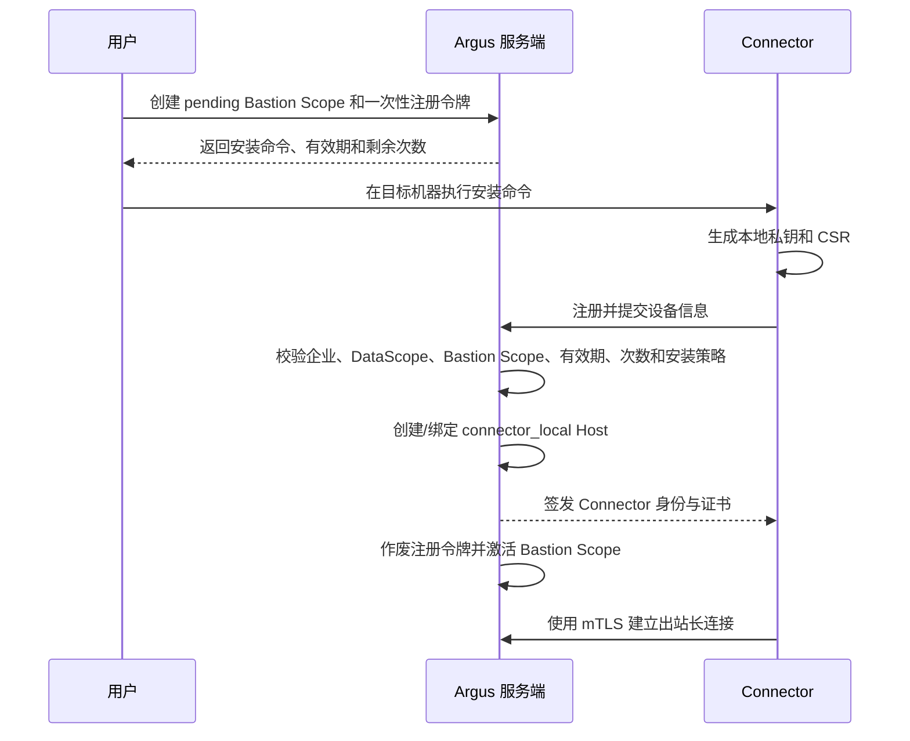
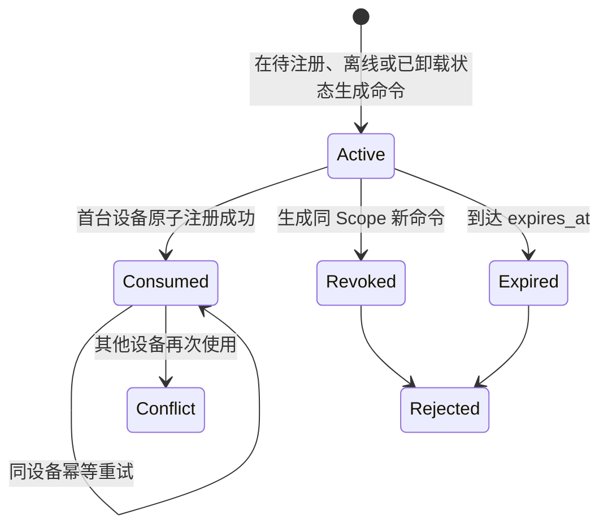
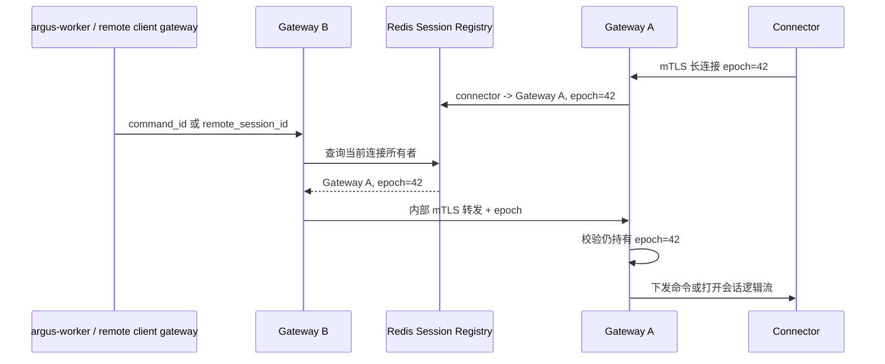
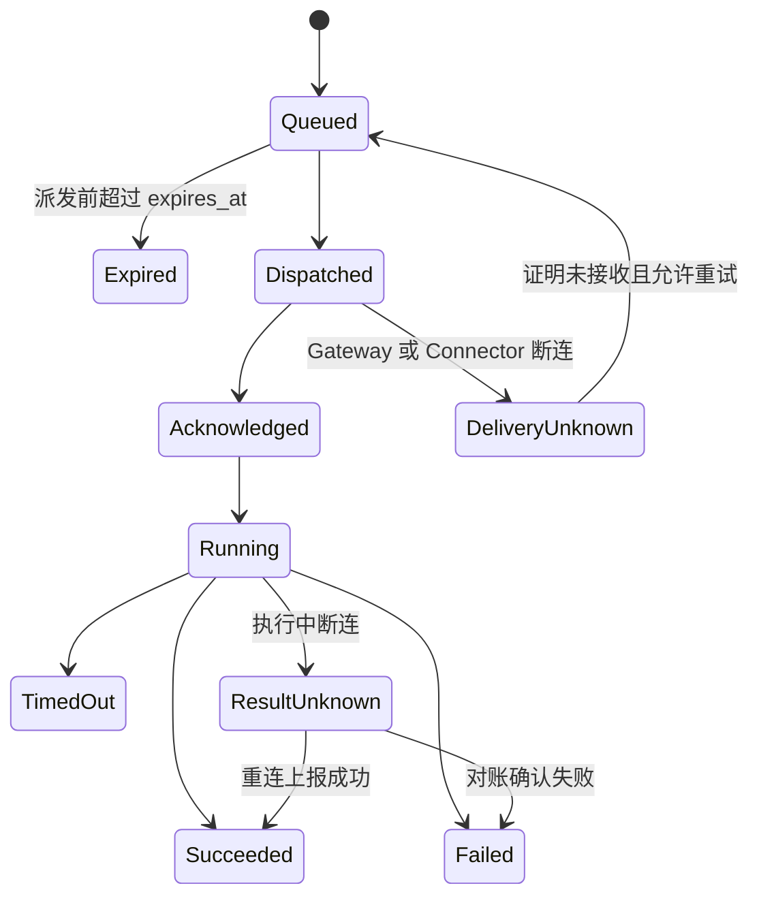

# Connector、堡垒机、主机与 Kubernetes 资源管理

## 1. Connector 定位

“代理”在 Argus 中统一定义为 Connector。Connector 安装在一台主机上，主动向 Argus 建立出站 mTLS 长连接；当用户用一次性安装命令注册 Connector 时，该主机在产品中成为堡垒机，并形成一个可容纳内网成员主机的 Bastion Scope。

Connector 与 Model Agent 不同，也不等同于 OpenTelemetry Collector。Connector 负责：

- 管理安装它的堡垒机本机。
- 通过 SSH 或 WinRM 管理同一 Bastion Scope 中的内网主机。
- 转发到私有 Kubernetes API Server。
- 执行经过授权的命令和安装任务。
- 通过 Artifact Tunnel 传输平台批准的不可变安装包。
- 为人工用户提供 SSH Web Terminal 等远程访问隧道。
- 后续承载 RDP、SFTP、端口转发和 Connector 高可用能力。

Connector 可以使所在主机承担“类似传统堡垒机”的资源访问和审计职责。第一版中文产品文案将这类 Host 统一称为“堡垒机”，英文称为 “Bastion”；只有在进程、证书、心跳和技术诊断信息中显示 Connector，避免把普通 Model Agent、OTLP 收集器或 SaaS Worker 称为代理。

### 1.1 M3 实现边界

M3 已实现 Secret/Credential、Host/Kubernetes、Bastion Scope、Connector 注册/证书/心跳、类型化只读命令、连接测试和资源专用 PendingAction。M3 ConnectorCommand 只允许 Connection Probe、Kubernetes Read、Credential Lease 和 Uninstall；任意 Shell、文件写入、Remote Access Frame、Collector 与 Telemetry 均不属于本阶段。Remote Access 在 M6 实现，Collector/Telemetry 在 M7 实现。

Connector PKI 由 cert-manager 签发。安装器复用同 major/minor 且 patch 不低于版本锁基线的实例，否则安装锁定版本。Server 和 Connector Gateway 都通过独立 ServiceAccount 与最小 CertificateRequest RBAC 使用同一个 namespaced Issuer；Gateway 缺少 Issuer 或权限时必须 fail closed，不能让轮换退化为继续使用旧证书。实例卸载不得删除被其他安装复用的 cert-manager CRD。

堡垒机还可以安装 `argus-otelcol` 并启用 Edge Gateway 模式，从而成为遥测中间机；此时用户看到的是一台同时具备堡垒访问与遥测网关角色的主机，但底层仍是两个独立进程：

```text
堡垒机 Host
├── argus-connector
│   ├── 控制、命令和远程会话隧道
│   └── Collector 安装、修复与配置下发
└── argus-otelcol
    ├── 采集堡垒机本机
    ├── 可选接收成员主机 OTLP
    └── 持久队列并推送 Argus
```

OTLP 数据不得经过 Connector 控制通道或人工远程会话流。

## 2. 核心对象和生命周期

### 2.1 Bastion Scope

Bastion Scope 表示一个稳定的堡垒机管辖范围：

```text
BastionScope
├── enterprise_id
├── name
├── connector_host_id
├── active_connector_id
├── member_host_ids
├── default_telemetry_route
└── status
```

Bastion Scope 与 Connector 实例分开保存。用户归类标签保存在根 Host 和成员 Host，不在 Scope 上再维护一套 `tags`。Connector 可能重装、轮换证书或被替换；这些操作不能改变 Scope ID，也不能让成员主机丢失分组和授权关系。第一版一个 Scope 只有一个活动 Connector，Schema 预留备用 Connector/Connector Pool，但界面不能在调度能力未实现时暗示已经具备自动高可用。

一个通过堡垒机接入的主机第一版只能属于一个 Bastion Scope。资源标签或 DataScope 不能复用为 Bastion Scope；前者表达归类和业务授权范围，后者表达网络接入路径。一个 Bastion Scope 可以为同一企业内不同标签的目标 Host 提供路由，但不会把堡垒机 Host 的 DataScope 传播给成员 Host。

### 2.2 主机连接模式

第一版主机连接模式固定为：

| 模式                        | 创建方式                                   | 执行路径                         | 是否属于 Bastion Scope |
| --------------------------- | ------------------------------------------ | -------------------------------- | ---------------------- |
| `connector_local`           | 执行 Connector 安装命令并完成注册          | Connector 管理本机               | 是，且为根堡垒机       |
| `via_bastion`               | 手工填写内网地址、Credential 并选择堡垒机  | Argus → Connector → SSH/WinRM    | 是，且为成员主机       |
| `direct_ssh`/`direct_winrm` | 手工填写公网地址、Credential，不选择堡垒机 | Argus Direct Executor → 公网目标 | 否                     |

“内网主机”和“公网主机”是接入路径而不是仅根据 IP 字符串自动推导的永久类型。服务端仍必须解析 DNS/IP、校验实际目的地址，并拒绝 Direct Executor 访问私网和平台内部地址。

### 2.3 Remote Access Session

RemoteAccessSession 表示一次人工远程登录：

```text
RemoteAccessSession
├── enterprise_id / user_id / host_id
├── connection_mode / connector_id / bastion_scope_id
├── managed_account_id / credential_ref
├── remote_access_grant_id / access_lease_id
├── protocol / granted_actions / authorization_version
├── reason / approval_ref / policy_snapshot / break_glass_ref
├── ticket_jti / ticket_expires_at
├── started_at / last_activity_at / ended_at
├── recording_ref
└── status
```

状态至少包括：

```text
Requested
→ AwaitingApproval（按策略）
→ Authorized
→ Connecting
→ Active
→ Terminated / Failed / Expired / ConnectionLost
```

Remote Access Session 是人工作业通道，不是 MCP Tool Commit。AI、交互卡片、Automation 和 OpenSandbox 不得创建或消费交互式会话票据，也不能通过浏览器终端间接执行生产操作。

## 3. 堡垒机安装、注册和界面创建

具有 `bastion_scope.create` 和相应资源 DataScope 的企业用户在“主机”页面点击“添加堡垒机”，填写名称、用户标签和安装策略并生成一次性安装命令。创建注册令牌时即创建一个 `pending` Bastion Scope，界面显示“等待 Connector 注册”的分组框；Connector 注册成功后在同一事务或可恢复工作流中创建/绑定同企业的堡垒机 Host，并激活 Scope。



一次性注册令牌必须绑定：

- `enterprise_id`。
- 根堡垒机 Host 的预分配 ID、初始 `labels` 和 DataScope 校验摘要。
- `bastion_scope_id`。
- 创建用户和安装策略。
- 允许的 Connector 名称、平台或标签限制。
- 允许注册次数和有效期。

安装命令不能包含永久访问令牌。Connector 必须在本地生成私钥和 CSR；私钥不得出现在安装命令或服务端。服务端证书绑定企业、Connector、Host、设备公钥、序列号和允许能力，并支持按设备吊销与短窗口重叠轮换。

### 3.1 编辑与更新安装

“编辑堡垒机”编辑的是稳定的 Bastion Scope，字段与新增时的业务字段保持一致：名称和用户标签。根堡垒机 Host 的地址、端口和 Connector 身份由注册事实产生，不允许在该表单中手工修改。Scope 名称或非授权敏感标签保存后，服务端同步更新根堡垒机 Host 与当前 Connector 的展示元数据，但不得改变 Scope ID、Host ID 或成员主机关系；命中生效授权选择器的标签变更必须走 Preview/Commit 并递增 AuthorizationVersion。

编辑抽屉底部提供“堡垒机安装/更新命令”，用于首次安装，或在当前 Connector 已卸载、已被隔离或被服务端判定为离线后迁移到另一台机器。打开编辑抽屉不能自动生成令牌；用户必须显式点击“生成新命令”。在线 Connector 不允许直接生成替换命令，必须先主动卸载，或者等待服务端确认其长期离线，防止两台机器同时获得有效身份。

更新注册完成时保持 `bastion_scope_id` 与根堡垒机 `host_id` 不变，签发新的 Connector 身份和证书。针对离线实例生成新命令时，服务端必须先增加 Scope 的 fencing generation、吊销旧证书并清空 `active_connector_id`；旧机器之后即使恢复网络也不能重新成为活动 Connector，只能使用新命令重新注册。

### 3.2 主动卸载与离线检测

在线堡垒机提供独立的“卸载堡垒机”操作。点击后由 PendingAction 冻结当前 `connector_id + bastion_scope_id + connection_epoch + fencing generation`，Confirm 后派发类型化 `connector_uninstall` 命令。Connector 必须先上报同时证明 `identity_removed = true` 和 `service_stopped = true` 的成功结果；Gateway 持久化 Connector/Scope 最终状态并 ACK 覆盖该结果序号后，客户端才删除本地身份并退出。不能先删除本地身份再尝试上报，否则服务端无法区分正常卸载与网络故障。

卸载期间 Scope 进入 `uninstalling`，阻止新命令、任务和 Remote Access Session；已有会话按策略排空或终止。服务端确认后 Connector 进入 `uninstalled`，Scope 进入 `uninstalled`，但保留 Scope、根 Host、成员主机、权限和监控配置。此时页面重新提供安装命令，以便快速更换承载同一批成员主机的堡垒机。

Gateway 按心跳维护在线事实。推荐心跳周期 30 秒，连续 3 次未收到心跳进入 `suspected_offline`，持续 5 分钟仍未恢复才在控制面标记为 `offline`；阈值必须可配置。短暂抖动不能直接开放替换。离线状态生成新安装命令等同于管理员确认隔离旧实例，必须执行 fencing 并写入审计。

有效 Connector 重连并取得新的 `connection_epoch` 时，服务端必须在同一恢复路径把对应 Bastion Scope 恢复为 `active`，或把 KubernetesCluster 恢复为 `connected`。Redis Registry 丢失、Gateway Drain 或短暂断连不能让资源状态永久停留在 `suspected_offline`。

### 3.3 删除 Bastion Scope

“卸载”只移除当前 Connector 实例；“删除”才移除 Bastion Scope。删除按钮只在 Connector 已离线或 Scope 已卸载时显示，在线和卸载中状态不得显示。服务端不能只依赖前端门禁，删除时必须再次校验：

- `member_host_ids` 为空，所有成员主机已迁移到其他 Scope 或改为其他连接模式。
- 不存在活动 Remote Access Session、任务或待执行命令。
- 当前 Scope 已 `uninstalled`，或 Connector 已被 fencing 且 Scope 为 `offline`；不能仍有活动 Connector 或有效证书。

如果仍有成员主机，点击删除后弹窗必须列出成员数量并提示“请先将全部主机移出该堡垒机”，确认按钮保持禁用。满足门禁后再次确认才逻辑删除 Scope 与根堡垒机 Host，并撤销历史 Connector 的活动凭据和未消费命令；根 Host 保留 `deleted_at` 墓碑，审计记录和历史引用继续保留，不做级联物理删除。

### 3.4 一次性令牌互斥与幂等

注册令牌生命周期固定为 `active → consumed`，或从 `active` 进入 `revoked / expired`。用途区分首次注册 `initial_registration` 与替换安装 `connector_replacement`。服务端必须使用数据库条件更新或行锁原子消费令牌，消费条件至少包含 `status = active`、`remaining_uses = 1` 和 `expires_at > now()`，不能用进程内锁代替持久化互斥。

多台机器执行同一安装命令时遵循以下规则：

- 第一台通过校验并原子消费令牌的机器获得 Connector 身份。
- 不同设备再次提交同一令牌时返回 HTTP `409`、错误码 `TOKEN_ALREADY_CONSUMED`，并说明该命令已由其他机器使用，需要在堡垒机编辑页生成新命令；不得静默成功，也不得替换当前 Connector。
- 同一设备以相同设备指纹和注册请求重试时返回首次注册结果，记为 `idempotent_retry`，不得创建第二个 Connector 或重复切换。
- 被新命令替代的旧命令返回 `TOKEN_REVOKED`；过期命令返回 `TOKEN_EXPIRED`；未知命令返回 `TOKEN_MISSING`。
- 日志和审计只保存令牌 ID、用途、状态、消费时间与设备指纹摘要，不记录明文令牌。



## 4. Connector 通道和多副本路由

Connector 主动连接服务端，以穿越 NAT 和防火墙：

```text
Connector
→ TLS/mTLS
→ argus-connector-gateway
→ Session Registry
→ Command / Tunnel / Remote Session Dispatcher
```

协议必须划分独立逻辑流并分别限流：

- Control Channel：心跳、能力协商、命令控制和状态。
- Command Data：命令输出、日志和结果。
- Artifact Tunnel：批准 Artifact 的分块传输。
- Remote Session Stream：经短期票据授权的人工终端输入输出。

Collector OTLP 不属于以上任何流。远程会话流量压力不得阻塞心跳和控制命令；Artifact 和终端流量分别设置带宽、并发和优先级。

每次长连接建立时 Gateway 分配单调递增的 `connection_epoch`，Session Registry 保存：

```text
connector_id
enterprise_id
bastion_scope_id
gateway_instance_id
connection_epoch
capabilities
connected_at / last_heartbeat_at
draining
```

PostgreSQL 保存最后连接事实、命令和 RemoteAccessSession，Redis 保存带 TTL 的在线 Registry 和跨 Gateway Pub/Sub 派发提示。命令总是先进入 PostgreSQL 权威队列；Pub/Sub 丢失时由 Gateway/Connector 的 PostgreSQL 轮询兜底。Redis 清空后 Connector 心跳重建 Registry，不能丢失命令或会话审计事实。

### 4.1 Gateway 多副本路由



内部转发必须认证服务身份并校验企业、Bastion Scope、Connector、`connection_epoch` 和会话票据。旧 Gateway 或旧连接不能向新连接写入数据。Gateway Drain 时停止接收新远程会话和新命令，允许现有会话在限定窗口结束或生成明确的中断事件，再通知 Connector 重连。

### 4.2 Connector Command 状态机



Command 保存 command_id、execution_id、企业、Connector、连接代次、目标资源、计划哈希、幂等键、有效期、Fence Token 和结果摘要。`DeliveryUnknown`/`ResultUnknown` 不能当作普通失败自动重试，必须先向 Connector 本地幂等日志或目标系统对账。卸载命令的普通 reconcile 不携带能够证明本地身份和服务均已清理的类型化结果，因此必须保持 `ResultUnknown`，不能仅凭“曾执行过”提升为成功。

后台 sweeper 收敛超过有效期的命令：未派发命令进入 `Expired`，已派发/确认/运行命令进入 `TimedOut`，同时撤销关联 Credential Lease 并让 ConnectionTest 收敛为 `expired/failed`。Gateway 的内存 inflight 槽位必须按同一过期时间释放，不能让超时命令耗尽单连接并发额度。

## 5. Direct Executor

没有选择堡垒机的公网主机使用受控 Direct Executor。第一版 Direct Executor 作为 `argus-worker` 的受隔离运行角色或独立 Worker Pool，不增加新的业务程序；它不能由普通 HTTP Handler 直接调用任意 Socket。

Direct Executor 必须具备：

- 固定、可展示给用户加入防火墙白名单的出口 IP。
- 仅允许 SSH/WinRM 等版本化协议与端口白名单。
- DNS 解析前后校验，禁止私网、环回、链路本地、广播、云元数据和 Argus 内部网段。
- 防 DNS Rebinding；连接时再次校验最终 IP。
- SSH Host Key/证书校验和首次信任的显式预览。
- 企业、用户、目标、Credential、用途、时长和并发绑定。
- 与 Agent/模型调用隔离的网络策略和 Worker Queue。
- 所有连接、命令和文件操作审计。

Direct Executor 只解决公网目标管理，不能宣称 SaaS Worker 可以穿透客户内网。若公网主机后来安装 Connector 并注册为堡垒机，它将创建新的 Bastion Scope；原 Host 的身份迁移、Credential 和历史审计必须使用显式预览。

Server 与 Direct Executor 之间使用独立内部 CA 的 mTLS gRPC。Server 只发送绑定 `connection_test_id` 的低延迟派发提示，Executor 从 PostgreSQL 原子 Claim 已冻结计划；PostgreSQL 扫描负责 RPC 丢失和 Pod 重启恢复，因此 Handler 不能把 RPC 当作唯一队列或传入任意目标参数。Direct Kubernetes Reader 同样固定首次解析的公网 IP，每次请求前后重新校验 DNS，并拒绝 HTTP Redirect 和跳过 TLS 校验。

## 6. 添加和管理主机

### 6.1 通过堡垒机添加内网主机

用户填写：

```text
connection_mode = via_bastion
bastion_scope_id / connector_id
private_address / hostname
port
protocol = ssh | winrm
credential_ref
labels
```

流程固定为：

```text
选择堡垒机
→ 填写内网地址和 Secret 表单
→ Connector 测试 DNS、路由、Host Key 和认证
→ 展示资源与连接预览
→ 用户确认
→ 创建 Host 并加入 Bastion Scope
```

成员主机在主机页面显示在所属堡垒机框内，其连接路径明确为“Argus → 堡垒机 → 内网地址”。移动到另一个 Scope 会改变网络路径和凭证使用边界，必须 Preview/Commit，不能只修改前端分组。

### 6.2 添加公网独立主机

用户填写：

```text
connection_mode = direct_ssh | direct_winrm
public_address / hostname
port
credential_ref
labels
```

流程固定为：

```text
解析并校验公网地址
→ 显示 Argus 固定出口 IP
→ Direct Executor 测试 Host Key、端口和认证
→ 展示资源与连接预览
→ 用户确认
→ 创建独立 Host
```

服务端不得仅因为用户未选择堡垒机就接受 RFC1918、环回、链路本地、内部 DNS 或重定向后的私网目标。

ConnectionTest 是独立的异步只读资源。服务端创建时冻结目标地址、Credential/Secret 版本、Connector epoch、DNS/IP、Host Key 或 TLS 摘要和过期时间；Host/Kubernetes Preview 只能引用与当前输入完全匹配且未过期的成功测试。创建后的地址、端口、连接模式、Bastion Scope 或 API Server 等网络路径变化同样必须先创建新测试，纯名称、描述等元数据变化才可复用原路径。Confirm 再次校验冻结计划、操作者、DataScope、资源版本、AuthorizationVersion 和网络身份，不能用一个目标的成功结果提交另一个目标。Secret 轮换、Connector 换代或授权变化会立即使相关测试和 Credential Lease 失效。

### 6.3 Host 与 Credential 分离

```text
Host
├── enterprise_id
├── address / hostname / port
├── platform
├── connection_mode
├── bastion_scope_id（via_bastion 时必填）
├── connector_id（connector_local/via_bastion 时使用）
├── labels: Record<string, string>
├── labels_version / resource_version
└── connection_status
```

Host 不直接保存用户名、密码或私钥。目标登录账号保存为 `ManagedAccount`，并通过 `credential_ref` 引用 Secret：

```text
ManagedAccount
├── enterprise_id / host_id
├── username / privilege_level
├── credential_ref
├── allowed_protocols
└── status
```

同一个 Host 可以配置多个 Managed Account。账号管理、凭证代用和 Secret 原值读取必须分别授权；普通远程访问用户只获得 Credential Broker 的短期代用包，不能读取原值。聊天中不得鼓励用户发送密码；疑似凭证在进入模型前切换到受控 Secret 表单。若凭证已发送给外部模型，系统不能声称可靠撤回，应阻止继续回显、记录安全事件并建议轮换。

### 6.4 Remote Access Grant

拥有 `remote_access.request` 或 `remote_access.session.create` 只表示具备使用远程访问功能的能力，不自动获得企业内全部 Host 和账号。创建会话还必须命中 DataScope 和有效的 RemoteAccessGrant：

```text
RemoteAccessGrant
├── enterprise_id
├── subject: user | department
├── explicit_host_ids[]
├── host_label_selector
├── managed_account_ids
├── protocols
├── actions
├── valid_from / valid_until
├── policy_id / status
└── version
```

Grant 至少包含显式 Host ID 或经过校验的 Host 标签选择器；空范围不代表企业内全部主机。标签变化导致 Grant 命中集合改变时必须递增 AuthorizationVersion，并使未使用票据和待连接会话重新鉴权。

第一版只必须支持 `connect`；`clipboard`、`upload`、`download`、`session_share` 和 `port_forward` 是独立动作并默认关闭。需要临时访问时，Access Request 审批后生成短期 AccessLease 或激活受限 Grant；批准访问不能自动批准某个 AI/MCP 生产变更。

## 7. 人工远程登录和堡垒隧道

成员主机的 SSH Web Terminal 使用：

```text
Browser
→ argus-server 校验企业、DataScope、Host、ManagedAccount、Grant、MFA/JIT/审批和授权版本
→ 签发短期票据与 Credential Package
→ argus-connector-gateway Remote Access 入口
→ 当前 Connector 长连接的 Remote Session Stream
→ Connector 使用短期 Credential Package 发起 SSH
→ 内网主机
```

公网独立主机使用：

```text
Browser
→ argus-server 校验企业、DataScope、Host、ManagedAccount、Grant、MFA/JIT/审批和授权版本
→ 签发短期票据与 Credential Package
→ Remote Access 入口
→ 受控 Direct Executor
→ 公网主机
```

所有已经完成连接测试并处于可管理状态的 Host 都显示统一的“打开命令行”入口，但底层能力随连接模式变化：

| Host 路径                              | 命令行实现                                             | 第一版界面语义                                   |
| -------------------------------------- | ------------------------------------------------------ | ------------------------------------------------ |
| `connector_local`                      | Connector 在堡垒机本机创建受限 PTY/ConPTY              | 本机终端                                         |
| `via_bastion` + SSH                    | Connector 使用短期 Credential Package 建立远端 PTY     | SSH 终端                                         |
| `direct_ssh`                           | Direct Executor 建立远端 PTY                           | SSH 终端                                         |
| `via_bastion` + WinRM / `direct_winrm` | Connector/Direct Executor 建立持久 PowerShell Runspace | PowerShell 命令行，不宣称具备完整 PTY 或桌面语义 |

第一版提供 SSH Web Terminal 和 WinRM PowerShell 命令行；RDP、SFTP 和通用端口转发延后。会话创建前展示目标、完整路径、登录身份、协议能力、最长时长、录像、剪贴板、文件传输和审批策略。默认规则：

- 票据短期、一次性、绑定浏览器 Session、用户、企业、Host、ManagedAccount、协议、动作、DataScope 摘要、AuthorizationVersion 和 RemoteAccessSession。
- 平台超级管理员无权进入企业远程会话。
- AI、Card、Automation、OpenSandbox 不获得票据。
- 录像和结构化事件写入 Artifact Store/PostgreSQL；Gateway Pod 不保存唯一录像。
- 生产环境默认要求 MFA/Step-up；是否审批由策略决定。
- 剪贴板和文件传输默认关闭，开启时分别授权和审计。
- 管理员可以终止活动会话，但不能静默接管用户身份。
- 用户禁用、RoleBinding/DataScope/RemoteAccessGrant/Policy 撤销、授权敏感标签变化或企业停用时，未使用票据立即失效，等待连接的会话被拒绝，活动会话立即终止或进入有上限的安全结束窗口并审计。

交互式 Shell 允许人工执行改变目标状态的命令，因此不能声称每条命令都走 Tool Preview/Commit。Tool/Automation 仍使用两阶段操作；远程会话则使用会话级 JIT 授权、录像和审计。后续 RDP、SFTP、端口转发必须分别形成协议和安全 ADR。

第一版至少记录结构化命令和完整会话录像；后续 CommandPolicy 可以按用户/部门、Host/标签、ManagedAccount、命令组和优先级执行允许、拒绝、复核或告警。命令匹配不能作为唯一安全边界，高敏主机仍应使用低权限 Managed Account、MFA/JIT、短会话和最小文件能力。

### 7.1 人工命令行与自动化命令的边界

Collector 安装、升级、配置收敛、Profile 开关和 Telemetry Route 变更会使用与人工命令行相同的底层连接基础设施，但不能使用同一个逻辑通道：

```text
人工命令行
→ RemoteAccessSession
→ Remote Access Gateway
→ Connector / Direct Executor 连接适配器

自动化任务
→ Preview / Confirm
→ Execution / ConnectorCommand
→ Connector / Direct Executor 连接适配器
```

二者可以复用目标解析、SSH/WinRM 客户端、Host Key 校验、Credential Broker 和网络路径，但必须分离：

- 人工命令行使用用户绑定的短期会话票据、交互输入输出、会话录像和会话级授权。
- 自动化命令使用服务端生成的不可变执行计划、幂等键、步骤状态、超时、重试/对账和回滚状态。
- Collector 自动化任务只能执行版本化的安装、配置和验证模板，不能把任意 Shell 字符串包装成“安装任务”。
- 前端必须明确标识当前处于“人工命令行”还是“平台自动化任务”，不能在后台向已打开的人工终端写入命令。
- 两类操作分别计入 RemoteAccessSession 与 Execution/ConnectorCommand 审计，支持按用户、目标、会话或任务独立检索。

## 8. 主机管理界面

主机页面采用“Bastion Scope 分组卡片 + 独立主机”结构：

```text
主机                                              [添加堡垒机] [添加普通主机]

┌─ 北京生产网关 ───────────────────────────────────────────┐
│ gw-bj-01 · Connector 在线 · 成员 12 · 活动会话 2        │
│ Collector Gateway 未启用                                │
│ [gw-bj-01] [web-01] [web-02] [db-01] ...   [添加内网主机] │
└─────────────────────────────────────────────────────────┘

独立主机
[public-web-01] [public-db-01] [dev-server]
```

堡垒机不作为成员主机卡片重复嵌套在 Bastion Scope 内。Scope 外框标题栏直接显示可进入 Host 详情的堡垒机名称、环境、堡垒机身份、接入服务状态、OTLP 收集器状态，以及连接测试和编辑快捷操作；堡垒机不提供独立删除按钮。标题栏右侧显示活动远程会话、成员数和成员 OTLP 收集器汇总。成员卡片显示连接路径、远程登录、OTLP 收集器状态和 Telemetry Route；独立主机显示 Direct Executor 连通性和固定出口要求。

主机规模较大时默认折叠 Scope，只显示汇总和前若干成员；展开后使用紧凑卡片或服务端分页表格。卡片视觉分组不能替代服务端 Bastion Scope、权限和路由检查。

主机详情的“组件与采集”区域承载 Connector 和 OTLP 收集器：

```text
Connector                未安装 / 在线 / 离线 / 需升级
OTLP 收集器            未安装 / 监控中 / 配置待下发 / Gateway
```

Connector 和 Collector 不作为企业左侧一级菜单。

主机详情建议固定为：

```text
概览 | 终端与会话 | 组件与采集 | 任务与审计
```

“终端与会话”提供打开命令行、活动会话、历史录像和强制终止；“组件与采集”中的 Connector 技术信息仅在堡垒机显示，OTLP 收集器则在所有支持的 Host 上显示安装按钮。主机和堡垒机列表中的“未安装”状态直接打开安装抽屉，“监控中”直接进入对应 Host 的“组件与采集”中的收集器区域，而不是跳到全局收集器页面。堡垒机自身的 OTLP 收集器可以直接上报 Argus，也可以在路由测试通过后选择同企业内另一个已激活堡垒机作为代理，但不能选择自身：

```text
Collector 概览 | 采集能力 | 数据推送 | 配置版本 | 运行状态
```

## 9. Kubernetes 管理

支持：

- kubeconfig + Bastion Scope Connector 访问私有 API Server。
- kubeconfig 由受控 Direct Executor 访问经校验的公网 API Server。
- 集群内 Connector 使用 ServiceAccount。
- 后续扩展托管集群身份和临时凭证。

KubernetesCluster 保存：

```text
enterprise_id
name
api_server
connection_mode
bastion_scope_id / connector_id（私网模式）
credential_ref
default_namespace（可选）
labels: Record<string, string>
labels_version / resource_version
connection_status
```

kubeconfig 作为 Secret 处理，模型只获得 context、cluster name 和 server 地址等非敏感摘要。集群接入先测试 API、集群身份、版本和权限，再配置授权 Namespace Scope 并确认写入。

`in_cluster` 确认会返回一次性 Connector 安装命令。Enterprise 前端只在确认结果抽屉中展示并允许复制；关闭抽屉后立即清除，不能写入 URL、localStorage、Query Cache、日志或普通 KubernetesCluster DTO。

第一版管理能力覆盖集群 CRUD、连接测试、Namespace/Node/Pod/Deployment/StatefulSet/DaemonSet/Service 查询和 Pod 日志。变更操作继续使用两阶段确认。

Kubernetes Collector 在集群详情中安装和配置，使用 DaemonSet + Gateway Deployment；集群内 Gateway 不要求部署在某台堡垒机主机上，Connector 只负责访问 Kubernetes API 和下发安装。

如果 Kubernetes Node 已经作为 Host 接入并安装 Host Collector，不能仅凭 IP 或主机名直接禁止 DaemonSet，也不能默认同时打开两套相同采集能力。

安装前先建立 Kubernetes Node 与 Host 的可信物理绑定，再按 Collection Claim 检测具体 Profile 是否重叠。两个 Collector 进程可以共存，但同一物理节点上的同一采集责任默认只能有一个主所有者；详细规则见 [OpenTelemetry 接入与监控数据链路](./09-opentelemetry-observability.md)。

## 10. Secret 使用原则

- 加密存储，业务表只保存引用。
- 解密发生在尽量靠近实际连接执行者的位置。
- MCP Tool、RemoteAccessSession 和 Direct Executor 只使用 `secret_ref`。
- Connector/Direct Executor 获取绑定执行或会话的短期使用包，而非无限期主密钥。
- 日志、Tool Result、会话 DOM、录像元数据和 Card DOM 不出现密钥。
- Secret 访问本身产生审计事件。

Credential Broker 根据 Execution 或 RemoteAccessSession、目标资源和有效期签发短期使用包。Connector/Direct Executor 只能在内存或操作系统保护的临时文件中使用，并在任务或会话结束后清理。Kubernetes 第一版由连接执行者使用短期 kubeconfig/Token 代执行 API 请求，不向 Worker、模型或浏览器返回完整 kubeconfig。

## 11. Collector 安装与 Artifact Tunnel

Collector 安装入口位于主机详情。执行路径继承 Host 的连接模式：

```text
connector_local  → 本机 Connector 安装本机 Collector
via_bastion      → 所属堡垒机 Connector 经 SSH/WinRM 安装成员 Collector
direct_ssh       → Direct Executor 经公网 SSH 安装 Collector
```

安装 Preview 必须展示完整执行路径、OS/架构/权限、下载或 Tunnel 模式、文件与服务变化、端口、防火墙、版本、Digest、健康检查和回滚计划。

Connector Artifact Tunnel 只使用平台发布清单中的不可变 Artifact，支持分块、续传、SHA256/签名校验、带宽限制、临时文件清理和进度上报。Direct Executor 可以让目标从批准地址下载，或通过受控 Artifact 读取路径传输；两种方式都不能成为任意文件写入能力。

Collector 安装后，用户在主机详情进入“采集能力”和“数据推送”配置。Collector 组件通常编译进 Distribution，因此 UI 中的“监控插件”在领域层定义为 Collection Profile 开关和参数；如果当前 Distribution 不包含所需组件，必须先 Preview 升级。

Connector 只负责安装、控制和 Artifact；Collector 自身通过 OTLP 主动推送。堡垒机上普通 Collector 默认只采集本机，只有显式启用 Edge Gateway Profile、OTLP Listener、持久队列和 Leaf 认证后，才成为成员主机可选的遥测中间机。详细规则见 [OpenTelemetry 接入与监控数据链路](./09-opentelemetry-observability.md)。

## 12. 列表、过滤、Tool 与人工会话接口

主机和 Kubernetes 领域服务提供过滤、稳定排序、游标翻页和详情查询；卡片只展示和收集白名单条件，不能模拟跨页数据库过滤。

基础 Tool：

```text
bastion.scope.list(filter, sort, page)
bastion.scope.get(scope_id)
bastion.scope.create.preview / commit

host.list(filter, sort, page)
host.get(host_id)
host.test_connection(host_id 或临时连接引用)
host.create.preview / commit

remote_access.session.create
remote_access.session.terminate
remote_access.session.get
kubernetes.cluster.list(filter, sort, page)
kubernetes.cluster.get(cluster_id)
kubernetes.resource.list(cluster_id, resource_type, filter, sort, page)
kubernetes.resource.get(cluster_id, resource_type, namespace, name)
kubernetes.pod.logs(cluster_id, namespace, pod, container, options)
```

上面列表中的 `remote_access.*` 是人工管理 UI/OpenAPI 领域接口，不注册为模型可发现的 MCP Tool；其他变更 Tool 继续遵守 Preview/Commit。是否需要远程会话审批由策略决定，但短期票据签发必须在最终重新授权后完成。

主机过滤覆盖名称/地址、在线状态、连接模式、Bastion Scope、Connector、平台、环境、团队、标签、Collector 和 Telemetry Route。服务端始终求用户过滤与授权 Scope 的交集。Cursor 签名绑定企业、资源类型、过滤哈希、稳定排序和有效期。

Kubernetes 资源过滤覆盖 Namespace、名称、Label Selector、允许的 Field Selector、Phase、Node、Owner 和最小重启次数。服务端先求授权 Namespace Scope 与请求过滤的交集，再访问 Kubernetes API；无权限与不存在使用不泄漏资源存在性的统一错误语义。
