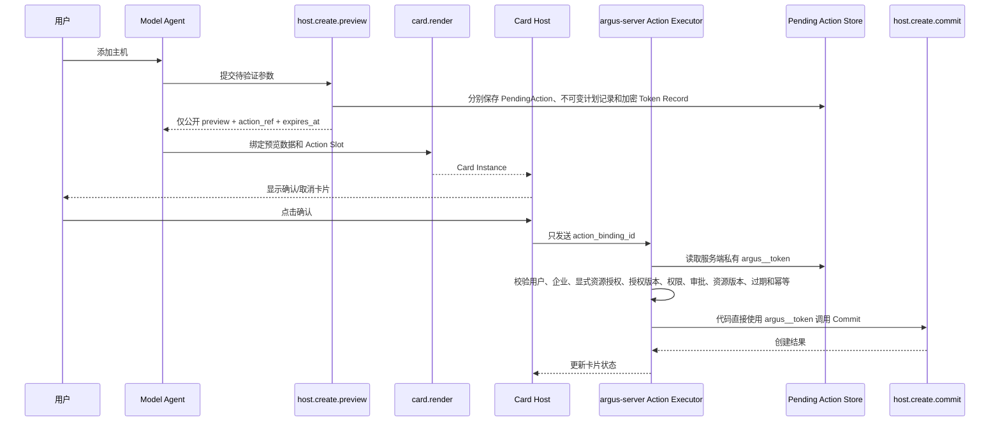
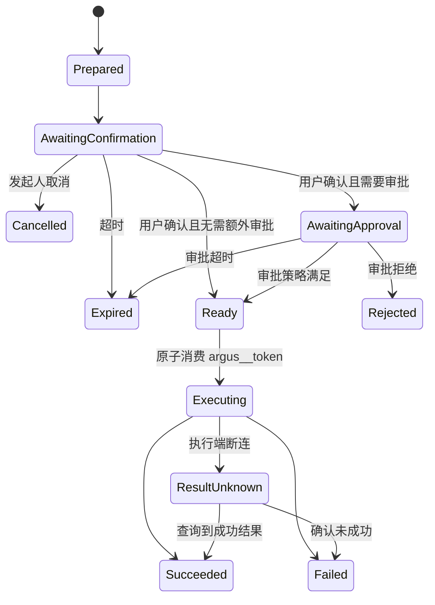

# Agent、MCP 与两阶段操作

> Agent 查询和操作复用主体的显式资源授权结果。创建工具不要求已有显式资源授权，提交成功后创建事务授予创建主体只读授权；读取、编辑、删除均要求功能权限、读取权限和目标资源授权。

## 1. 职责边界

Chatbox 和 Model Agent 负责：

- 理解意图。
- 收集缺少的参数。
- 选择和调用 MCP Tool。
- 生成执行计划。
- 请求用户确认。
- 组织回答，并通过内置“渲染交互卡片”Skill 从系统卡片和已启用企业卡片中生成 Render Plan。

MCP Tool 和领域服务负责：

- 业务校验。
- 企业、资源、Tool、显式资源授权、授权版本和显式资源授权校验。
- 幂等与状态持久化。
- 访问数据库、Connector 和第三方 API。
- 返回结构化结果和结构化错误。
- 写入审计。

人工 RemoteAccessSession 不属于 Model Agent 或 MCP Tool 能力。创建 SSH Web Terminal 使用管理 UI/OpenAPI 的独立授权接口、MFA/JIT/审批和短期一次性票据；AI、交互卡片和 OpenSandbox 不能获得该票据。当前版本不提供定时无人值守任务。交互式会话中的人工命令不逐条走 Tool Preview/Commit，必须由会话级权限、时长、录像、剪贴板/文件传输策略和审计约束。

Conversation 和 Run 只绑定服务端确认的 `enterprise_id`。模型生成的企业、标签过滤条件、Host 或 Kubernetes ID 只是候选参数，不能切换当前身份域或扩大显式资源授权；每个 ToolCall、Run、PendingAction 和 Execution 保存实际目标资源引用和授权版本快照。

## 2. Tool 设计

Tool 分成两类：

- 查询/诊断 Tool：不改变服务端或目标环境状态，可以单阶段执行，例如 `.list`、`.get`、`.query`、`.status` 和 `.test_connection`。
- 变更 Tool：改变持久数据、远端资源、权限、凭证、配置、软件版本或网络拓扑，必须成对提供同名前缀的 `.preview` 和 `.commit`。

命名和 Schema 是强制协议，不允许出现只有 Preview 没有 Commit、Commit 额外接受新业务参数，或使用单个写 Tool 通过 `dry_run=true/false` 切换语义的情况。

示例 Tool：

```text
connector.list
connector.create_enrollment_token
host.create.preview
host.create.commit
host.test_connection
host.list
host.get
kubernetes.cluster.create.preview
kubernetes.cluster.create.commit
kubernetes.cluster.list
kubernetes.cluster.get
kubernetes.namespace.list
kubernetes.node.list
kubernetes.pod.list
kubernetes.pod.get
kubernetes.deployment.list
kubernetes.statefulset.list
kubernetes.daemonset.list
kubernetes.service.list
kubernetes.pod.logs
telemetry.host.install.preview
telemetry.host.install.commit
telemetry.kubernetes.install.preview
telemetry.kubernetes.install.commit
telemetry.group.create.preview
telemetry.group.create.commit
telemetry.gateway.enable.preview
telemetry.gateway.enable.commit
telemetry.route.test
telemetry.collector.config.preview
telemetry.collector.config.commit
telemetry.collector.repair.preview
telemetry.collector.repair.commit
telemetry.collector.status
telemetry.metrics.query
telemetry.logs.query
pending_action.cancel
card.render
```

取消采用统一的 `pending_action.cancel`，它接收公开 `action_ref` 并再次检查用户和会话；取消不是业务 Commit，不需要向模型暴露私有 Token。查询、预览和提交必须显式区分，高风险 Tool 不应依靠模型记住“刚才已经确认”。

Tool Registry 在执行前统一校验当前 Subject 的 Tool 权限、ServiceAccount `allowed_tool_ids`、严格 Input Schema、风险/执行模式和显式资源授权。模型输出中的未知字段、非法类型、截断 JSON 或调用方自报来源均不能进入领域 Service。

### 2.1 Preview/Commit 强制配对约定

对任意变更前缀 `x.y.operation`：

```text
x.y.operation.preview(candidate_parameters) -> public preview + private argus__token
x.y.operation.commit(argus__token) -> execution/result
```

`preview` 负责：

1. 当前身份、企业、Tool 权限、显式资源授权、目标资源和 AuthorizationVersion 校验。
2. 参数 Schema、业务规则、连接和资源状态检查。
3. 根据真实资源计算最终风险与审批策略。
4. 生成不可变执行计划、预览摘要、参数哈希和执行前置条件。
5. 持久化 Pending Action，生成公开 `action_ref` 和私有 `argus__token`。
6. 返回固定版本的公开结果和私有 `_meta.argus__token`。

`commit` 负责：

1. 只接收私有 `argus__token`；调用者不能重新提交业务参数。
2. 原子校验 Token 哈希、一次性状态、过期、目标 Commit Tool 和调用来源。
3. 重新检查当前用户、企业状态、功能权限、显式资源授权、AuthorizationVersion、审批、资源版本和前置条件。
4. 把 Pending Action 原子推进到 Executing，并创建 Execution/ConnectorCommand。
5. 使用服务端保存的不可变计划执行，返回可审计结果。

### 2.2 Commit 输入约定

Commit 的 MCP 输入 Schema 固定为：

```json
{
  "argus__token": "opaque-secret",
  "execution_context": {
    "action_binding_id": "cab_01K2...",
    "request_id": "req_01K2..."
  }
}
```

其中 `execution_context` 由 Action Executor 生成和签名，不接受浏览器或模型提供的同名字段。业务参数、目标 ID、版本、远程路径、脚本和 Artifact 均从 Pending Action Store 恢复。

## 3. Tool Result 与数据来源

每一次调用都应生成稳定的 `tool_call_id`，完整 Tool Result 保存在服务端执行上下文中。AI 在生成 Render Plan 时引用：

```json
{
  "call_id": "call_host_list_01",
  "path": "$.data.items[*].name"
}
```

而不是把返回值复制成没有来源的字面量。这样 `card.render` 可以校验：

- Tool 来源。
- 调用所属企业、会话、目标资源引用和显式授权版本快照。
- 字段路径和类型。
- Slot 允许的数据来源。
- 字段是否敏感。

多 Tool 数据组合可以通过受限表达式描述，并保留所有输入的来源链。

M4 的确定性投影上限为：完整 Tool Result 最多 4 MiB 并保存为 Artifact，列表最多投影 50 项，Pod Logs 最多投影 32 KiB，任一模型投影总量最多 64 KiB。投影保存稳定 Hash、`projected_bytes`、`resource_refs` 和公开 `result_ref`；完整结果不能复制进模型上下文。

## 4. Agent Harness 与持久化 Run

Agent Loop、上下文账本、ToolResult Projection、ContextSnapshot、Token 预算和压缩恢复的完整契约见[Agent Harness 与上下文管理](./16-agent-harness-and-context-management.md)。本节只描述它与持久化 Run 和两阶段操作的关系。

多步骤任务必须落到 Run 状态机：

```text
Run
├── Step 1：查询 Connector
├── Step 2：测试目标连通性
├── Step 3：创建预览
├── Step 4：等待用户确认
├── Step 5：执行提交
└── Step 6：验证结果
```

Run 支持：

- 暂停和恢复。
- 等待用户输入或审批。
- 服务重启后恢复。
- 超时、取消和重试。
- 上下文预算、ToolResult Projection 和可恢复 Compaction。
- 每一步独立审计。

Run、Step 和 Task 的唯一状态保存于 PostgreSQL。Server 创建 Task 时在同一事务写入 Outbox；Worker 使用 Lease、Fence Token 和条件更新领取任务。Redis Stream/PubSub 只通知“可能有新任务”，不能作为任务是否存在或是否完成的事实来源。

```text
pending -> leased -> running -> waiting_input / waiting_approval
                     └───────→ succeeded / failed / cancelled / timed_out
```

Worker 失联后，只有 Lease 过期且数据库中的 Fence Token 未变化时，其他 Worker 才能接管。对具有外部副作用的 Step，接管前必须查询 Execution/ConnectorCommand 结果；不能因为 Lease 过期就直接重复执行。

完整 ConversationEvent 只追加保存；RunState 和 Typed Checkpoint 从数据库事实生成。ContextSnapshot 只保存被压缩历史的来源范围、结构化 Checkpoint、叙述摘要、模型/Prompt Revision 和压缩前后 Token。压缩不得删除原始 Message、ToolCall、ToolResult 或执行事件。

Agent Loop 为 Preview 注入服务端可信 `run_id`，PendingAction 和后续 Execution 继承该关联；Preview 后原 Run 进入 `waiting_input`，Action 终态创建 Verify Task 并只恢复同一 Run。浏览器和模型输入中不存在可自报的 `run_id`。公开 Run 必须返回稳定 `stop_reason` 和 `error_code`，便于断线恢复后区分取消、额度耗尽和执行失败。

第一版只运行一个 Model Agent。查询 Tool 只有显式标记 `parallel_safe` 时可以并行，默认顺序执行；Preview 默认顺序执行，Commit 不出现在 Model Agent Tool Registry 中。

## 5. 两阶段操作

以新增主机为例：



用户点击确认后的提交不再进入模型推理。M4 的 Tool Gateway 是 Worker 进程内可信 Registry；提交只允许 Action Executor 使用内部身份调用隐藏的 Commit Handler。浏览器请求只携带公开 `action_ref` 或后续 Card 产生的 `action_binding_id`，不得携带 Commit Tool 名称、业务参数或 `argus__token`。若未来把 Gateway 拆成独立进程，内部调用必须使用 mTLS，且不得暴露到公共 Ingress。

## 6. Preview Tool 返回约定

MCP 核心协议提供 `structuredContent` 和可选 `outputSchema`，但不定义 Argus 的 Pending Action 语义，因此需要约定版本化返回结构：

```json
{
  "kind": "pending_action",
  "schema_version": "argus.pending_action/v1",
  "preview": {
    "name": "server-01",
    "address": "10.0.0.12",
    "connection_type": "ssh-via-connector"
  },
  "pending_action": {
    "action_ref": "pa_01K2...",
    "expires_at": "2026-08-14T17:10:00+08:00",
    "available_actions": ["confirm", "cancel"]
  }
}
```

完整内部返回约定如下：

```json
{
  "structuredContent": {
    "kind": "pending_action",
    "schema_version": "argus.pending_action/v1",
    "preview": {
      "name": "server-01",
      "address": "10.0.0.12",
      "connection_type": "ssh-via-connector"
    },
    "pending_action": {
      "action_ref": "pa_01K2...",
      "expires_at": "2026-08-14T17:10:00+08:00",
      "available_actions": ["confirm", "cancel"]
    }
  },
  "_meta": {
    "argus__token": "opaque-256-bit-random-token"
  }
}
```

`_meta.argus__token` 是所有 Preview Tool 的固定私有返回字段。Argus Tool Gateway 收到完整结果后必须立即执行分流：

```text
完整 Preview Result
├── 公开投影：进入 Tool Result Store、模型上下文和 card.render
└── 私有投影：argus__token 加密保存到 Pending Action Store
```

`argus__token` 推荐使用至少 256 bit 随机不透明值。Pending Action Store 保存用于查重/校验的 Token 哈希，以及使用专用密钥加密的 Token 密文或 Secret Store Handle；只有 Action Executor 可解密/读取一次并调用 Commit。日志和审计只记录 Token ID/哈希摘要，禁止记录原值、密文或可逆编码。

业务 Tool 不需要绑定某张卡片。内置“渲染交互卡片”Skill 根据 `kind`、Tool Output Schema、预览数据和已启用交互卡片目录生成可校验 Render Plan；运行时绑定始终引用真实 `tool_call_id + path`。

## 7. Token 与 Action Binding

如果真正的提交 Token 进入模型上下文、浏览器或卡片，模型或前端代码就可能绕过用户点击直接提交，用户确认将不再是安全边界。因此采用：

```text
模型可见：公开 preview、action_ref
浏览器和 交互卡片 可见：action_binding_id
argus-server 私有：argus__token、目标 Commit Tool、计划和参数
```

完整 Tool Result 到达 Argus Tool Gateway 后，Gateway 将 `_meta.argus__token` 存入 Pending Action Store，只向模型、浏览器和普通 Tool Result Store 提供安全投影。MCP `_meta` 本身不是保密边界，因此带 Preview/Commit 能力的变更 Tool 只允许通过 Argus 管理的 Tool Gateway 调用；不受控的外部 MCP Client 不得获得完整 Preview 返回。

Action Binding 至少保存：

```json
{
  "binding_id": "cab_01K2...",
  "card_instance_id": "cardi_01K2...",
  "action_ref": "pa_01K2...",
  "action": "confirm",
  "target_tool": "host.create.commit",
  "enterprise_id": "ent-1",
  "resource_scope_snapshot": "scope-snapshot-37",
  "user_id": "user-1",
  "conversation_id": "chat-1",
  "expires_at": "...",
  "status": "pending"
}
```

Token 或 Pending Action 服务端记录应绑定：

- 唯一 ID 和一次性使用状态。
- enterprise_id、creator_user_id 和 conversation_id。
- authorization_version、显式授权版本和有效的目标资源快照。
- preview_call_id。
- commit Tool。
- 预览参数哈希。
- 不可变执行计划版本和资源版本。
- 风险计算结果、Policy Version 和所需审批策略。
- 有效期。

Commit Tool 必须只接收 `argus__token`，由服务端恢复预览参数，避免确认后参数被修改。Token 在状态从 Ready 原子更新为 Executing 时即视为已消费；后续重试使用 Execution ID 和业务幂等键，不重新消费或签发原 Token。

## 8. Tool 暴露范围

推荐将模型与卡片执行器的权限分开：

```text
模型可调用：host.create.preview、pending_action.cancel、card.render
Action Executor 可调用：host.create.commit
```

统一取消 Tool 后，推荐权限为：

```text
Model Agent：读取 Tool、*.preview、pending_action.cancel、card.render
Action Executor：与 Action Binding 对应的 *.commit
Card iframe：无直接 Tool 权限，只能调用已绑定 Query/Action Slot
```

Commit Tool 不得出现在 Model Agent 的 Tool Registry 投影中。Tool Gateway 还必须校验调用方是 Action Executor 的内部服务身份，不能只凭某个请求声明 `origin=card_action`。

## 9. 点击结果进入会话

直接点击结果记录为独立会话事件，而不是伪装成 Model Agent 发起的 Tool Call：

```json
{
  "type": "card_action_result",
  "origin": "user_interaction",
  "actor_user_id": "user-1",
  "card_instance_id": "cardi_01K2...",
  "action": "confirm",
  "tool": "host.create.commit",
  "status": "success",
  "result_ref": "tool-result-123"
}
```

前端直接更新原卡片。下次模型继续对话时再把该事件作为历史上下文提供，不需要在每次点击后启动模型。

## 10. MCP 兼容边界

以 2026-07-28 规范为基线：

- [MCP Tools](https://modelcontextprotocol.io/specification/2026-07-28/server/tools) 支持结构化输出、输出 Schema 和多轮输入要求，但不规定具体 UI。
- [MCP Apps](https://modelcontextprotocol.io/extensions/apps/overview) 是官方可选扩展，允许沙箱 HTML 通过 Host Bridge 发起 `tools/call`。
- Argus 可以只让通用 `card.render` 声明 MCP App UI，业务 Tool 不声明 UI，从而保持 Tool 与 交互卡片 解耦。
- 不支持 MCP Apps 的客户端可以降级成文字预览和普通确认对话。

降级成文字确认时仍然不能把 `argus__token` 交给客户端。客户端提交公开 `action_ref` 和明确确认手势，`argus-server` 创建一次性 Action Binding 后仍由 Action Executor 执行 Commit。

## 11. Pending Action、审批和执行状态

Pending Action 表示操作生命周期并只引用不可变计划记录和私有 Token Record；不可变计划记录保存 Preview 冻结的执行参数和哈希，Token Record 独立保存加密的一次性能力及消费状态。User Confirmation 表示发起人确认，Approval Request 表示额外审批，Execution 表示实际执行，这些对象不能合并成一个布尔字段或一条混合私有记录。



创建人确认不能自动满足“非创建人审批”规则。Approval Request 为每条命中策略保存独立 Requirement Snapshot；所有 Requirement 都满足后才可进入 `ready`，任一有效拒绝会拒绝整个请求。权限撤销、企业停用、策略版本、资源版本、标签影响或计划变化会使尚未执行的审批失效。

Approval 只满足 Policy 对已经授权操作提出的附加条件，不能为发起人补齐缺失的 Role、显式资源授权、Tool、资源或目标账号权限。M4 不直接实现 Break Glass；M8 本地加固提供 TOTP Step-up 和显式 Break Glass Session，但仍不能用单管理员场景降低基础权限或职责分离要求。

Execution 如果产生 Bastion 或 Kubernetes Connector Enrollment，公开对象只返回 `one_time_result_available`。原发起人使用独立幂等接口领取 AES-GCM 加密保存、最长五分钟有效的一次性结果；同一 Idempotency-Key 可以重放同一响应，新 Key 二次领取稳定失败。明文安装命令不得进入 PendingAction、Execution、ConversationEvent、审计、日志或 Redis。

### 11.1 当前版本的执行边界

当前版本不提供定时或无人值守任务。所有 AI、Chatbox、资源管理页面和受控服务主体的资源写操作，都必须进入通用 `PendingAction -> Approval -> Execution -> Task` 链路；人工远程访问继续使用独立的 Remote Access Approval API。

## 12. 并发、幂等和错误处理

- 确认、取消、过期和审批使用数据库条件更新，只能有一个合法状态迁移成功。
- Action Binding 调用先以 `(binding_id, request_id)` 去重；Commit 再以 Pending Action/Execution 的业务幂等键去重。
- 用户双击返回同一个 Execution，不创建第二次执行。
- Commit 已创建 Execution 但响应丢失时，Action Executor 查询现有 Execution，不重新调用业务变更。
- 远端结果未知时返回 `EXECUTION_RESULT_UNKNOWN`，进入对账流程；只有 ConnectorCommand/上游操作的终态事实才能完成 Execution，不能当作普通失败自动重试或重放副作用。
- Preview 过期后必须重新 Preview；不能只延长旧 Token 的有效期。

## 13. Tool 发布门禁

每个变更 Tool 上线前必须通过自动契约测试：

1. `.preview` 和 `.commit` 同名前缀成对存在。
2. Preview 具有固定 `argus.pending_action/v1` 公开 Schema 和 `_meta.argus__token`。
3. 安全投影中搜索不到 Token 原值或可逆编码。
4. Commit Schema 不包含业务参数，只接受 `argus__token` 和内部执行上下文。
5. Model Agent 的 Tool 列表中不存在 `.commit`。
6. Token 只能使用一次，过期、取消、跨企业、跨用户或跨 Tool 使用均失败。
7. Preview 后修改资源版本、显式资源授权、AuthorizationVersion 或撤销权限，Commit 必须失败并要求重新 Preview；标签变化不触发授权失效。
8. 双击、超时重试和服务重启不会产生重复副作用。
9. 审批不能补齐缺失的基础权限；Break Glass 只能用于 Policy 明确允许且绑定单个 Pending Action 的场景。
10. Model Agent、Card 和 OpenSandbox 无法创建或消费人工远程会话票据。
