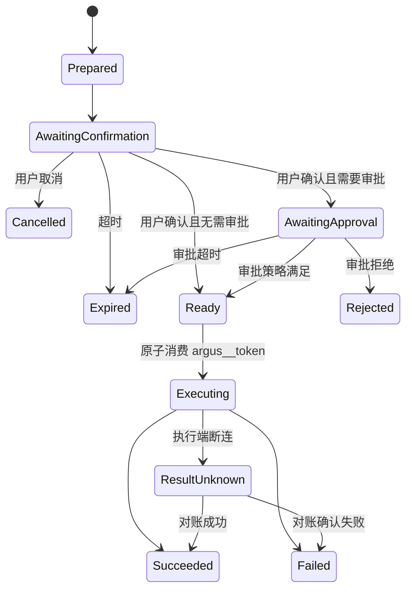

# 安全基线与 MVP 路线

## 1. 安全基线

Argus 同时连接模型、不可信用户输入、生成代码、基础设施凭证和生产环境，因此必须假设任意单一检测层都会失效。

核心原则：

- 权限由服务端统一判断。
- Secret 不进入普通聊天、日志和 Card DOM。
- 人工确认必须对应不可篡改的预览内容。
- 模型不能持有能够绕过确认的完整提交能力。
- AI 生成代码必须同时经过静态检查和运行时隔离。
- 所有操作具有来源、身份、租户和调用链。
- 平台身份与企业身份互斥；EnterpriseUser 直接绑定唯一企业和部门，`enterprise_id` 是唯一隔离边界，资源授权由企业级 RoleBinding 与 DataScope 共同决定。
- 变更操作默认幂等、可追踪、可超时。

## 2. 主要威胁与控制

| 威胁                                       | 控制                                                                                                                                                 |
| ------------------------------------------ | ---------------------------------------------------------------------------------------------------------------------------------------------------- |
| 跨企业数据访问                             | enterprise_id 强制过滤、统一授权中心、服务端检查                                                                                                     |
| 借标签或直接资源 ID 越权                   | 企业归属复核、受限标签选择器、DataScope、Query Service 强制 Resource Filter、统一 Tool/Card 数据裁剪                                                 |
| 平台管理员借空企业上下文读取企业数据       | 平台/企业身份类型互斥、不同 Audience 和 API 域、平台账号不能加入企业                                                                                 |
| Prompt injection 诱导越权 Tool             | Tool allowlist、策略中心、风险分级、模型与 Action Executor 权限隔离                                                                                  |
| AI 绕过确认直接提交                        | 模型只看到 action_ref；`_meta.argus__token` 仅进入服务端 Pending Action Store；Commit Tool 不暴露给模型                                              |
| 确认后修改参数                             | Token 绑定预览参数哈希；commit 从服务端恢复参数                                                                                                      |
| Token 重放                                 | 短期、一次性、jti、幂等和消费状态                                                                                                                    |
| 凭证泄漏给模型                             | Secret 表单、SecretRef、上下文投影和日志脱敏                                                                                                         |
| 恶意 交互卡片                              | 静态扫描、独立来源 iframe、CSP、Bridge 白名单、资源限制                                                                                              |
| 卡片伪造 Tool 数据来源                     | 使用 tool_call_id + path，服务端解析，禁止受限 Slot 使用 literal                                                                                     |
| Connector 被冒用                           | 一次性注册、mTLS、证书轮换、设备吊销和本地策略                                                                                                       |
| Direct Executor 被用于 SSRF/内网扫描       | 固定出口、协议/端口白名单、DNS 前后校验、私网/元数据/内部地址拒绝和独立 Worker Pool                                                                  |
| 远程会话票据泄漏或被 AI 使用               | 一次性短期票据绑定用户/浏览器/企业/Host/ManagedAccount/动作/DataScope/授权版本；AI、Card、Automation、Sandbox 不可获取；MFA/JIT/审批、录像与强制终止 |
| 功能权限被误当作 root/任意账号访问         | RoleBinding 只授予功能能力；DataScope 和 RemoteAccessGrant 独立限定 Host、ManagedAccount、协议、动作和有效期                                         |
| 交互式 Shell 绕过 Tool 两阶段确认          | 明确划分人工堡垒会话与 AI Tool；人工会话使用独立权限、理由、审批、时长、剪贴板/文件策略、录像和命令审计                                              |
| 平台自动化借人工终端执行未审计命令         | RemoteAccessSession 与 Execution/ConnectorCommand 使用不同票据、API、队列和审计；安装配置只执行不可变计划和版本化模板，禁止向人工终端注入命令        |
| Sandbox 横向访问生产环境                   | 默认断网或受限出网，生产访问必须通过受控 Tool 和 Connector                                                                                           |
| 用户双击或网络重试                         | 幂等键、Action Binding 状态机、按钮即时禁用                                                                                                          |
| Leaf Collector 伪造其他主机身份            | Leaf 独立凭证或 mTLS，Edge Gateway 根据认证结果写入可信资源 ID                                                                                       |
| Edge Gateway 单点或磁盘打满                | Leaf/Gateway 持久队列、容量限制、积压告警和后续双 Gateway                                                                                            |
| 遥测高基数和摄入成本失控                   | Attribute 限制、Series 配额、日志大小限制、企业速率与日用量限制                                                                                      |
| Kafka 重试造成遥测重复                     | 明确至少一次语义、事件 ID/Offset 策略和查询去重方案                                                                                                  |
| Host Collector 与 DaemonSet 重复采集       | 可信 KubernetesNodeHostBinding、Profile 展开为 CollectionClaim、同一 Claim 单主所有者、迁移重叠过期和配置提交前冲突检测                              |
| 权限撤销后旧票据或 Pending Action 继续生效 | AuthorizationVersion、Commit/连接时重新鉴权、活动会话终止、Outbox 驱动缓存和订阅失效                                                                 |
| 单管理员企业伪造双人审批                   | 禁止同一主体自批；只有 Policy 明确允许时使用 Step-up MFA、理由、短时票据和高优先级审计的 Break Glass                                                 |

## 3. Pending Action 状态机

状态变化必须通过 PostgreSQL 条件更新或事务保证，防止确认、取消、审批、过期和 Commit 并发发生。Redis 可以用于短期锁、通知和幂等窗口，但不能成为状态事实来源。失败重试使用已创建 Execution 的幂等键；不能重新消费原 `argus__token`，`ResultUnknown` 也不能自动重试。

PendingAction、UserConfirmation、ApprovalRequest 和 Execution 分开保存。创建人确认不能自动满足职责分离审批，权限撤销、企业停用、资源版本或执行计划变化都会使未执行确认失效。

## 4. 交互卡片 发布安全

发布前至少执行：

1. Manifest 和 JSON Schema 校验。
2. HTML/CSS/JavaScript AST 检查。
3. 依赖锁定和供应链扫描。
4. CSP 与权限计算。
5. Demo 数据渲染。
6. 运行时超时和资源测试。
7. 对 enterprise/system 等级执行人工审核。
8. 生成不可变版本和内容哈希。

交互卡片 更新必须创建新版本，历史消息继续引用原版本或保存渲染快照，避免旧会话展示内容在不知情时变化。

## 5. 第一阶段：SaaS 和连接基座

- Kubernetes 一键安装器、Helm Chart 和环境预检。
- PostgreSQL、Redis、MinIO Artifact Store、OpenSandbox、Kafka 和 ClickHouse 的 Kubernetes 集成部署；第一版不提供外部中间件模式。
- 首次初始化状态机和一次性 Setup Token。
- 初始化平台超级管理员账号密码。
- 平台超级管理员门户。
- 企业和企业管理员创建流程。
- Enterprise、PlatformUser、EnterpriseUser、Department、Role、Permission、RoleBinding、DataScope 和 AuthorizationVersion。
- EnterpriseUser 直接绑定唯一 `enterprise_id + department_id`，不提供 Membership、企业切换、Project 或通用 Group。
- 企业级功能权限、显式资源/标签选择范围和统一授权入口。
- ServiceAccount/APIKey 和平台/企业分域审计日志；Secret Vault 在资源执行阶段接入。
- OpenSandbox 由 Helm 安装；平台级镜像、Profile、配额和活动会话治理 API 作为 Agent/Sandbox 接入前置在 M4 完成。
- Connector 一次性注册、mTLS、心跳和在线状态；注册同时创建/激活堡垒机 Host 和稳定 Bastion Scope。
- 管理后台基础框架。

完成标准：首次启动能够通过短期 Setup Token 安全创建唯一的平台超级管理员；超级管理员能够创建企业、默认部门和临时密码初始管理员但不能访问企业业务数据；平台身份不能成为企业身份，企业用户不能切换到其他企业；企业管理员能够建立 RoleBinding、DataScope、ServiceAccount 和 APIKey，不同企业之间身份、资源范围、密钥和审计完全隔离。该阶段只达到 Evaluation 身份闭环，平台超级管理员 MFA 仍是 Production 硬阻断。

## 6. 第二阶段：资源管理基座（M3）

- Host/KubernetesCluster CRUD 和用户自定义 `labels`，以及标签筛选、分组和授权敏感变更 Preview/Commit。
- 主机 `connector_local`、`via_bastion`、公网 `direct_ssh/direct_winrm` 连接模式。
- 受控 Direct Executor：固定出口、SSRF 防护、Host Key 校验和独立执行池。
- Secret、Credential、ManagedAccount 和绑定操作/资源/接收者的短期 Credential Lease；不提供原值读取权限。
- 主机卡片按 Bastion Scope 分组，直连 Host 独立显示。
- Kubernetes 集群 CRUD、kubeconfig Secret 化和连接测试。
- Namespace、Node、Pod、Deployment、StatefulSet、DaemonSet、Service 和有界日志读取。
- Connector 一次性注册、CSR/mTLS、证书轮换/吊销、心跳、Gateway Registry、Drain 和类型化命令。
- 资源专用 PendingAction/Plan/Token 与 Preview/Confirm；M4 在其上增加 Approval、Execution、Agent 和 Tool。
- 管理后台和领域服务打通。

完成标准：不使用 AI 也能通过管理后台完成 Secret/ManagedAccount、带标签的堡垒机安装、经堡垒机/直连主机和 Kubernetes 接入；Resource Operator 不能使用 DataScope 之外的资源，所有 Secret 不回显，所有接入路径、确认和连接测试可审计。

M3 已于 2026-08-17 达到该完成标准。临时 Namespace E2E 同时验证了 Connector 注册竞争/证书轮换、双 Gateway 路由、Bastion Replacement、Direct SSRF 边界、Kubernetes 三种接入、DataScope 撤权、Secret 轮换、Redis 清空和 Server/Gateway 重启恢复；M3 Namespace、PVC 与 Lease 均已清理。

人工 SSH/WinRS 会话、RemoteAccessGrant、AccessLease、短期会话票据、录像和终止已由 M6 完成；M8 已为本地环境补齐 TOTP、Step-up 和 Break Glass，并由统一 AuthenticationAssuranceService 约束 Critical Action 与 Remote Access。Collector 安装、CollectionClaim、Telemetry Route 与 OTLP 链路属于 M7。M3 ConnectorCommand 仍明确禁止任意 Shell、文件写入、Remote Access Frame 和 Collector 命令，M6 使用独立类型化会话协议。

## 7. 第三阶段：Chatbox 与 MCP

- 单一 `AIModel` 的 OpenAI Compatible 一步式测试创建、启停与健康状态。
- 模型连通性测试、调用价格快照、部门/用户月金额额度和治理仪表盘。
- 会话历史和消息模型。
- 会话显式选择模型，切换只影响后续消息，额度耗尽时不自动切换。
- Conversation/Run 固定企业；每个 ToolCall、Run、PendingAction 和 Execution 保存目标资源引用、DataScope 与授权版本快照。
- Provider-neutral 单 Agent Harness、ConversationEvent Ledger、Typed Run Checkpoint、ToolResult Projection 和 Token 预算 Compaction。
- MCP Gateway、Tool Registry 和 Tool Result Store。
- Model Agent 基础编排。
- 查询类 Tool。
- 新增主机和 Kubernetes 的 preview/commit/cancel 两阶段 Tool。
- Pending Action、Action Binding 和审计。

完成标准：用户能够通过自然语言添加、查询其 DataScope 范围内资源；模型可发现的 Tool 和可见数据不超过当前用户权限；所有写操作可预览、确认、审计且不能由模型绕过确认或通过审批补齐基础权限。

## 8. 第四阶段：交互卡片

- 交互卡片包格式，以及自定义卡片/内置卡片目录。
- 企业超级管理员通过 `/` 命令创建企业自定义卡片，创建后默认禁用。
- Slot Binding、Tool Output Schema Catalog、Action Slot 和 Render Plan。
- 安全与场景验证、AI 自修复、启用门禁。
- 独立 Origin 或严格沙箱 iframe、按卡片 CSP、版本化 Manifest、MessageChannel/MessagePort Host Bridge、自适应高度和真实 Demo 预览。
- 内置卡片只读，普通用户只查看已启用企业卡片和内置卡片。

完成标准：同一 Tool Result 可以被不同 交互卡片 展示，一张 交互卡片 可以组合多个 Tool Result；用户点击 Action Slot 可在不经过模型的情况下安全调用第二阶段 Tool。

## 9. 第五阶段：人工远程访问（M6）

- RemoteAccessGrant 限定 user/department、显式 Host ID/标签选择器、ManagedAccount、协议、动作和有效期；审批只能收窄，不能补齐缺失权限。
- AccessRequest/Lease 与 M4 Action Approval 分离，多策略全部满足；MFA obligation 在 Evaluation 中 fail closed。
- Ticket 为 60 秒一次性 opaque Token，绑定 HTTP Session、用户、企业、Host、ManagedAccount、协议、Lease、AuthorizationVersion 和 Session Fence。
- SSH 提供完整 PTY；WinRM 只提供 HTTPS WinRS PowerShell 行模式，不宣称完整 PTY、PSRP 或桌面能力。
- 录像采用 asciicast v2 NDJSON、AES-256-GCM 分片和 SHA-256 Hash Chain；ObjectStore 连续不可用 30 秒或内存缓冲超过 4 MiB 时终止会话。
- Gateway 外部 WSS、内部 peer mTLS、Connector gRPC 和 Direct Executor RPC 使用独立端口与身份；Redis 丢失后从 PostgreSQL 和 Connector 心跳恢复。

完成标准：已于 2026-08-18 达成。旧 Shell Harness 最终运行号为 `20260818072400-79219`，验证真实 SSH、TLS WinRS 模拟器、跨 Gateway Drain、Ticket 重放、AuthorizationVersion 撤权、MinIO fail closed、录像和 real Playwright，清理后 Namespace、PVC 与 Lease 零残留。当前官方入口为 `go run ./cmd/argus-dev e2e run --suite m6`。M8 本地加固补齐 MFA/Step-up 与本地录像恢复；Production 录像不可变保留、真实 Windows、容量和安全审计仍在 Production Validation 清单。

## 10. 第六阶段：OpenTelemetry 监控链路（M7）

- 在 M3 资源、Connector 和 Credential Broker 以及 M4 Execution 基座上，实现 Collector 安装、路由、存储和查询链路；M3 不预先实现 Collector 命令。
- 第一批只实现独立主机 `direct_argus` 与 Bastion Scope 的 `bastion_gateway`；Standalone Edge Gateway/Telemetry Group 延后到基础链路稳定后。
- Kubernetes DaemonSet + Gateway Deployment。
- KubernetesNodeHostBinding、CollectionClaim 和 Host Collector/DaemonSet 冲突检测；默认允许进程共存但禁止同一物理资源同一 Claim 长期重复采集。
- 第一版 Metrics、Logs、Traces Collection Profile 目录，以及 OTLP 优先、Jaeger/Zipkin 兼容、主动日志读取和受控数据库/中间件 Receiver。
- 企业级 OTLP 凭证和可信 Enterprise/Resource/Collector 身份注入。
- `argus-telemetry ingest`、Kafka、`argus-telemetry writer` 和 ClickHouse。
- Altinity ClickHouse Operator、ClickHouseInstallation、Keeper、Schema Migration 和备份恢复演练。
- Metrics/Logs 查询 Tool、基础监控页面、告警和用量界面；授权 Resource ID/标签范围、Signal、字段脱敏、Live Tail、Export 和查询预算分别授权。
- Collector、Gateway、Kafka Consumer 自身健康监控。

完成标准：Bastion Scope 成员只能直推或使用所属堡垒机 Gateway，第一批独立主机只允许直推 Argus；Leaf 数据可靠归属到具体企业和资源，跨企业、超出 DataScope 的查询及跨 Scope 路由被拒绝；同一 Kubernetes Node 的 Host/DaemonSet Claim 冲突在提交前被阻止或形成有期限迁移计划；安装和配置均经过两阶段确认并支持失败回滚。

## 11. 第七阶段：Agentic AIOps

- 持久化 Run 和多步骤任务。
- 复杂诊断计划、上下文压缩治理和长任务恢复。
- OpenSandbox 集成。
- 日志分析和故障诊断。
- 长任务、重试、暂停和恢复。
- 企业级 交互卡片 发布和治理。
- 高危生产操作的增强审批。
- ServiceAccount 绑定企业、Tool 与 DataScope 的定时自动化、AuthorizationVersion 撤权和单管理员受控 Break Glass。

完成标准：AI 能够在受控范围内完成“发现问题—获取证据—生成计划—用户批准—执行—验证”的完整闭环。

第一版不把通用子 Agent 作为完成条件。Card Render 作为同一 Run 的受限声明式步骤；只有单 Agent Harness、上下文投影和恢复语义稳定后，才评估子 Agent、Agent 间消息和动态委派。

## 12. 第一版建议收敛

第一版产品目标建议定义为：

> AI 能够安全地接入、查询和诊断主机与 Kubernetes 资源，并通过明确预览和用户确认完成有限的变更操作。

优先验证五个基础协议：

1. 单企业用户、企业级 RoleBinding、DataScope、RemoteAccessGrant、Telemetry Scope、AuthorizationVersion 和统一授权决策。
2. Connector 注册、Bastion Scope、Direct Executor、RemoteAccessSession 与命令/远程会话通道。
3. Tool Result/Pending Action/Action Binding。
   - 所有变更 Tool 的 `.preview/.commit` 强制配对。
   - `_meta.argus__token` 安全分流、单次消费和不可见性测试。
   - PendingAction、Approval、Execution 和 ConnectorCommand 状态机。
4. 交互卡片/Render Plan/Host Bridge。
5. Bastion Scope/Telemetry Route/Collector Identity/多租户遥测 Schema；独立 Telemetry Group 在基础链路稳定后引入。

`AIModel` 的兼容实现、子 Agent 实现和前端视觉技术可以演进替换；上述五个协议一旦被业务大量依赖，修改成本会显著更高，应优先形成版本化规范和测试用例。

初始化、平台/企业权限边界、`AIModel` 调用快照、额度结算和 Sandbox Profile 同样应在第一版固化，因为它们决定部署、运营和企业隔离方式。

## 13. 权限 E2E 发布门禁

权限能力必须通过 Kubernetes 临时 Namespace 的端到端测试，测试结束后删除 Namespace。至少覆盖：

1. 平台超级管理员能够创建企业、默认部门和初始企业管理员，但不能读取该企业 Host、Conversation、Telemetry、Secret 或审计正文。
2. EnterpriseUser 不能登录或构造 Token 访问其他企业，也不存在企业切换入口。
3. DataScope A 的用户不能通过列表、详情、批量 API、Tool、Card、游标、伪造标签选择器或直接资源 ID 获取范围外资源。
4. 仅有 Metrics 权限的用户不能查询 Logs、Traces、Live Tail、Export 或敏感字段；Model Agent 得到相同裁剪结果。
5. `resource_operator` 没有 RemoteAccessGrant 时不能建立终端；Grant 只允许显式 Host/标签选择结果和 ManagedAccount，不能改为 root 或启用未授权文件能力。
6. 生产 Tool 完成 Preview 后撤销 RoleBinding/DataScope、修改授权敏感标签或递增 AuthorizationVersion，Commit 必须失败并要求重新 Preview。
7. 远程会话票据签发后撤销 Grant，未使用票据立即失败，活动会话按策略终止并产生审计。
8. Approval 不能补齐缺失的 Role/DataScope/Tool/资源权限；创建人不能满足非本人审批，Break Glass 必须绑定单个操作并完整审计。
9. Automation 以 ServiceAccount 当前 Tool/DataScope 权限执行，创建人后续权限不影响其身份边界，也不能消费人工会话票据。
10. Collector 自报伪造 EnterpriseId、ResourceId 或 CollectorId 时被覆盖或拒绝，超出授权资源范围的遥测查询不返回记录。
