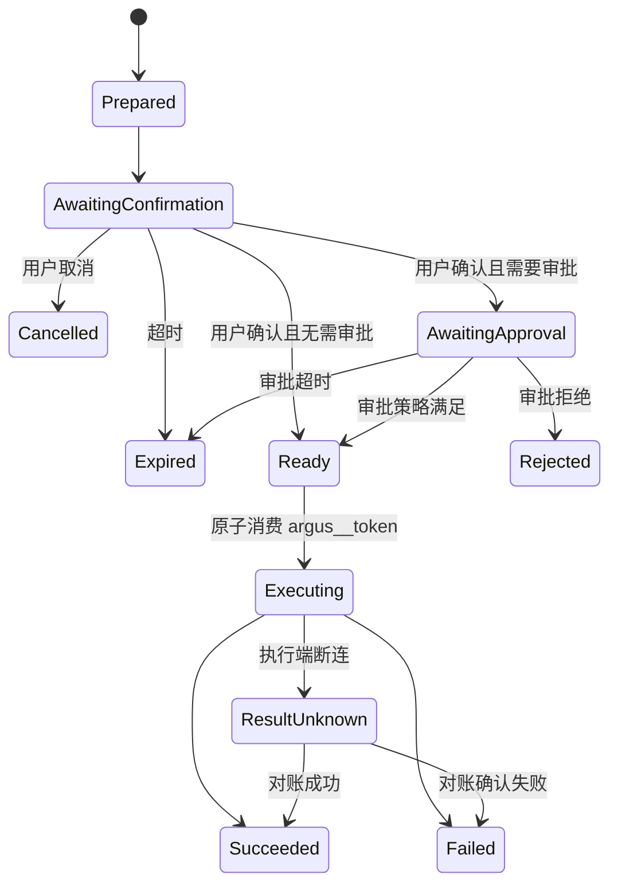

# 安全基线与 MVP 路线

## 1. 安全基线

Argus 同时连接模型、不可信用户输入、生成代码、基础设施凭证和生产环境，因此必须假设任意单一检测层都会失效。

核心原则：

- 权限由服务端统一判断。
- Secret 不进入普通聊天、日志和 Card DOM。
- 人工确认必须对应不可篡改的预览内容。
- 模型不能持有能够绕过确认的完整提交能力。
- AI 生成代码必须同时经过静态检查和运行时隔离。
- 所有操作具有来源、身份、租户和调用链。
- 变更操作默认幂等、可追踪、可超时。

## 2. 主要威胁与控制

| 威胁 | 控制 |
| --- | --- |
| 跨企业数据访问 | enterprise_id 强制过滤、统一授权中心、服务端检查 |
| Prompt injection 诱导越权 Tool | Tool allowlist、策略中心、风险分级、模型与 Action Executor 权限隔离 |
| AI 绕过确认直接提交 | 模型只看到 action_ref；`_meta.argus__token` 仅进入服务端 Pending Action Store；Commit Tool 不暴露给模型 |
| 确认后修改参数 | Token 绑定预览参数哈希；commit 从服务端恢复参数 |
| Token 重放 | 短期、一次性、jti、幂等和消费状态 |
| 凭证泄漏给模型 | Secret 表单、SecretRef、上下文投影和日志脱敏 |
| 恶意 Card Skill | 静态扫描、独立来源 iframe、CSP、Bridge 白名单、资源限制 |
| 卡片伪造 Tool 数据来源 | 使用 tool_call_id + path，服务端解析，禁止受限 Slot 使用 literal |
| Connector 被冒用 | 一次性注册、mTLS、证书轮换、设备吊销和本地策略 |
| Sandbox 横向访问生产环境 | 默认断网或受限出网，生产访问必须通过受控 Tool 和 Connector |
| 用户双击或网络重试 | 幂等键、Action Binding 状态机、按钮即时禁用 |
| Leaf Collector 伪造其他主机身份 | Leaf 独立凭证或 mTLS，Edge Gateway 根据认证结果写入可信资源 ID |
| Edge Gateway 单点或磁盘打满 | Leaf/Gateway 持久队列、容量限制、积压告警和后续双 Gateway |
| 遥测高基数和摄入成本失控 | Attribute 限制、Series 配额、日志大小限制、企业速率与日用量限制 |
| Kafka 重试造成遥测重复 | 明确至少一次语义、事件 ID/Offset 策略和查询去重方案 |

## 3. Pending Action 状态机

状态变化必须通过 PostgreSQL 条件更新或事务保证，防止确认、取消、审批、过期和 Commit 并发发生。Redis 可以用于短期锁、通知和幂等窗口，但不能成为状态事实来源。失败重试使用已创建 Execution 的幂等键；不能重新消费原 `argus__token`，`ResultUnknown` 也不能自动重试。

PendingAction、UserConfirmation、ApprovalRequest 和 Execution 分开保存。创建人确认不能自动满足职责分离审批，权限撤销、企业停用、资源版本或执行计划变化都会使未执行确认失效。

## 4. Card Skill 发布安全

发布前至少执行：

1. Manifest 和 JSON Schema 校验。
2. HTML/CSS/JavaScript AST 检查。
3. 依赖锁定和供应链扫描。
4. CSP 与权限计算。
5. Demo 数据渲染。
6. 运行时超时和资源测试。
7. 对 tenant/system 等级执行人工审核。
8. 生成不可变版本和内容哈希。

Card Skill 更新必须创建新版本，历史消息继续引用原版本或保存渲染快照，避免旧会话展示内容在不知情时变化。

## 5. 第一阶段：SaaS 和连接基座

- Kubernetes 一键安装器、Helm Chart 和环境预检。
- PostgreSQL、Redis、Artifact Store、OpenSandbox 的集成部署或外部连接模式。
- 首次初始化状态机和一次性 Setup Token。
- 初始化平台超级管理员账号密码。
- 平台超级管理员门户。
- 企业和企业管理员创建流程。
- Enterprise、User、Membership、Group、Role、Permission。
- 基础数据范围和统一授权入口。
- Secret Vault 和审计日志。
- 平台级 OpenSandbox 镜像、Profile、配额和活动会话管理。
- Connector 一次性注册、mTLS、心跳和在线状态。
- 管理后台基础框架。

完成标准：首次启动能够安全创建唯一的平台超级管理员；超级管理员能够创建企业和企业管理员但不能访问企业业务数据；企业管理员能够安全安装 Connector，并且不同企业之间资源、密钥和审计完全隔离。

## 6. 第二阶段：资源管理

- 主机 CRUD、SSH/WinRM、Connector 转发和连接测试。
- Kubernetes 集群 CRUD、kubeconfig Secret 化和连接测试。
- Pod、Deployment、Service、Node 和日志读取。
- 管理后台和领域服务打通。

完成标准：不使用 AI 也能通过管理后台完成资源接入与只读查询。

## 7. 第三阶段：Chatbox 与 MCP

- 企业级模型供应商、Deployment、Alias、Agent Profile 和基础 fallback。
- 模型连通性测试、用量和预算统计。
- 会话历史和消息模型。
- MCP Gateway、Tool Registry 和 Tool Result Store。
- Model Agent 基础编排。
- 查询类 Tool。
- 新增主机和 Kubernetes 的 preview/commit/cancel 两阶段 Tool。
- Pending Action、Action Binding 和审计。

完成标准：用户能够通过自然语言添加、查询资源；所有写操作可预览、确认、审计且不能由模型绕过确认。

## 8. 第四阶段：Card Skill

- Card Skill 包格式和目录。
- `/` 命令引用。
- Data Slot、Action Slot 和 Render Plan。
- `card.render` 校验与 AI 自修复。
- 沙箱 iframe、CSP 和 Host Bridge。
- 临时卡片生成、预览和个人保存。

完成标准：同一 Tool Result 可以被不同 Card Skill 展示，一张 Card Skill 可以组合多个 Tool Result；用户点击 Action Slot 可在不经过模型的情况下安全调用第二阶段 Tool。

## 9. 第五阶段：OpenTelemetry 监控链路

- 主机 Direct/Leaf/Edge Gateway Collector 模式。
- Collector 版本清单、安装、升级、配置校验和回滚。
- Connector Artifact Tunnel。
- Telemetry Group 和网络连通性预览。
- Kubernetes DaemonSet + Gateway Deployment。
- 企业级 OTLP 凭证和可信资源身份注入。
- `argus-telemetry ingest`、Kafka、`otel-clickhouse-writer` 和 ClickHouse。
- Altinity ClickHouse Operator、ClickHouseInstallation、Keeper、Schema Migration 和备份恢复演练。
- Metrics/Logs 查询 Tool 和基础监控页面。
- Collector、Gateway、Kafka Consumer 自身健康监控。

完成标准：同一互通网络可以只由 Edge Gateway 访问 Argus；Leaf 数据仍能被可靠归属到具体企业和资源；安装和配置均经过两阶段确认并支持失败回滚。

## 10. 第六阶段：Agentic AIOps

- 持久化 Run 和多步骤任务。
- Presentation Agent/子 Agent。
- OpenSandbox 集成。
- 日志分析和故障诊断。
- 长任务、重试、暂停和恢复。
- 租户级 Card Skill 发布和治理。
- 高危生产操作的增强审批。

完成标准：AI 能够在受控范围内完成“发现问题—获取证据—生成计划—用户批准—执行—验证”的完整闭环。

## 11. 第一版建议收敛

第一版产品目标建议定义为：

> AI 能够安全地接入、查询和诊断主机与 Kubernetes 资源，并通过明确预览和用户确认完成有限的变更操作。

优先验证五个基础协议：

1. 统一授权决策。
2. Connector 注册与命令通道。
3. Tool Result/Pending Action/Action Binding。
   - 所有变更 Tool 的 `.preview/.commit` 强制配对。
   - `_meta.argus__token` 安全分流、单次消费和不可见性测试。
   - PendingAction、Approval、Execution 和 ConnectorCommand 状态机。
4. Card Skill/Render Plan/Host Bridge。
5. Telemetry Group/Collector Identity/多租户遥测 Schema。

模型供应商、子 Agent 实现和前端视觉技术可以演进替换；上述五个协议一旦被业务大量依赖，修改成本会显著更高，应优先形成版本化规范和测试用例。

初始化、平台/企业权限边界、Model Alias 和 Sandbox Profile 同样应在第一版固化，因为它们决定部署、运营和企业隔离方式。
