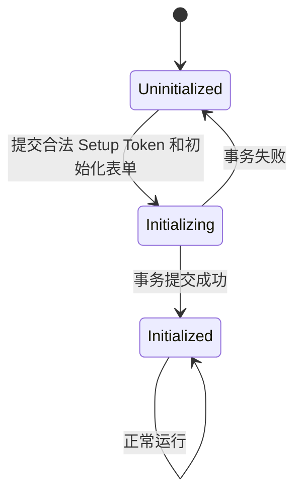

# 系统初始化与双层管理门户

## 1. 目标

Argus 第一次启动时没有任何用户和企业。系统通过一次性初始化流程让部署者设置平台超级管理员账号和密码。初始化完成后，平台超级管理员负责创建企业和对应企业管理员；企业管理员进入独立企业门户管理本企业。OpenSandbox 由 Helm 安装和配置，不进入 Setup 向导；其治理 API 在 M4 Agent/Sandbox 接入前补充。

平台超级管理员不是企业的“万能管理员”，其权限应保持最小化。

平台身份和企业身份第一版互斥：平台超级管理员不属于任何企业；企业用户必须且只能绑定一个企业。系统不提供同一用户跨企业 Membership、企业切换或平台身份切换为企业身份的能力。

前端固定分为三个界面：

1. 企业工作台：企业用户的 Chatbox、会话和模型选择。
2. 企业管理后台：企业管理员和被授权成员管理本企业模型、组织、资源、交互卡片与审计。
3. 平台超级管理员门户：M2 管理企业生命周期、企业管理员和平台审计；OpenSandbox 治理在 M4 接入。

企业工作台和企业管理后台共享企业 Session；平台门户使用独立平台 Session/Audience。任一入口发现身份域不匹配时必须拒绝进入并引导到正确门户，不能先渲染错误界面再依赖接口报错。

## 2. 系统状态

建议维护独立的 PlatformState：

```text
uninitialized
initializing
initialized
```

只有 `uninitialized` 状态可以访问初始化接口。初始化完成后，普通 HTTP 请求不能把系统重新切回未初始化状态。



## 3. Setup Token

如果初始化页面直接暴露在公网，第一个访问者可能抢占超级管理员。因此首次初始化需要一个部署侧生成的一次性 Setup Token。

M2 固定由 `argusctl` 生成 32 字节随机 Token，保存到独立 Kubernetes Secret，并设置 24 小时过期时间。Server 通过只读 Secret Volume 每次重新读取 Token 与过期时间，因此未初始化期间可以轮换而无需重启 Pod。

Setup Token 应具有：

- 高随机性。
- 短有效期。
- 单次使用。
- 只允许调用初始化接口。
- 不写应用日志、审计或错误详情；只向部署者调用终端显示一次。

初始化成功后 PlatformState 使该 Token 永久失去认证能力并关闭初始化接口；Secret 的后续清理由部署流程负责，Server 不需要写入其只读 Volume。

未初始化时可以执行 `argusctl setup-token rotate` 更新 Secret；初始化完成后该命令必须拒绝执行。

## 4. 初始化向导

建议步骤：

### 4.1 系统信息

- 平台显示名称。
- 默认语言和时区。
- 外部访问地址，用于门户跳转和后续受信回调地址。

### 4.2 超级管理员

- 登录名。
- 显示名称。
- 邮箱。
- 密码与确认密码。

密码至少要求：

- 长度不少于 12 位。
- 禁止常见弱密码。
- 使用 Argon2id 或等价强密码哈希。
- 密码明文不写日志、不进入审计详情。

### 4.3 初始化提交

初始化必须在一个数据库事务中完成：

1. 锁定 PlatformState。
2. 再次确认系统未初始化。
3. 校验 Setup Token。
4. 创建平台超级管理员。
5. 创建平台默认设置和审计根记录。
6. 将 PlatformState 更新为 `initialized`。
7. 永久关闭 Setup 接口并使 Setup Token 失效。

并发初始化请求只能有一个成功。

## 5. 超级管理员登录后界面

超级管理员门户使用独立 Audience 和路由，菜单严格限制为：

```text
平台管理
├── 企业管理
├── 企业管理员
├── 平台审计
└── 我的账号
```

M1 原型中的 Sandbox 页面在 M2 real 模式保持稳定不可用，不得读取 mock；M4 补齐治理 API 后再开放服务连接、镜像、Profile、配额和活动会话。

`我的账号` 在 M2 只用于修改自身密码和撤销 Session，不属于业务管理权限扩张。M8 已在同一账户边界加入 TOTP、恢复码和 Step-up。

超级管理员界面不出现：

- Chatbox 和企业会话。
- 企业 `AIModel` 配置和模型凭证。
- Connector、主机和 Kubernetes。
- Bastion Scope、Remote Access Session、远程终端和会话录像。
- 企业 Secret。
- 企业 交互卡片。
- 企业 Tool Result 和业务审计正文。
- 企业原始 Metrics、Logs、Traces 和 Collector 配置正文。

活动 Sandbox 页面只展示平台运行所需元数据，例如企业、Profile、资源占用和状态；默认不展示企业文件、命令内容和输出。

## 6. 企业创建

超级管理员创建企业时填写：

```json
{
  "name": "Example Corp",
  "code": "example-corp",
  "status": "active",
  "timezone": "Asia/Shanghai",
  "remark": ""
}
```

企业状态：

- `active`：正常使用。
- `suspended`：禁止企业用户登录和新任务执行，但保留数据。
- `disabled`：长期停用，仍不立即删除数据。

删除企业属于高危且难恢复操作，不建议第一版提供。先提供停用和数据保留策略。

创建企业时必须在同一事务或可恢复工作流中创建可重命名的默认 Department、内置 Role 模板和空的默认 DataScope 模板。第一版不创建 Default Project；Host 和 KubernetesCluster 通过用户标签归类，Conversation、Run 和 Automation 只归属企业并分别保存实际目标资源和授权快照。

企业状态必须由授权服务在所有入口统一执行，不能只在登录页面判断：

| 能力 | active | suspended | disabled |
| --- | --- | --- | --- |
| 企业用户新登录 | 允许 | 拒绝 | 拒绝 |
| 已登录 Session | 允许 | 立即撤销 | 立即撤销 |
| 新 Run/Tool/Action | 允许 | 拒绝 | 拒绝 |
| 未执行 Pending Action/Approval | 允许 | 失效 | 失效 |
| 正在执行的危险操作 | 正常 | 请求安全停止并审计；不可中断步骤继续到安全点 | 同 suspended |
| Connector 控制连接 | 允许 | 保持心跳但拒绝新命令 | 吊销设备凭证并断开 |
| 人工远程会话 | 允许 | 拒绝新会话并请求活动会话安全终止 | 立即吊销票据、终止会话并审计 |
| Telemetry 摄入 | 允许 | 默认继续短期摄入，按平台策略限额 | 拒绝新数据 |
| 历史数据查询 | 按权限 | 默认拒绝企业用户；平台不获得正文权限 | 拒绝 |
| 数据保留 | 套餐策略 | 保留 | 按停用保留策略 |

`suspended` 默认继续接收一段可配置宽限期的遥测，避免因商务或登录问题造成不可恢复监控缺口，但禁止企业用户查询；超过宽限期后 Ingest 按策略拒绝。平台超级管理员只能看到用量和健康元数据，不能借此读取业务正文。

## 7. 创建企业管理员

企业创建完成后，超级管理员至少创建一名 Enterprise Admin：

```json
{
  "enterprise_id": "ent-01",
  "username": "corp-admin",
  "display_name": "企业管理员",
  "email": "admin@example.com",
  "department_id": "default-department-id"
}
```

第一版只支持 24 小时临时密码，首次登录必须修改；不实现激活链接、邮件、SMTP 或重发邀请。临时密码只在创建或重置结果中显示一次，不进入 URL、日志、Query Cache 或 localStorage。

Enterprise 用户名全局大小写不敏感唯一。原因是企业登录只提交 `username + password`，不接受客户端 `enterprise_id`，因此服务端必须在认证前唯一定位企业身份。

初始企业管理员是新的 EnterpriseUser，直接固定绑定目标 `enterprise_id + department_id`，不能复用平台超级管理员身份。`enterprise_admin` 允许其建立企业 IAM、角色、DataScope 和授权，但不自动授予生产远程 Shell、ManagedAccount、Secret 原值或 AI 生产执行权限；需要操作生产资源时由企业管理员建立对应 RoleBinding、DataScope 和 RemoteAccessGrant，并记录审计。

超级管理员可以：

- 创建多名企业管理员。
- 禁用企业管理员。
- 重置为一次性临时密码。
- 查看临时密码/正常/禁用状态和最近登录时间。

超级管理员不能以企业管理员身份代登录，也不能看到企业管理员后续设置的模型密钥。

## 8. 企业管理员门户

企业用户登录固定企业门户，例如 `/app`。如果路由为了可读性包含企业 Code，服务端仍必须从已认证的 EnterpriseUser 获取唯一 `enterprise_id`，不能把 URL 参数作为企业切换能力。企业门户使用两种布局而不是在 Chatbox 外再叠一层完整管理侧栏：

- Chatbox 布局左侧只显示新建会话、搜索和会话历史，底部提供“进入管理后台”。
- 管理后台布局左侧显示确定性管理菜单，顶部提供“返回智能会话”。

第一阶段不提供“接入中心”和独立“可观测性”菜单。Connector、Remote Access 和 OpenTelemetry Collector 都在主机/Kubernetes 资源上下文中安装与管理。建议菜单：

```text
← 返回智能会话

资源
├── 主机
└── Kubernetes

执行治理
├── 任务记录
├── 访问申请
└── 待审批

企业设置
├── 用户与部门
├── 角色与资源范围
├── 远程访问授权
├── 访问策略
├── AI 设置
├── 交互卡片（自定义 / 内置）
├── Secret
└── 企业审计
```

主机页面提供“添加堡垒机”和“添加普通主机”。Connector 注册后自动创建/激活一个 Bastion Scope 分组框；经该堡垒机添加的内网主机显示在框内，未选择堡垒机的公网 Direct Host 显示在“独立主机”。堡垒机、成员和独立主机卡片均在详情中展示连接路径、远程登录和 Collector 状态。

Collector 不单独占用左侧菜单。未安装时在主机或 Kubernetes 详情显示安装按钮；安装后通过“概览、采集能力、数据推送、配置版本、运行状态”进入配置。Metrics/Logs/Traces 查询、告警和用量大屏后续再加入“可观测性”菜单。

任务记录和待审批必须使用不同路由和页面，不能像早期原型一样共同指向一个“自动化与审批”页面。组件展厅属于开发路由，不出现在生产企业菜单。

企业管理员可以创建自定义企业角色并下放部分管理能力。OpenSandbox 是 SaaS 平台底层资产，企业工作台和管理后台均不展示或查询 OpenSandbox 服务、镜像、Profile、配额、活动会话和用量；相关管理与观测只存在于平台超级管理员门户。

进入 Chatbox 只恢复固定企业身份、功能权限和 DataScope，不提供 Project 选择器。Conversation 和 Run 保存 `enterprise_id`；具体 ToolCall、Run、PendingAction 和 Execution 保存目标资源引用和授权范围快照。模型或 Card 不能修改身份域或扩大 DataScope。

## 9. 固定企业上下文和资源范围

EnterpriseUser 登录后只有一个固定企业上下文。服务端 Session 和 Access Token 必须包含该用户唯一的企业 Audience；客户端提交的 `enterprise_id`、URL 企业 Code 或资源 ID 只是请求参数，任何查询都必须再次验证资源真实归属。

平台 Session 和企业 Session 必须使用不同 Audience、路由和 Cookie/Token 约束。平台身份不能访问企业 API，企业身份不能访问平台 API；禁止通过 `enterprise_id = null`、指定其他企业 ID 或修改 URL 切换身份域。

企业内没有 Project 切换。用户可以在资源列表中按标签筛选或保存视图，但筛选条件不能扩大服务端计算的 DataScope。RoleBinding、DataScope、RemoteAccessGrant 或授权敏感标签变化后，客户端必须失效相关缓存和 Binding，SSE/WebSocket/Live Tail 在恢复与周期检查时重新鉴权。

API Key 和 ServiceAccount 固定绑定一个 `enterprise_id`、允许 Tool 和 DataScope，不支持运行时扩大范围。任何资源 ID 查询都必须验证资源真实 `enterprise_id` 并重新计算当前授权，不能只信任 Token、标签或客户端参数。

### 9.1 认证基线

M2 提供本地账号认证，并预留 OIDC/SAML Adapter：

- 密码使用 Argon2id，登录、修改密码和恢复流程统一限流。
- M2 不实现 MFA，只达到 Evaluation 身份闭环；M8 本地加固已实现平台超级管理员 TOTP、恢复码和 Step-up，但 Production Profile 仍因 HA、出口、容量和灾备清单保持阻断。
- Session 使用 256 位随机 opaque Token，数据库只保存 SHA-256 Hash；空闲超时 30 分钟，绝对有效期 12 小时。
- Platform 与 Enterprise 使用独立 Host-only Cookie；Production 使用 `Secure + HttpOnly + SameSite=Strict`。所有已认证变更同时执行 Session 绑定 CSRF Token 和 Origin 校验。
- 用户禁用、密码重置、企业停用时在 PostgreSQL 写入撤销事实并递增相关 AuthorizationVersion；Redis 只传播快速失效通知。
- Redis 不可用时 Server 保持 degraded：已有 Session 继续由 PostgreSQL 校验，新登录因为限流依赖不可用而 fail closed。
- WebSocket/SSE/Live Tail 建立、恢复和周期性检查时重新校验 Session、固定企业、DataScope 和 AuthorizationVersion。
- Service Account/API Key 只显示一次原值，数据库保存哈希，支持到期、轮换、撤销、Tool/DataScope Scope 和最后使用审计；Key 固定绑定创建时的 ServiceAccount AuthorizationVersion。

## 10. 账号恢复

单一超级管理员存在不可恢复风险。第一版即使只初始化一个超级管理员，也应提供部署者控制的离线恢复命令：

```text
argus admin reset-password
```

该命令只允许在服务端主机执行，要求访问部署密钥或数据库主密钥，且写入高优先级平台审计。它不创建企业权限，也不能导出企业数据。

后续可以增加多个平台超级管理员或外部 IdP，但不应通过企业管理界面隐式产生平台管理员。

## 11. 审计域

平台审计和企业审计分离：

- 平台审计：初始化、企业生命周期、企业管理员生命周期、Sandbox Profile、镜像、配额和活动会话终止。
- 企业审计：Department、用户权限、RoleBinding、DataScope、资源标签、RemoteAccessGrant、ManagedAccount、Connector、资源、OpenTelemetry 安装与配置、监控查询/导出、Chatbox、MCP Tool、Card Action、Break Glass 和 Secret 使用。

超级管理员默认只能查看平台审计；企业管理员只能查看本企业审计。企业审计读取按角色、DataScope 和字段规则裁剪；`security_auditor` 可以查看被授权的企业审计正文，但不能因此获得远程操作、监控敏感字段或 Secret 权限。
