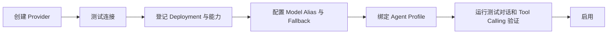
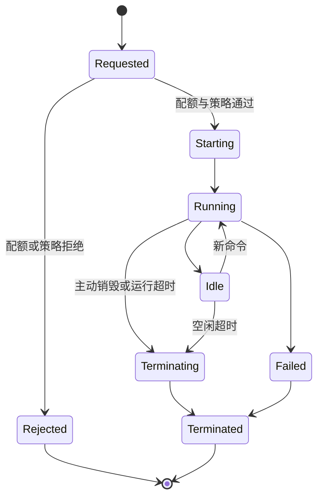

# 模型与 OpenSandbox 管理

## 1. 管理归属

模型和 OpenSandbox 采用不同管理归属：

| 配置 | 平台超级管理员 | 企业管理员 | Model Agent |
| --- | --- | --- | --- |
| OpenSandbox 服务连接 | 管理 | 不可修改 | 不可见凭证 |
| Sandbox 镜像 | 管理和批准 | 不可修改 | 不可直接指定 |
| Sandbox Profile | 管理 | 查看可用项 | 在允许范围内选择 |
| 企业 Sandbox 配额 | 设置 | 查看用量 | 受配额限制 |
| 活动 Sandbox | 查看元数据、终止 | 查看本企业元数据 | 管理自己创建的会话 |
| 模型供应商 | 不可访问企业配置 | 管理本企业 | 不可修改 |
| 模型凭证 | 不可访问 | 管理本企业 | 只通过 Model Alias 使用 |
| 模型部署和 Alias | 不可访问 | 管理本企业 | 读取运行时投影 |
| Agent Profile | 不可访问 | 管理本企业 | 按分配的 Profile 运行 |

## 2. 企业模型管理对象

### 2.1 Model Provider

表示企业连接的模型供应商：

```json
{
  "id": "provider-01",
  "enterprise_id": "ent-01",
  "name": "production-openai",
  "type": "openai",
  "base_url": "https://api.openai.com/v1",
  "credential_ref": "secret-model-provider-01",
  "enabled": true
}
```

第一版可支持 OpenAI、Azure OpenAI、Anthropic、Google、AWS Bedrock、OpenAI Compatible 和本地模型服务。供应商凭证存入企业 Secret Vault；平台超级管理员不能查看。

Provider `base_url`、代理和自定义 CA 是服务端出网能力，必须经过专用 Model Egress Policy：禁止访问云 Metadata、Loopback、Link-local、集群 Service CIDR、平台管理网和未批准私网；解析 DNS 后和每次重定向后都重新校验目标 IP，限制端口、响应大小和重定向次数。私有化部署需要访问企业本地模型时，由管理员显式配置允许的网络范围，不能默认放开任意地址。

界面操作：

- 新增、编辑、启用和停用。
- 测试连通性。
- 查看最近健康状态。
- 配置代理或自定义 CA，受企业和平台网络策略限制。

### 2.2 Model Deployment

表示实际可调用的模型端点：

```json
{
  "id": "deployment-01",
  "provider_id": "provider-01",
  "name": "primary-reasoning-model",
  "model_id": "provider-model-id",
  "capabilities": {
    "tool_calling": true,
    "structured_output": true,
    "vision": true,
    "reasoning": true,
    "embedding": false
  },
  "limits": {
    "context_window": 200000,
    "max_output_tokens": 16000,
    "rpm": 60,
    "tpm": 1000000,
    "max_concurrency": 10
  },
  "pricing": {
    "currency": "USD",
    "input_per_million": 0,
    "output_per_million": 0
  }
}
```

Capabilities 由管理员配置和平台探测共同维护。Agent 在选择模型前必须检查 Tool Calling、结构化输出、视觉和上下文能力。

### 2.3 Model Alias

业务不直接引用供应商模型 ID，而是引用企业逻辑别名：

```text
default-chat
planner
presentation
code-generation
fast-classifier
summarizer
embedding
```

```json
{
  "alias": "presentation",
  "primary_deployment_id": "deployment-fast-01",
  "fallback_deployment_ids": [
    "deployment-fast-02"
  ],
  "timeout_seconds": 60
}
```

切换实际模型时只修改 Alias，不修改 Agent Profile 和业务代码。

Provider、Deployment、Alias、Agent Profile 和 Routing Policy 的每次修改都创建不可变 Revision。Run 启动时固定 Agent Profile/Alias Revision；每次模型调用记录实际解析的 Deployment Revision。配置更新只影响后续调用是否由企业策略明确决定，默认不改变正在执行 Run 的能力和预算语义。

### 2.4 Agent Profile

Agent Profile 将模型、Tool、Sandbox 和预算组合起来：

```json
{
  "id": "main-aiops-agent",
  "model_alias": "planner",
  "allowed_tools": [
    "host.*",
    "kubernetes.*",
    "card.render",
    "sandbox.*"
  ],
  "allowed_sandbox_profiles": [
    "shell-basic",
    "python-analysis"
  ],
  "max_tool_rounds": 20,
  "max_sub_agents": 3,
  "max_run_seconds": 900,
  "max_model_cost": 2.0,
  "require_confirmation_above_risk": "write"
}
```

建议内置但允许企业修改副本：

- Main AIOps Agent。
- Presentation Agent。
- Code/Sandbox Agent。
- Summarizer Agent。
- 后续的日志、Kubernetes、主机诊断 Agent。

### 2.5 Routing Policy

第一版采用确定性路由：

```text
Agent Profile
→ Model Alias
→ Primary Deployment
→ 按顺序 Fallback
```

路由判断可以考虑：

- 能力是否匹配。
- Deployment 是否健康。
- 企业并发、RPM、TPM 和预算。
- 数据区域和敏感等级。
- 任务是否包含图片或大上下文。

不建议第一版让另一个模型自由选择供应商端点；先使用可解释规则。

所有供应商通过统一 Model Adapter 暴露规范化能力和错误：Tool Calling、结构化输出、流式、图像、上下文限制、取消、超时和用量。Deployment 启用前执行兼容测试，不能只相信管理员手工填写的 capabilities。

## 3. 企业模型管理界面

建议配置流程：



界面必须提供：

- 连通性测试，但不回显 API Key。
- Tool Calling 和 JSON Schema 输出测试。
- 模型健康和最近错误。
- Token、请求、费用和延迟统计。
- 日、月预算和告警阈值。
- 停用前影响分析，例如哪些 Agent Profile 正在引用。
- 配置版本和变更审计。

## 4. 模型运行时治理

每次模型调用记录：

```text
enterprise_id
conversation_id / run_id
agent_profile_id
model_alias
resolved_deployment_id
input/output token
estimated cost
latency
fallback reason
tool call count
result status
```

默认不在用量日志保存完整 Prompt 和响应。需要诊断采样时，应由企业显式启用、脱敏并设置保留期。

预算达到阈值时可以：

- 告警但继续。
- 切换到低成本 Alias。
- 禁止新长任务。
- 阻止超过单 Run 成本上限的 Agent 继续执行。

并发调用使用预算预留：发起请求前按最大允许输出估算并原子预留额度，完成后按实际用量结算和释放差额。Redis 可承担短期并发/预算计数，PostgreSQL 保存预算策略和最终账本；Redis 故障时采用保守拒绝或较低本地上限，不能无限放行。

## 5. OpenSandbox 平台管理

OpenSandbox 是平台基础设施，由平台超级管理员管理。企业管理员只能看到本企业可用 Profile、配额和使用情况。

平台管理对象：

- SandboxBackend：OpenSandbox 服务连接和健康。
- SandboxImage：平台批准的不可变镜像。
- SandboxProfile：运行环境和安全策略。
- SandboxQuota：企业资源与并发配额。
- SandboxSession：一次临时执行环境。
- SandboxArtifact：允许带出沙箱的文件。

## 6. SandboxBackend

连接设置示例：

```json
{
  "name": "primary-opensandbox",
  "endpoint": "https://sandbox.internal",
  "credential_ref": "platform-secret-sandbox-01",
  "tls_verify": true,
  "enabled": true,
  "default_storage": "sandbox-artifacts"
}
```

超级管理员可以测试连接、查看容量和停用后端。停用前必须展示正在运行的 Session 和受影响企业。

## 7. SandboxImage

镜像必须使用不可变 Digest：

```json
{
  "id": "image-python-analysis",
  "name": "Python Analysis",
  "reference": "registry.argus.local/sandbox/python-data@sha256:...",
  "languages": [
    {"name": "python", "version": "3.13"}
  ],
  "scan_status": "passed",
  "signature_status": "verified",
  "enabled": true
}
```

第一版只允许平台镜像。镜像发布前需要：

- 漏洞扫描。
- 签名验证。
- 依赖清单/SBOM。
- 禁止 root 默认用户。
- 清理构建密钥。
- 固定 Digest。

## 8. Sandbox Profile

语言只是 Profile 的元数据，Profile 才是 AI 可以选择的执行单位：

```json
{
  "id": "python-analysis",
  "name": "Python 数据分析",
  "description": "用于解析日志、CSV、JSON 和生成图表",
  "image_id": "image-python-analysis",
  "resources": {
    "cpu": 1,
    "memory_mb": 2048,
    "disk_mb": 4096,
    "pids": 128
  },
  "timeouts": {
    "command_seconds": 600,
    "idle_seconds": 300,
    "lifetime_seconds": 1800
  },
  "network": {
    "mode": "deny_all",
    "allowed_domains": []
  },
  "capabilities": {
    "file_upload": true,
    "artifact_download": true,
    "secret_injection": false,
    "gpu": false
  }
}
```

建议内置：

| Profile | 主要用途 | 默认网络 |
| --- | --- | --- |
| shell-basic | 文本、压缩包和简单脚本 | 禁止 |
| python-analysis | 日志、JSON、CSV、数据分析 | 禁止 |
| node-card-builder | Card Skill 生成和验证 | 仅内部依赖仓库 |
| go-build | Go 代码生成、构建和测试 | 受限 |

## 9. 企业 Sandbox 配额

超级管理员为企业分配：

```json
{
  "enterprise_id": "ent-01",
  "allowed_profiles": [
    "shell-basic",
    "python-analysis",
    "node-card-builder"
  ],
  "max_concurrent_sessions": 5,
  "max_daily_session_minutes": 1000,
  "max_daily_cpu_minutes": 2000,
  "max_artifact_storage_mb": 10240,
  "artifact_retention_days": 7
}
```

企业管理员只能查看配额和用量。如果需要调整，通过平台运营流程由超级管理员修改，不能由 Model Agent 自动提升。

## 10. AI 使用 Sandbox

AI 不传任意镜像和资源，只选择可用 Profile：

```json
{
  "profile_id": "python-analysis",
  "purpose": "分析用户上传的 Nginx 日志",
  "run_id": "run-123"
}
```

建议 MCP Tool：

```text
sandbox.profile.list
sandbox.session.create
sandbox.session.execute
sandbox.session.upload
sandbox.session.download_artifact
sandbox.session.inspect
sandbox.session.destroy
```

平台管理 Tool 不暴露给普通 Model Agent。AI 不能：

- 创建或修改 Sandbox Profile。
- 指定未批准镜像。
- 提高 CPU、内存、磁盘或超时。
- 扩大网络白名单。
- 注入任意生产 Secret。

Sandbox Artifact 输入输出必须经过类型识别、大小和解压比限制、恶意文件扫描、路径穿越检查、内容哈希和保留策略。下载只返回 `artifact_ref`，不允许 Sandbox 选择任意宿主或对象存储路径。允许域名出网通过 Egress Proxy 执行 DNS/IP/重定向复检，不能只把 `allowed_domains` 写入容器环境变量。

## 11. Session 生命周期



每个 Session 绑定 enterprise_id、user_id、conversation_id、run_id、Agent Profile 和 Sandbox Profile。管理员终止 Session 时只操作运行状态，不默认读取其中内容。

## 12. Sandbox 与生产环境边界

默认策略：

```text
无生产凭证
无宿主文件系统
无外部网络
无 Connector 直连
无任意 MCP Tool 调用
```

脚本实际在生产环境执行时走：

```text
Sandbox 生成和测试脚本
→ Model Agent 形成执行计划
→ Preview Tool
→ 用户确认
→ Connector 执行 Tool
```

Sandbox 只负责不可信计算环境，不能绕过 Argus 的权限、确认和 Connector 执行链路。

## 13. 第一版范围

模型管理：

- 企业 Model Provider、Deployment、Alias 和 Agent Profile。
- 主模型与顺序 Fallback。
- 连通性和 Tool Calling 测试。
- Token、成本、延迟和错误统计。
- 企业预算和并发限制。

OpenSandbox：

- 一个平台 OpenSandbox Backend。
- 3 至 4 个平台批准 Profile。
- 镜像 Digest 和基础安全扫描。
- 企业并发、时长和存储配额。
- AI 自动创建和销毁 Session。
- 超级管理员查看元数据并终止异常 Session。
- 企业管理员查看本企业用量。

第一版不支持企业上传任意镜像、AI 创建 Profile、Sandbox 直接使用生产 Secret 或直接连接生产主机/Kubernetes。

Kubernetes 完整安装默认同时部署 OpenSandbox 服务和隔离 Runtime，并自动登记平台 `SandboxBackend`；受限集群也可以改用外部 Backend。具体命名空间、网络策略、安装顺序和验证流程见[服务组件与 Kubernetes 一键部署](./10-service-components-and-kubernetes-deployment.md)。
