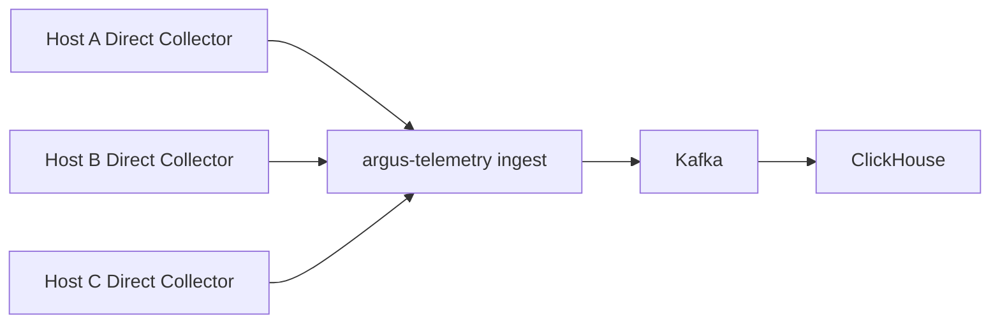
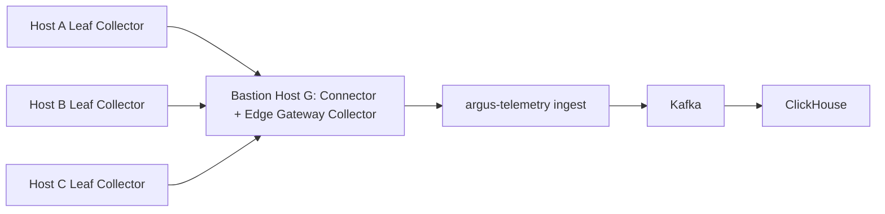
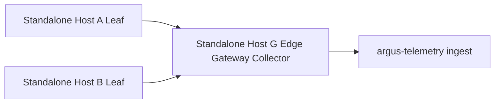
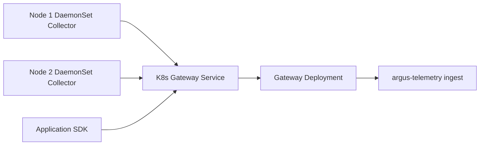

# OpenTelemetry 接入与监控数据链路

## 1. 目标与范围

### M10 查询语义

遥测查询运行在一个 Query 进程内，但由三个独立 Engine 执行：Prometheus PromQL Engine、Argus KQL Engine 和 SkyWalking GraphQL Engine。PromQL 通过 `storage.Queryable` 适配 ClickHouse；KQL 经过白名单 Parser/Pipeline 编译；SkyWalking Trace 使用固定 SDL `internal/telemetry/queryengine/skywalking/schema/trace.graphql` 和 schema-first Resolver。查询文本不进入 SQL，也不再经过统一 Query IR。Metrics 的 Series/Samples、Logs 的 stream labels、Traces 的 Summary/Edges Schema v3 由 `argus-telemetry writer` 规范化写入。

三种外部协议保留自身结果模型：PromQL 使用 Prometheus `status/data.resultType/data.result/warnings` 并附加 `argus_meta`，KQL 使用 `argus.kql_result/v1`，Trace GraphQL 使用 `data/errors/extensions.argus`。旧统一 Query JSON Schema 和 `argus.telemetry_result/v2` 已删除。PromQL 预算同时限制 Samples 与 Series；`MaxSeries` 默认 100,000、硬上限 1,000,000，并由 HTTP、gRPC、MCP 和 ClickHouse Adapter 共同执行。

资源详情同时提供 Query Builder 与 DSL 编辑器。Builder 只负责生成相同语言文本，不绕过服务端 Parser、权限、预算和结果投影。经典 Histogram 的 bucket/count/sum 已转换为 Prometheus 可查询序列；Native Histogram 和 Summary 已由真实 ClickHouse 集成测试及 Kubernetes E2E 覆盖。

Argus 根据主机已有连接路径一键安装并管理 OpenTelemetry Collector：Bastion Scope 成员经所属堡垒机 Connector 执行，公网独立主机经受控 Direct Executor 执行，Kubernetes 经其既定 API 连接路径执行。Collector 主动向 Argus 推送 Metrics、Logs 和 Traces，目标环境不需要公网入站端口。

堡垒机范围内只有堡垒机本机可以启用 Edge Gateway Collector，成员主机可以选择直接推送 Argus，或推送到所属堡垒机上的 Gateway Collector。堡垒机以外的独立主机第一批只支持直接推送；独立 Telemetry Group 保留为后续能力，且不能选择任何 Bastion Scope 内的堡垒机或成员作为跨范围上游。

这个设计采用 OpenTelemetry Agent + Gateway 模式，不额外开发重复的遥测 Pusher。堡垒机上的 `argus-connector` 负责安装、配置和修复，`argus-otelcol` 负责 OTLP 接收、队列和推送；遥测不进入 Connector 控制或远程会话通道。

第一版范围：

- 主机 Collector 安装、状态、配置、升级、修复和卸载。
- Direct、Leaf、Edge Gateway 三种主机角色。
- `direct_argus` 与 Bastion Scope 约束的成员 → 堡垒机 `bastion_gateway` 路由；独立主机 Telemetry Group 延后。
- Kubernetes DaemonSet + Gateway Deployment。
- Connector Artifact Tunnel。
- `argus-telemetry ingest` → Kafka → `argus-telemetry writer` → ClickHouse。
- Host/Kubernetes 详情中的 Collector 安装、采集能力、推送配置和 Metrics/Logs/Traces 有界查询；告警大屏延后。

截至 2026-08-22，M7 已完成 Linux arm64 Host 与 Kubernetes Evaluation 闭环。M10 已完成单进程 Query、同步租户 Schema lifecycle、PromQL/KQL/SkyWalking GraphQL、真实 ClickHouse 差分、Schema 漂移门禁和最终 Kubernetes E2E；三种独立 wire format、固定 SDL 和 `MaxSeries` 收口后的成功运行号为 `20260822063330-17805`，结束后三个临时 Namespace、相关 PVC 和 E2E Lease 零残留。完整 SkyWalking OAP 和完整 KQL 兼容不在本次范围。

Kubernetes 节点无法拉取镜像时，第一版只检测 Runtime 并提供离线导入提示，不实现镜像分发。

## 2. Collector 角色

| 角色 | 数据来源 | 上游 | 是否需要访问 Argus |
| --- | --- | --- | --- |
| Direct Collector | 本机/本应用 | `argus-telemetry ingest` | 是 |
| Leaf Collector | 本机/本应用 | Edge Gateway Collector | 否 |
| Bastion Edge Gateway Collector | 同一 Bastion Scope 的成员 Leaf OTLP 和本机数据 | `argus-telemetry ingest` | 是 |
| Standalone Edge Gateway Collector | 同一 Telemetry Group 的独立主机 Leaf OTLP 和本机数据 | `argus-telemetry ingest` | 是 |
| K8s DaemonSet Collector | 节点、容器和 Pod | K8s Gateway Service | 否 |
| K8s Gateway Collector | DaemonSet、应用 SDK、集群级数据 | `argus-telemetry ingest` | 是 |

所谓 Pusher 是 Collector 中的 OTLP Exporter Pipeline，不是独立 Argus 进程。

## 3. 网络拓扑

### 3.1 Direct 模式



适合每台主机都能访问 Argus 的网络。

### 3.2 Bastion Scope Edge Gateway 模式



主机 G 是这些成员所属 Bastion Scope 的根堡垒机。Connector 负责安装和控制，Edge Gateway Collector 负责接收内网 OTLP、持久队列和统一出站。下游身份管线不得跨 Collector batch；只有同一可信主体内的数据才可聚合，避免不同 Leaf 身份被合并为一个 OTLP 请求。它仍然采集本机数据，但不能覆盖 Leaf 的 `host.id`、`host.name`、`service.name` 和 Argus Resource ID。

### 3.3 独立主机 Edge Gateway 模式



独立 Gateway 候选必须是不属于任何 Bastion Scope、可由 Direct Executor 管理、已显式启用 Gateway Profile 且路由测试成功的主机。普通独立 Collector 不能仅因已安装就被其他主机选为上游。

### 3.4 Kubernetes 模式



DaemonSet 采集节点指标和容器日志，Gateway Deployment 采集集群级资源并统一推送。应用 SDK 也可以直接向集群内部 Gateway Service 发送 OTLP。

## 4. Bastion Scope 与 Telemetry Group

Bastion Scope 已经表达堡垒机与内网成员的可信网络边界，因此这类成员不再创建一个平行的 Telemetry Group。它们的 Telemetry Route 只记录 `direct_argus` 或 `bastion_gateway`，并由服务端确认 Gateway Collector 正是所属 Scope 的堡垒机。

Telemetry Group 只用于堡垒机范围之外的独立主机组网，描述一组经验证互通的独立主机、独立 Edge Gateway 和采集 Profile。该模型保留为后续能力；第一批遥测闭环只实现 `direct_argus` 和 `bastion_gateway`：

```json
{
  "id": "tg-01",
  "enterprise_id": "ent-01",
  "name": "公网业务采集组",
  "mode": "edge_gateway",
  "gateway_resource_id": "public-otel-gateway-01",
  "fallback_gateway_resource_ids": [],
  "member_resource_ids": [
    "host-01",
    "host-02",
    "host-03"
  ],
  "collector_distribution": "argus-otelcol",
  "collector_version": "supported-version",
  "collection_profiles": [
    "host-basic",
    "system-logs"
  ]
}
```

主要对象：

- TelemetryGroup：网络与路由拓扑。
- CollectorInstance：某个资源上的 Collector 实例和角色。
- CollectorDistributionVersion：受支持二进制、组件清单和 Artifact。
- CollectionProfile：可启用的采集能力及配置模板。
- CollectorConfigRevision：期望配置、有效配置、哈希和状态。
- TelemetryCredential：Leaf/Gateway/Argus 身份凭证。
- TelemetryRoute：上游端点、主备和连通性状态。

后续启用 Telemetry Group 时可以先支持单 Edge Gateway，但数据模型预留 `fallback_gateway_resource_ids`。Bastion Scope 与 Telemetry Group 不能交叉包含同一 Host；独立主机一旦注册为堡垒机，必须先 Preview 并解除其独立 Telemetry Group 路由。

### 4.1 Kubernetes Node 与 Host 绑定

同一台物理机器可能既以 Host 被 Argus 管理，又作为 Kubernetes Node 出现在集群中。安装 Kubernetes DaemonSet 前必须尝试建立 `KubernetesNodeHostBinding`，不能只比较名称或当前 IP：

```text
KubernetesNodeHostBinding
├── enterprise_id
├── kubernetes_cluster_id / node_uid
├── host_id
├── matched_by
├── evidence_hash
├── confidence
├── verified_at
└── status = proposed | verified | rejected | stale
```

自动匹配证据按可信度从高到低使用：

1. Kubernetes Node `systemUUID`。
2. 云厂商 `providerID` 与 Host 云资源身份。
3. OS `machine-id` 的受信摘要。
4. Collector Resource Detection 产生的稳定 `host.id`。
5. 经连接路径验证的 Node InternalIP/ExternalIP。
6. 主机名只作为弱提示，不足以自动确认。

高可信唯一匹配可以自动标记为 `verified`；多候选、只有 IP/名称或证据发生变化时进入人工确认。绑定变化会影响采集归属，必须展示 Preview、受影响 Profile 和可能重复/中断的信号。

人工确认后的 `evidence_hash` 只绑定 Node UID、Node Name、Provider ID、受信 Machine ID 和 System UUID 等稳定强身份。InternalIP/ExternalIP 完整集合仍保存在证据中并参与 Host 候选匹配，但不进入确认哈希，避免节点网络短暂出现或消失 IPv4/IPv6 地址时错误撤销 Binding；任一强身份变化仍将 Binding 标记为 `stale`，并使关联 Claim/操作重新 Preview。

### 4.2 Collection Claim 与共存规则

Host Collector 和 Kubernetes DaemonSet Collector 技术上允许同时存在。限制对象不是“Collector 进程数量”，而是同一物理资源上的采集责任。每个 Collection Profile 在保存前展开为一个或多个 `CollectionClaim`：

```text
CollectionClaim
├── enterprise_id
├── physical_resource_ref
├── collector_instance_id
├── claim_type
├── selector / signal
├── profile_id / config_revision
├── ownership = primary | supplemental | migration
├── expires_at（migration 必填）
└── status
```

第一版至少识别：

```text
host.system.metrics
host.system.logs
host.process.metrics
docker.container.metrics
k8s.node.metrics
k8s.container.logs
k8s.cluster.metrics
application.otlp.traces
database.postgresql.metrics
database.mysql.metrics
middleware.redis.metrics
```

同一 `physical_resource_ref + claim_type + selector` 默认只能有一个 `primary`。推荐责任划分为：

- Kubernetes DaemonSet 负责 Node、Kubelet、容器指标和 Kubernetes 容器日志。
- Kubernetes Gateway 负责集群级对象、应用 OTLP 接收和集中处理。
- Host Collector 只保留 OS 审计日志、DaemonSet 无权读取的受控文件、节点外数据库/中间件和其他不重叠 Profile。
- 如果只需要 Kubernetes 标准能力，已绑定 Node 上可以不安装 Host Collector，或关闭其冲突 Profile；不能因 Host Collector 已存在就笼统禁止 DaemonSet。

安装或配置 Preview 必须逐节点显示 `无冲突`、`将接管`、`需要关闭 Host Profile`、`节点未绑定` 和 `临时重复`。迁移/蓝绿期间可以短时允许两个 Collector 持有同一 Claim，但必须指定主实例、过期时间、回退计划并明确提示下游可能出现重复；到期后自动阻止继续收敛而不是永久共存。

## 5. 管理界面

OTLP 收集器不作为企业左侧一级菜单，也不以“可观测性大屏”作为第一阶段入口。主机、堡垒机和 Kubernetes 列表直接展示收集器状态：“未安装”直接打开安装界面，“监控中”直接进入对应资源详情的收集器区域。安装、配置和状态仍归属具体资源。

### 5.1 主机详情

未安装时显示：

```text
OTLP 收集器
状态：未安装
执行路径：北京生产网关 → gw-bj-01 → web-01
[安装 OTLP 收集器]
```

独立公网主机显示 `Argus Direct Executor → public-web-01`。安装完成后显示状态、版本、角色、Desired/Effective Revision、启用的 Collection Profile、Telemetry Route、最后成功发送和升级/修复/卸载操作。

OTLP 收集器详情使用：

```text
概览 | 采集能力 | 数据推送 | 配置版本 | 运行状态
```

“采集能力”以卡片和草稿开关配置 `host-basic`、系统日志、文件日志、Docker、Prometheus、应用 OTLP 接收等 Collection Profile。开关不立即生效；保存必须执行 Schema 校验、配置 Diff、Preview/Confirm/Commit、目标版本配置校验、重启或热加载、健康检查和失败回滚。当前 Distribution 缺少组件时先引导升级，不能动态下载未经批准的插件。

### 5.2 数据推送选择矩阵

| 源主机 | 直接 Argus | 所属堡垒机 Gateway | 其他 Bastion Scope | 独立 Gateway |
| --- | ---: | ---: | ---: | ---: |
| Bastion Scope 成员 | 允许 | 允许 | 禁止 | 禁止 |
| 堡垒机本机 | 允许；Gateway Pipeline 同时可接收成员 | 不作为自己的代理上游 | 允许选择其他已激活堡垒机 | 禁止 |
| 公网独立主机 | 允许 | 禁止 | 禁止 | 允许 |
| 独立 Gateway | 允许 | 禁止 | 禁止 | 按 Telemetry Group 策略 |

服务端强制执行矩阵，UI 只展示合格候选。第一版不允许用户手工填写任意 OTLP 地址：

- Bastion Scope 成员选择 `direct_argus`，或选择所属堡垒机上已经启用 Gateway Profile 的 Collector。
- 堡垒机本机选择 `direct_argus`，或选择同企业内另一个已激活堡垒机作为上报代理；不得选择自身，保存前必须通过路由测试。
- 堡垒机上的普通 Collector 默认只采集本机；启用 OTLP Listener、持久队列、Leaf mTLS 和 Gateway Pipeline 后才成为成员候选。
- 独立主机只能选择同一企业、不属于任何 Bastion Scope、已经显式加入 Telemetry Group、启用 Gateway Profile 且路由测试成功的独立 Collector。
- 连接路径可选不代表实际可达；保存前必须从源 Collector 所在主机执行路由测试。

### 5.3 Edge Gateway 详情

Gateway 详情显示下游 Leaf、最后上报、接收/发送/丢弃速率、持久队列、到 Argus 的连接、CPU/内存/磁盘/带宽压力和单点风险。堡垒机卡片同时展示 Connector 与 Collector Gateway 状态，但不能把两者合成同一进程状态。

### 5.4 Kubernetes 详情

Kubernetes 集群列表直接展示 OTLP 收集器状态，并提供与主机相同的快捷交互。集群详情提供 DaemonSet + Gateway Deployment 安装入口；安装向导先发现 Node 与 Host 的绑定，再按 Collection Claim 展示冲突矩阵和推荐责任划分，用户不能只看到“已经安装另一份 Collector”而不知道具体重叠了哪些数据。

安装后显示就绪副本、镜像版本/Digest、Namespace、ServiceAccount、RBAC、Node/Host 绑定覆盖率、Claim 冲突、节点/日志/集群/应用 OTLP Profile 和到 Argus 的出口状态。集群内部 Gateway 不受主机 Bastion Scope 推送矩阵约束。

管理界面和 Chatbox 调用同一 Tool/领域服务，只是 `origin` 分别为 `admin_ui` 和 `model_agent`。Metrics/Logs/Traces 查询、告警和摄入用量大屏在后续可观测性阶段提供，不阻塞 Collector 安装与配置界面。

## 6. Tool 设计

```text
telemetry.host.install.preview
telemetry.host.install.commit

telemetry.kubernetes.install.preview
telemetry.kubernetes.install.commit

telemetry.group.create.preview
telemetry.group.create.commit
telemetry.group.update.preview
telemetry.group.update.commit

telemetry.gateway.enable.preview
telemetry.gateway.enable.commit
telemetry.member.attach.preview
telemetry.member.attach.commit
telemetry.route.test

telemetry.node_host_binding.list
telemetry.node_host_binding.confirm.preview
telemetry.node_host_binding.confirm.commit
telemetry.collection_claim.list
telemetry.collection_claim.conflicts

telemetry.collector.config.preview
telemetry.collector.config.commit
telemetry.collector.upgrade.preview
telemetry.collector.upgrade.commit
telemetry.collector.status
telemetry.collector.repair.preview
telemetry.collector.repair.commit
telemetry.collector.uninstall.preview
telemetry.collector.uninstall.commit

pending_action.cancel
```

安装、升级、组网、配置、修复、推送路由、Node/Host 绑定确认和卸载属于写操作，全部成对提供 `.preview/.commit` 并使用统一 `pending_action.cancel`。状态、Claim 冲突查询和路由测试属于读取/诊断操作。所有 Preview 内部返回固定 `_meta.argus__token`，公开投影只包含预览和 `action_ref`；Commit 只接受服务端私有 Token。`telemetry.member.attach` 只用于独立 Telemetry Group；Bastion Scope 成员改用服务端校验的 `bastion_gateway` Route，不能跨 Scope attach。

## 7. 主机安装 Preview

Preview 阶段探测：

- OS、CPU 架构、服务管理器和运行用户。
- 已安装版本、配置和服务状态。
- 目标版本支持的组件。
- 磁盘、内存、端口和权限。
- Direct/Leaf/Gateway 路由可达性。
- 直接下载或 Connector Artifact Tunnel。
- Host 的 `connection_mode`、完整安装执行路径和 Direct Executor/Connector 前置状态。
- 将要创建/修改的文件、服务和防火墙规则。
- 配置校验、健康检查和回滚计划。

示例：

```json
{
  "target": {
    "type": "host",
    "id": "host-01",
    "os": "linux",
    "arch": "amd64"
  },
  "current": {
    "installed": false
  },
  "desired": {
    "distribution": "argus-otelcol",
    "version": "supported-version",
    "role": "leaf",
    "execution_path": "bastion_scope:bs-01/connector:conn-01/ssh",
    "profiles": ["host-basic"],
    "upstream": "10.0.0.10:4317",
    "install_mode": "connector_artifact_tunnel"
  },
  "changes": [
    "安装 Collector",
    "注册 systemd 服务",
    "创建本地持久队列目录",
    "写入 mTLS 凭证和 Collector 配置"
  ],
  "pending_action": {
    "action_ref": "pa-...",
    "expires_at": "..."
  }
}
```

Commit 使用服务端保存的计划执行，不能让 AI 在确认后更改版本、Artifact、远程路径和脚本。

Telemetry Group/Gateway 变更采用分阶段执行计划，不能一次性同时覆盖所有 Leaf：

```text
准备新 Gateway Listener
→ 验证新 Gateway 到 Argus
→ 分批切换 Leaf 并逐台验证最后数据时间
→ 旧 Gateway Drain 持久队列
→ 完成拓扑切换
```

任一批次失败时停止后续切换，未切换成员继续使用旧 Gateway，已切换成员按计划回滚或保持并明确标为部分完成。Preview 必须展示批次、预计中断、队列容量和回滚边界。

## 8. Artifact Registry 与 Connector Tunnel

Collector Artifact 发布清单包含：

```text
Distribution 名称
版本
OS
CPU 架构
Artifact URI
SHA256
签名
大小
组件清单
配置 Schema 版本
支持状态
```

第一版清单随 Argus 版本发布，企业管理员只能选择受支持版本，不提供任意上传二进制入口。

传输模式：

- `direct_download`：目标从批准地址下载。
- `connector_tunnel`：Argus Artifact Store 经 Connector Data Channel 发送。
- `direct_executor_transfer`：公网独立主机由受控 Direct Executor 从 Artifact Store 读取批准包并经 SSH/WinRM 传输。

Tunnel 要求：

- 分块和断点续传。
- 每块及完整文件校验。
- 签名验证。
- 任务、目标、路径和有效期绑定。
- 带宽/并发限制。
- 临时目录和失败清理。
- 进度事件，不把二进制放入 MCP Tool Result 或模型上下文。

AI 只能选择发布清单中的 Artifact，不能把 Tunnel 变成任意文件写入能力。

## 9. Collector Distribution 与 Collection Profile

Collector 组件通常编译进二进制，不是运行时动态下载的插件。因此“开启插件”在产品中定义为启用 Collection Profile；如果组件不在当前 Distribution 中，需要先升级 Distribution。

建议第一版 `argus-otelcol` Distribution 包含支撑下列 Profile 的版本锁定组件：

```text
host_metrics
filelog
windows_event_log
journald
docker_stats
prometheus
OTLP receiver/exporter
Jaeger receiver
Zipkin receiver
PostgreSQL / MySQL / Redis / Kafka / Nginx 对应 Contrib receiver 或 Prometheus 模板
HTTP/TCP 可用性 receiver
resourcedetection
k8sattributes
memory_limiter
batch
filter / transform
file_storage
health_check
```

Collection Profile 示例：

```yaml
name: host-basic
description: 采集 CPU、内存、磁盘、文件系统和网络指标
required_components:
  - host_metrics
supported_platforms:
  - linux
  - windows
  - darwin
supported_collector_versions: ">=x.y,<x.z"
required_privileges: []
config_template: host-basic.yaml
```

Profile 需要声明 Collector 版本范围和配置 Schema。组件名称和配置可能随版本变化，例如新文档使用 `host_metrics`，旧版本中常见 `hostmetrics`，不能向所有版本下发同一份 YAML。

Argus 不自行重写所有主机、数据库和中间件采集器，而是对锁定版本的 OpenTelemetry Collector Contrib Receiver、权限、只读查询和配置模板做产品封装。企业用户只配置业务参数、SecretRef、采集间隔和标签，第一版不提供任意 YAML 编辑器、动态下载组件或自定义二进制。

### 9.1 Metrics Profile

第一版 UI 目录建议为：

| 产品 Profile | 采集对象 | 主要配置 |
| --- | --- | --- |
| 主机基础指标 | CPU、内存、负载、磁盘、文件系统、网络 | 间隔、磁盘/网卡过滤 |
| 进程指标 | 受控进程集合 | 名称/命令白名单、间隔 |
| Docker | 容器 CPU、内存、网络和状态 | Socket 权限、容器过滤 |
| Kubernetes Node | Node、Kubelet、容器运行时 | 节点范围、权限 |
| Kubernetes Cluster | 集群对象和状态 | Namespace Scope、RBAC |
| Prometheus Endpoint | 标准 `/metrics` 端点 | URL、认证 SecretRef、Relabel 白名单 |
| PostgreSQL / MySQL | 数据库运行指标 | 地址、只读账号 SecretRef、数据库范围 |
| Redis / Kafka / Nginx | 中间件运行指标 | 地址、认证、实例/Topic 等范围 |
| HTTP/TCP 可用性 | 端点连通性、延迟和状态 | URL/Host、周期、超时、期望结果 |

数据库和中间件 Profile 必须使用版本锁定的只读查询模板或官方 Receiver，禁止用户提交任意 SQL/Shell。Prometheus Profile 必须保留，因为大量数据库、中间件和自研服务最稳定的采集出口仍然是 `/metrics`；“全部使用自身插件”在产品上表示由 Argus Profile 统一管理，而不是拒绝 Prometheus 标准协议。

### 9.2 Logs Profile

第一版日志策略是 Collector 主动读取原始日志源，不优先把 Argus 做成其他厂商日志 Agent 的汇聚入口：

```text
Linux Journald
Windows Event Log
受控文件日志
Kubernetes Container Logs
```

受控文件日志只允许管理员从平台探测到的路径或策略白名单中选择，必须配置多行解析、字符集、轮转识别、起始位置、单条大小和敏感字段处理。第一版不提供 Fluent Forward、Beats 或任意第三方日志收集器输入；网络 Syslog Listener 后续作为独立高风险 Profile 评估，不能与本地文件读取混为一个开关。

### 9.3 Traces Profile

Trace 以“接收应用 SDK 数据”为主，不是从操作系统主动推导完整调用链：

```text
OTLP Trace Receiver（默认，gRPC/HTTP）
Jaeger Receiver（兼容迁移）
Zipkin Receiver（兼容迁移）
```

- Host 上的应用 SDK 默认发送到本机 Collector 的 OTLP Receiver；监听地址、协议、TLS 和允许的服务身份由 Profile 控制。
- Kubernetes 应用 SDK 默认发送到集群内 K8s Gateway Service，避免每个 Pod 依赖宿主机端口。
- 新接入优先使用 OpenTelemetry SDK + OTLP；Jaeger/Zipkin 仅用于兼容现有 SDK/Agent，不继续扩展更多厂商私有协议。
- Tail Sampling 需要看到完整 Trace，放在集中 Gateway/后端层；不能默认放在每个 Host Leaf 上造成跨服务决策不完整。

### 9.4 公共处理与可靠性能力

所有信号根据 Profile 自动组合公共能力，用户只能配置安全子集：

```text
Resource Detection
Kubernetes Attributes
Memory Limiter
Batch
Filter / Transform
敏感字段脱敏
File Storage Queue
Health Check
```

UI 必须显示每个 Profile 将创建的 Receiver、权限、监听端口、Collection Claim、预计资源消耗和数据去向。开关先进入草稿；只有 Schema 校验、Claim 冲突检测、配置 Diff、Preview/Confirm/Commit 和健康验证全部通过后才改变 Desired Revision。

## 10. 配置下发与远程管理

MVP 根据 Host 连接模式使用 Connector 或 Direct Executor：

1. 根据已启用 Profile 和经服务端校验的 Telemetry Route 合成完整期望配置。
2. 在目标上执行对应版本的配置校验。
3. 保存旧配置和 Config Revision。
4. 原子替换。
5. 重启服务。
6. 检查健康端点和发送状态。
7. 失败自动回滚。

`connector_local` 和 `via_bastion` 经 Connector 执行；`direct_ssh/direct_winrm` 经受控 Direct Executor 执行。两条路径复用相同 Config Revision、Preview/Commit、健康检查和审计协议，不能各自拼接 YAML。

不能用 AI 临时 Shell 对 YAML 做文本拼接。

长期可以引入 [OpAMP](https://opentelemetry.io/docs/collector/management/)：

- Connector：首次安装、离线 Artifact、故障修复、彻底卸载。
- OpAMP Supervisor：日常远程配置、Effective Config、健康、升级和证书管理。

数据模型提前保留 Desired Config、Effective Config、Package Version 和 Health Status，但第一版不强制实现 OpAMP。

## 11. Leaf 配置基线

```yaml
extensions:
  file_storage:
    directory: /var/lib/argus-otelcol/queue

receivers:
  host_metrics:
    collection_interval: 30s
    scrapers:
      cpu:
      memory:
      load:
      disk:
      filesystem:
      network:

processors:
  memory_limiter:
    check_interval: 5s
    limit_mib: 256
  batch:
    timeout: 5s
    send_batch_size: 1024

exporters:
  otlp/edge_gateway:
    endpoint: 10.0.0.10:4317
    tls:
      ca_file: /etc/argus-otelcol/ca.pem
      cert_file: /etc/argus-otelcol/client.pem
      key_file: /etc/argus-otelcol/client-key.pem
    sending_queue:
      enabled: true
      storage: file_storage
    retry_on_failure:
      enabled: true

service:
  extensions: [file_storage]
  pipelines:
    metrics:
      receivers: [host_metrics]
      processors: [memory_limiter, batch]
      exporters: [otlp/edge_gateway]
```

实际配置由版本化模板生成，示例不作为所有 Collector 版本的固定配置。

## 12. Edge Gateway 配置基线

```yaml
extensions:
  file_storage:
    directory: /var/lib/argus-otelcol/gateway-queue

receivers:
  otlp/lan:
    protocols:
      grpc:
        endpoint: 0.0.0.0:4317
      http:
        endpoint: 0.0.0.0:4318

processors:
  memory_limiter:
    check_interval: 5s
    limit_mib: 1024
  batch:
    timeout: 5s
    send_batch_size: 5000

exporters:
  otlp/argus:
    endpoint: telemetry.argus.example:4317
    tls:
      insecure: false
    sending_queue:
      enabled: true
      storage: file_storage
    retry_on_failure:
      enabled: true

service:
  extensions: [file_storage]
  pipelines:
    metrics:
      receivers: [otlp/lan]
      processors: [memory_limiter, batch]
      exporters: [otlp/argus]
    logs:
      receivers: [otlp/lan]
      processors: [memory_limiter, batch]
      exporters: [otlp/argus]
    traces:
      receivers: [otlp/lan]
      processors: [memory_limiter, batch]
      exporters: [otlp/argus]
```

## 13. 身份和信任链

通过一个 Edge Gateway 推送时必须同时保留：

```text
源资源：argus.resource.id
源 Collector：argus.collector.id
经过的 Edge Gateway：argus.edge_gateway.id
企业：argus.enterprise.id
```

Leaf 到 Edge Gateway 使用独立 mTLS。Collector 本地生成私钥和 CSR，Enrollment 返回短期证书；Kubernetes Agent 与 Gateway 通过内存卷装载身份，Agent 到 Gateway 的 OTLP 链路要求双向 TLS。Edge Gateway 根据认证结果和服务端资源关系覆盖可信 Enterprise、Resource 和 Collector ID，不能相信 Leaf 自报的企业、资源和 Collector 字段。覆盖发生在接收 Pipeline 最前端，客户端提交的 `argus.enterprise.id`、`argus.resource.id`、`argus.collector.id` 和 `argus.edge_gateway.id` 同名字段必须删除后重建，不能只在已有属性旁追加可信值。

堡垒机 Gateway 只签发给同一 Bastion Scope 成员的 Leaf Credential，认证时同时校验 `bastion_scope_id`、源 Host、源 Collector 和目标 Gateway。独立 Gateway 只接受同一 Telemetry Group 的独立主机凭证。即使网络端口可达，跨 Scope、独立主机 → 堡垒机 Gateway、堡垒机成员 → 独立 Gateway 的凭证都必须被拒绝。

Edge Gateway 到 Argus 使用独立凭证。`argus-telemetry ingest` 根据该凭证确定企业，并从受信资源目录解析源 Resource 和 Collector，覆盖可信 `argus.enterprise.id`、`argus.resource.id` 和 `argus.collector.id`，同时校验源资源属于同一企业。Bastion Scope、Telemetry Group 或用户标签都不能替代资源真实企业归属和 DataScope 授权。

Kubernetes Gateway 转发自身 Collector 数据时，只有内嵌 Collector ID 和证书序列与外层 mTLS 身份完全一致才按同 Collector 接受；其他下游身份必须匹配已落库的 Route、Gateway、资源和 Leaf 证书关系。Kubelet receiver 只读挂载宿主 kubelet 证书链并要求 `nodes/stats` 最小 RBAC，禁止设置 `insecure_skip_verify`。

真实私钥不进入模型、普通 Tool Result 或 Card DOM。证书支持轮换、吊销和过期告警。

## 14. Telemetry Ingest 入口

`argus-telemetry --mode=ingest` 是独立于 `argus-server` 和 `argus-connector-gateway` 的无状态部署，提供：

- OTLP/gRPC 4317。
- OTLP/HTTP 4318。
- TLS/mTLS 和 Token 认证。
- 企业/资源/Collector 身份注入。
- 请求、解压后大小、Attribute 数量和长度限制。
- Signal、速率、并发和日用量配额。
- 数据过滤、脱敏和拒绝原因。
- `memory_limiter`、批处理、发送队列和 Kafka 背压。

Ingest 自身需要水平扩展，不保存唯一业务状态。凭证和配额缓存必须可快速失效。它不提供遥测查询接口、不接收 Connector 长连接，也不能持有资源变更或 OpenSandbox 凭证。

## 15. Kafka 链路

推荐：

```text
argus-telemetry ingest
→ Kafka Producer
→ Kafka
→ argus-telemetry writer（Kafka Receiver）
→ ClickHouse Exporter
→ ClickHouse
```

默认 Signal Topic 可采用官方约定：

```text
otlp_logs
otlp_metrics
otlp_spans
encoding = otlp_proto
```

Ingest 侧在认证和可信身份注入后使用幂等 Kafka Producer，并在写入成功前向 Collector 施加背压。分区建议：

- Traces：Trace ID。
- Metrics：ResourceAttributes 哈希。
- Logs：ResourceAttributes 或 Trace ID，二选一。

第一版使用共享 Signal Topic，通过可信 ResourceAttributes 和 Kafka Header 携带 `enterprise_id`、`resource_id` 和 `collector_id`。不要为每个企业或标签创建 Topic；超大企业后续再配置专用 Topic。

`argus-telemetry writer` 优先使用标准 OpenTelemetry Collector 发行物。Kafka Receiver 必须启用 `message_marking.after: true`，并保持 `on_error: false` 与 `on_permanent_error: false`，使消息只在下游 Pipeline 成功后标记；具体版本的 Offset 提交语义需要作为发布门禁集成测试。Kafka 到 ClickHouse 保持至少一次语义，不能使用 Kafka Receiver 的默认提前标记行为假设“写入必达”。标准 Writer 与 Argus 三个逻辑数据集的映射以 16.6 Writer Gate 为准，不满足可靠性或 Schema 门禁时才启用最小自研 Writer。

无法解析或永久失败的记录不能无限阻塞分区。第一版应提供受控的隔离/DLQ 流程：记录原 Topic、Partition、Offset、失败原因和 Payload 哈希，人工或修复任务确认后再跳过或重放。是否由 Collector 组件直接路由 DLQ 取决于锁定版本的能力；如果标准组件不能满足“写成功后提交 + 永久错误隔离”，应将 Writer 替换为最小自研消费者，而不是降低可靠性语义。

## 16. ClickHouse 表基线

### 16.1 租户物理表

Argus 对 Writer、Query 和产品层固定 Metrics、Logs、Traces 三类查询协议；M10 的事实存储按 Enterprise 使用独立物理表：

```text
metric_series_<enterprise_uuid_hex>
metric_samples_<enterprise_uuid_hex>
logs_<enterprise_uuid_hex>
traces_<enterprise_uuid_hex>
trace_summary_<enterprise_uuid_hex>
trace_span_edges_<enterprise_uuid_hex>
```

`TenantTableRouter` 只接受服务端可信 UUID 并生成表名；查询文本不能影响表名。`TenantSchemaManager` 负责六张表的创建、严格结构验证、TTL 和删除。企业创建/启用通过内部 mTLS RPC 同步写入 readiness，disabled 同步进入 deleting 并回收表；周期对账只负责自愈。`resource_id` 仍保留在表内，用于企业内部 DataScope 裁剪；Enterprise 边界由物理表隔离并由 mTLS/RPC Scope 再次校验。

### 16.2 公共字段

每租户物理表都必须直接保存受信任的公共列，而不是每次查询再从 Map 中解析。`EnterpriseId` 只参与可信表路由，不作为租户表列保存：

```text
ResourceId         String
CollectorId        String
ServiceName        LowCardinality(String)
Timestamp          DateTime64(9, 'UTC')
ObservedTimestamp  DateTime64(9, 'UTC')
IngestedAt         DateTime64(9, 'UTC')
SchemaVersion      LowCardinality(String)
RetentionClass     LowCardinality(String)
ExpiresAt          DateTime64(3, 'UTC')
ResourceAttributes Map(String, String)
ScopeName          LowCardinality(String)
ScopeVersion       LowCardinality(String)
ScopeAttributes    Map(String, String)
KafkaTopic         LowCardinality(String)
KafkaPartition     UInt32
KafkaOffset        UInt64
```

`EnterpriseId`、`ResourceId` 和 `CollectorId` 来自 Ingest/Edge Gateway 的认证结果并覆盖客户端同名属性；其中 `EnterpriseId` 只用于 `TenantTableRouter`，`ResourceId`/`CollectorId` 写入物理表。`ExpiresAt` 在写入时根据企业 Retention Policy 固化；租户表删除时由 Schema Manager 负责物理清理。

### 16.3 Metrics 逻辑表

每行表示一个 Metric Data Point。除公共字段外至少包含：

```text
MetricName          LowCardinality(String)
MetricDescription   String
MetricUnit          LowCardinality(String)
MetricType          Enum8(gauge, sum, histogram, exponential_histogram, summary)
AggregationTemporality Enum8(unspecified, delta, cumulative)
IsMonotonic         Bool
StartTimestamp      DateTime64(9, 'UTC')
Attributes          Map(String, String)
AttributesHash      UInt64
Flags               UInt32

Value               Nullable(Float64)        # Gauge/Sum
Count               Nullable(UInt64)         # Histogram/Summary
Sum                 Nullable(Float64)
Min                 Nullable(Float64)
Max                 Nullable(Float64)
BucketCounts        Array(UInt64)
ExplicitBounds      Array(Float64)
QuantileValues      Array(Tuple(Float64, Float64))
PositiveBucketCounts Array(UInt64)
NegativeBucketCounts Array(UInt64)
Scale               Nullable(Int32)
ZeroCount           Nullable(UInt64)
```

不同类型不用的列保持默认值或 `NULL`。第一版必须通过真实数据量 Benchmark 验证稀疏列压缩、写入吞吐和常用查询；如果统一 Metrics 表无法达到发布门禁，可以在物理层恢复按 Metric Type 的 Local Table，但 Query Service 仍只暴露一个 `metrics` 逻辑数据集。

建议：

```text
PARTITION BY toYYYYMM(Timestamp)
ORDER BY (
  EnterpriseId,
  MetricName,
  ResourceId,
  AttributesHash,
  toStartOfHour(Timestamp),
  Timestamp
)
SHARD BY cityHash64(EnterpriseId, ResourceId, MetricName, AttributesHash)
```

同一 Time Series 使用稳定 Sharding Key，便于 Counter Reset、Rate、乱序和去重在单 Shard 内完成。不能只用 `EnterpriseId` 分片，否则一个大型企业会被固定到单个 Shard 并形成热点。

### 16.4 Logs 逻辑表

除公共字段外至少包含：

```text
EventId          String
TraceId          String
SpanId           String
TraceFlags       UInt32
SeverityText     LowCardinality(String)
SeverityNumber   UInt8
Body             String
EventName        LowCardinality(String)
LogAttributes    Map(String, String)
BodySize         UInt32
```

建议：

```text
PARTITION BY toYYYYMM(Timestamp)
ORDER BY (
  EnterpriseId,
  ServiceName,
  toStartOfHour(Timestamp),
  Timestamp,
  EventId
)
SHARD BY cityHash64(EnterpriseId, ResourceId, EventId)
```

`EventId` 由受信链路生成并在 Kafka 重试时保持稳定。`TraceId`、`SpanId` 和常用高选择性字段建立版本锁定的 Bloom Filter/Token Index；禁止给任意租户 Attribute 自动建索引。

### 16.5 Traces 逻辑表

每行表示一个 Span。除公共字段外至少包含：

```text
TraceId          String
SpanId           String
ParentSpanId     String
TraceState       String
SpanName         LowCardinality(String)
SpanKind         UInt8
DurationNs       UInt64
StatusCode       UInt8
StatusMessage    String
SpanAttributes   Map(String, String)
Events           Array(Tuple(DateTime64(9, 'UTC'), String, Map(String, String)))
Links            Array(Tuple(String, String, Map(String, String)))
```

建议：

```text
PARTITION BY toYYYYMM(Timestamp)
ORDER BY (
  EnterpriseId,
  ServiceName,
  toStartOfHour(Timestamp),
  Timestamp,
  TraceId,
  SpanId
)
SHARD BY cityHash64(EnterpriseId, TraceId)
```

同一个 Trace 必须落在同一个 Shard。Trace ID 精确查询优先使用 `(EnterpriseId, TraceId, Timestamp)` Projection；如果锁定 ClickHouse 版本下 Projection 的性能或运维不满足门禁，再增加共享的 Trace Lookup 辅助表，不能为每个企业或标签增加索引表。

### 16.6 与官方 ClickHouse Exporter 的兼容边界

官方 ClickHouse Exporter 通常使用 `otel_logs`、`otel_traces`、Trace ID 索引表，以及按 Gauge、Sum、Summary、Histogram、ExponentialHistogram 拆分的多个 Metrics 表。Argus 的三个逻辑数据集是产品和查询协议，不应把官方自动建表结果直接变成永久业务协议。

截至 2026-08，官方组件主分支标注 Logs/Traces 为 beta、Metrics 为 alpha、Profiles 为 development，因此 Argus 不能把自动建表结果当作永不变化的数据库协议。

发布前必须执行 Writer Gate：

1. 如果锁定版本的标准 Writer 能映射到 Argus Schema，并满足“ClickHouse 成功后才提交 Kafka Offset”和 DLQ 要求，继续使用标准 Writer。
2. 如果标准 Writer 只能写官方多表 Schema，则允许物理层保留官方类型表并通过 Query 层形成三个逻辑数据集。
3. 如果可靠性和 Schema 两者都不能满足，启用最小自研 Kafka Writer；它只负责 OTLP 解码、规范化、批量写入、Offset/DLQ，不承载查询、授权或业务编排。

### 16.7 Altinity ClickHouse Operator

Kubernetes 内置部署必须使用 Altinity ClickHouse Operator。职责边界：

| 组件 | 职责 |
| --- | --- |
| Altinity ClickHouse Operator | ClickHouseInstallation、Shard/Replica、Keeper、PVC、配置和滚动维护 |
| Argus Schema Migration | 三个逻辑数据集的 Local/Distributed Table、索引、Projection、TTL 和 Schema Version |
| `argus-telemetry writer` | 从 Kafka 消费标准 OTLP 数据并通过 ClickHouse Exporter 插入 |
| `argus-telemetry query` | 企业隔离、语义查询、限流和结果裁剪 |

ClickHouse Exporter 必须设置 `create_schema: false`。Operator 不能代替应用 Schema Migration，Migration 也不能直接管理 Pod、Replica 或 PVC。

建议生产拓扑至少包含两个 Replica 和三个 Keeper；Shard 数由日写入量、保留期和查询负载决定，不能把“二副本”等同于“二分片”。ClickHouseInstallation 的扩容、滚动维护和 PVC 变更必须先经过容量及兼容性预检。

## 17. 多租户、分片和扩容要求

- 所有查询由 Query Service 强制注入 `EnterpriseId`、授权 `ResourceIds` 或经校验标签选择器解析出的资源范围、Signal、字段投影与脱敏，并限制时间范围、行数、扫描字节和超时。
- 企业用户和 Model Agent 不直接连接 ClickHouse。
- 租户表由 Schema Manager 创建，排序键按 Signal 固定；M10 不引入 Distributed/Store Gateway 查询层。
- Schema Migration 删除旧共享表并建立 Schema Version 3 bootstrap；企业创建/启用同步验证六张表，Query 启动和周期对账负责恢复。
- 样本表按时间和稳定 series/trace 键排序；资源授权仍在 Query Adapter 中绑定。
- 扩容和副本拓扑由 ClickHouse 部署层负责，不能通过用户输入改变表名或 Sharding Key。
- TTL 使用写入时固化的 `ExpiresAt`；冷热层、套餐保留期和删除任务由平台策略管理。
- `create_schema: false`，所有表、Projection、索引和 Schema Version 由 Argus Migration 管理。
- Writer 使用大批次；目标批次由 Benchmark 固化，默认从约 5000 行开始测试，并同时限制字节数和最大等待时间。
- 超大企业后续可以迁移到独立 ClickHouseInstallation；M10 的 Query 协议和 TenantTableRouter 不允许回退到共享事实表。

## 18. 重复、基数和成本

Kafka/Collector 重试会产生至少一次投递，可能重复：

- Trace 可基于 EnterpriseId + TraceId + SpanId 辅助去重。
- Logs 缺少统一天然 ID，可由 Gateway 增加 `argus.event.id` 或记录 Kafka Offset。
- Metrics 重复会影响 Sum/Rate，需要明确接受误差、写入去重或查询修正策略。

第一版必须选择并记录重复策略，不能假设 Kafka 天然 exactly-once。

第一版固定最低重复处理策略：

- Trace 写入保留 `EnterpriseId + TraceId + SpanId`，查询默认对同一键取最新摄入记录；Trace Projection 或共享 Lookup 表使用相同企业键。
- Ingest 为缺少稳定事件 ID 的 Log 生成 `argus.event.id`，由源 Collector ID、接收批次和记录序号组成；重试同一批次时保持稳定。
- Gauge 查询对同一 Enterprise/Resource/Metric/Attributes/Timestamp 取最新摄入点。
- Sum/Counter 原始点保留至少一次数据，Rate 查询在去重后处理单调性、重置和乱序；第一版不允许客户端直接对原始 Sum 表自行计算生产告警 Rate。
- Writer 记录 Kafka Topic/Partition/Offset 或等价摄入序列，供对账和受控重放使用。
- DLQ 跳过或重放必须记录审批人、Offset 范围、Payload 哈希和目标 Schema Version。

具体 ClickHouse 查询和物化视图通过版本化 Telemetry Semantic Schema 固化，并作为 Writer/Query 发布门禁集成测试。

高基数控制：

- Attribute 白名单/黑名单。
- 单记录 Attribute 数量和长度。
- 日志 Body 大小。
- Metric Series 企业配额。
- 命令行、环境变量和敏感日志脱敏。
- 企业摄入速率、日用量和存储预算。

### 18.1 查询语义和保护

Telemetry Query 不接受任意 SQL，只接受版本化 Metrics/Logs/Traces Query Schema。所有查询强制注入 EnterpriseId、授权 ResourceIds 或经校验标签选择器解析出的资源范围、Signal、时间范围、最大行数、最大扫描字节、超时和字段脱敏；昂贵查询使用 Redis 进行企业级并发和预算协调，权威策略保存在 PostgreSQL。

Metrics Query 必须声明：

```text
metric name / signal type
resource scope
attribute filters
time range
aggregation / rate / percentile
step and fill policy
```

Query 响应返回实际应用的过滤、Step、数据新鲜度、部分失败和 Schema Version，避免模型或卡片把缺失数据误认为零值。

`host.read`、Metrics、Logs、Traces、Live Tail、Export 和敏感字段读取是独立权限。Web、Model Agent 和 Card 必须消费同一 Query Service 安全投影；查询目标逐个资源授权，未授权资源从结果中移除并仅返回稳定的 `partial` 标记，不得泄露名称或属性。

## 19. 可靠性与容量

Leaf 和 Edge Gateway 都启用持久发送队列：

- Edge Gateway 短期不可用时由 Leaf 暂存。
- Argus 不可用时由 Edge Gateway 暂存。
- 队列配置磁盘上限、保留时间和告警阈值，避免填满系统盘。

单 Edge Gateway 是单点。第一版允许但必须显示风险；后续支持双 Gateway、内网 DNS/LB 或基于支持组件的负载分发。

Gateway 容量预览至少估算：

- Leaf 数量。
- Metrics Series 和采样频率。
- 日志字节速率。
- Trace Span 速率。
- CPU、内存、磁盘队列和出口带宽。

## 20. Kubernetes 弱网边界

Argus 在服务端渲染 Helm/YAML 并通过 API Server Apply，不要求集群访问 Helm 仓库；节点仍需获得 Collector 镜像。

第一版不处理节点镜像分发，只检测 Runtime 并给出提示：

```text
Docker：docker load
containerd：ctr -n k8s.io images import 或 nerdctl -n k8s.io load
CRI-O：使用对应 Registry Mirror 或 Runtime 导入方式
```

使用精确 Digest 和 `imagePullPolicy: IfNotPresent`。不能统一提示 `docker load`，因为多数现代集群并不使用 Docker 作为 Runtime。

## 21. Collector 自身可观测性

监控链路必须监控自己：

- Collector CPU、内存和重启。
- Receiver 接收量。
- Exporter 成功、失败和丢弃。
- 队列长度和磁盘占用。
- 最后成功发送时间。
- Desired/Effective Config Revision。
- Edge Gateway 下游连接数。
- Kafka Lag。
- ClickHouse 插入延迟和错误。

自身遥测使用独立标识和告警规则，避免用户只看到“没有数据”却无法判断故障发生在哪一层。

## 22. 权限和审计

安装、升级、配置、Gateway 切换和卸载需要对应 RBAC 权限。审计记录：

- 发起人和 origin。
- 企业、目标资源、资源标签快照、Bastion Scope 或独立 Telemetry Group。
- Host 连接模式、安装执行路径、源路由类型和目标 Gateway Collector。
- Preview/Commit Tool。
- Collector Distribution、版本和 Artifact 哈希。
- 配置前后 Revision 和 Diff 摘要。
- 权限、防火墙和服务变化。
- Signal、DataScope/Resource 授权范围、字段投影与脱敏、时间范围、扫描预算、Live Tail 或 Export 行为。
- Action Binding、Token 和用户确认。
- 执行步骤、Connector、回滚和最终状态。

## 23. MVP 实施顺序

1. CollectorDistributionVersion、CollectorInstance、CollectionProfile、CollectionClaim、KubernetesNodeHostBinding 和 TelemetryRoute。
2. 主机详情中的 Linux/Windows Collector 一键安装，覆盖 Bastion Scope 成员与公网 Direct Executor 两条执行路径。
3. Metrics/Logs/Traces 采集能力目录、草稿、Claim 冲突、配置 Diff、校验、下发和回滚界面。
4. Connector Artifact Tunnel、Direct Executor Transfer、校验和回滚。
5. `argus-telemetry ingest` 和企业/资源/Collector 可信身份注入。
6. Bastion Scope 成员 → 堡垒机 Gateway 规则和路由测试；独立 Telemetry Group 延后。
7. Kafka 三类 Signal Topic、DLQ 和消费链路。
8. Altinity ClickHouse Operator、ClickHouseInstallation、多租户表与 Migration。
9. Kubernetes Node/Host 绑定，以及带 Collection Claim 冲突检测的 DaemonSet + Gateway Deployment。
10. Collector 自身监控、配额和成本控制。
11. 带 DataScope/Resource、Signal、字段脱敏和查询预算授权的 Metrics/Logs 查询 Tool、交互卡片、告警和综合可观测性页面。

OpenTelemetry Profiles 信号、Trace 高级查询、双 Gateway、OpAMP、尾部采样、企业自定义 Distribution 和弱网 K8s 镜像分发在后续阶段实现。

## 24. 参考

- [OpenTelemetry Collector 部署模式](https://opentelemetry.io/docs/collector/deploy/)
- [OpenTelemetry Collector 管理与 OpAMP](https://opentelemetry.io/docs/collector/management/)
- [OpenTelemetry Kafka Exporter](https://github.com/open-telemetry/opentelemetry-collector-contrib/tree/main/exporter/kafkaexporter)
- [OpenTelemetry ClickHouse Exporter](https://github.com/open-telemetry/opentelemetry-collector-contrib/tree/main/exporter/clickhouseexporter)
- [Altinity ClickHouse Operator](https://github.com/Altinity/clickhouse-operator)
- [服务组件与 Kubernetes 一键部署](./10-service-components-and-kubernetes-deployment.md)
