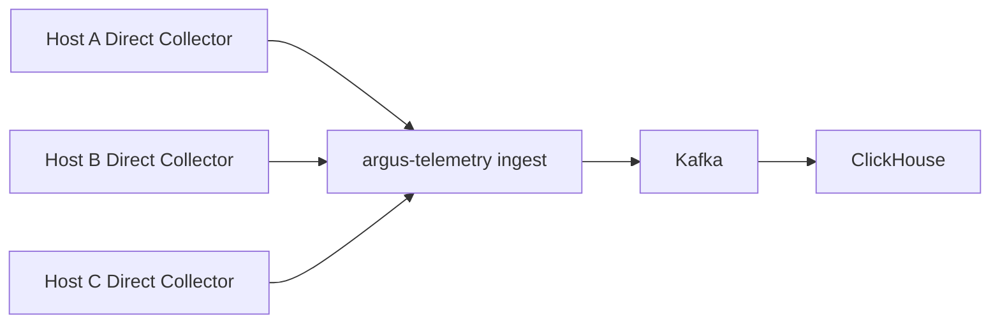
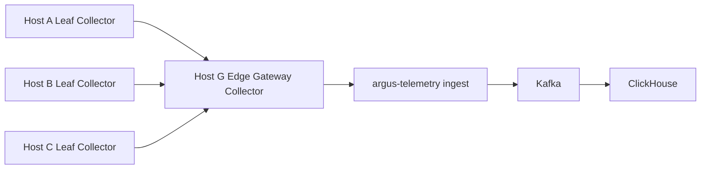
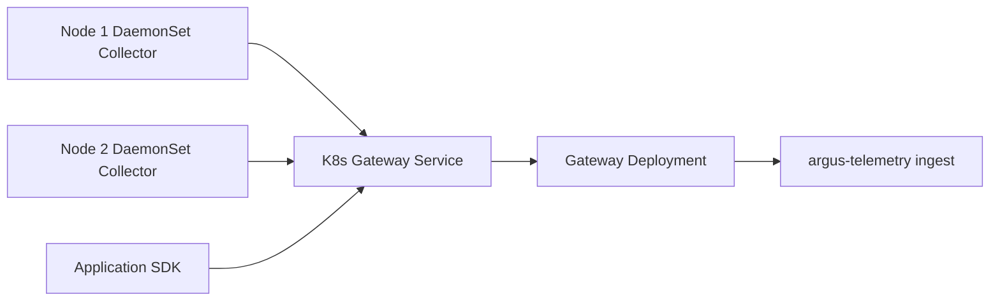

# OpenTelemetry 接入与监控数据链路

## 1. 目标与范围

Argus 利用已有主机凭证、Kubernetes kubeconfig 和 Connector 通道，一键安装并管理 OpenTelemetry Collector。Collector 主动向 Argus 推送 Metrics、Logs 和 Traces，目标环境不需要公网 IP 或公网入站端口。

互通网络中的机器可以选择一台作为 Edge Gateway，其余机器只向该节点推送；只有 Edge Gateway 访问 Argus。这个设计直接采用 OpenTelemetry 的 Agent + Gateway 部署模式，不额外开发重复的遥测 Pusher。

第一版范围：

- 主机 Collector 安装、状态、配置、升级、修复和卸载。
- Direct、Leaf、Edge Gateway 三种主机角色。
- Telemetry Group 组网。
- Kubernetes DaemonSet + Gateway Deployment。
- Connector Artifact Tunnel。
- `argus-telemetry ingest` → Kafka → `otel-clickhouse-writer` → ClickHouse。
- 基础主机指标、系统日志和监控状态查询。

Kubernetes 节点无法拉取镜像时，第一版只检测 Runtime 并提供离线导入提示，不实现镜像分发。

## 2. Collector 角色

| 角色 | 数据来源 | 上游 | 是否需要访问 Argus |
| --- | --- | --- | --- |
| Direct Collector | 本机/本应用 | `argus-telemetry ingest` | 是 |
| Leaf Collector | 本机/本应用 | Edge Gateway Collector | 否 |
| Edge Gateway Collector | Leaf OTLP，可选本机数据 | `argus-telemetry ingest` | 是 |
| K8s DaemonSet Collector | 节点、容器和 Pod | K8s Gateway Service | 否 |
| K8s Gateway Collector | DaemonSet、应用 SDK、集群级数据 | `argus-telemetry ingest` | 是 |

所谓 Pusher 是 Collector 中的 OTLP Exporter Pipeline，不是独立 Argus 进程。

## 3. 网络拓扑

### 3.1 Direct 模式



适合每台主机都能访问 Argus 的网络。

### 3.2 Edge Gateway 模式



主机 G 负责接收内网 OTLP、批处理、持久队列和统一出站。它仍然可以采集本机数据，但不能覆盖 Leaf 的 `host.id`、`host.name`、`service.name` 和 Argus Resource ID。

### 3.3 Kubernetes 模式



DaemonSet 采集节点指标和容器日志，Gateway Deployment 采集集群级资源并统一推送。应用 SDK 也可以直接向集群内部 Gateway Service 发送 OTLP。

## 4. Telemetry Group

Telemetry Group 描述一个企业内的遥测组网：

```json
{
  "id": "tg-01",
  "enterprise_id": "ent-01",
  "name": "北京内网服务器",
  "mode": "edge_gateway",
  "gateway_resource_id": "host-gateway-01",
  "fallback_gateway_resource_ids": [],
  "member_resource_ids": [
    "host-01",
    "host-02",
    "host-03"
  ],
  "collector_distribution": "argus-otelcol",
  "collector_version": "supported-version",
  "collection_profiles": [
    "host-basic",
    "system-logs"
  ]
}
```

主要对象：

- TelemetryGroup：网络与路由拓扑。
- CollectorInstance：某个资源上的 Collector 实例和角色。
- CollectorDistributionVersion：受支持二进制、组件清单和 Artifact。
- CollectionProfile：可启用的采集能力及配置模板。
- CollectorConfigRevision：期望配置、有效配置、哈希和状态。
- TelemetryCredential：Leaf/Gateway/Argus 身份凭证。
- TelemetryRoute：上游端点、主备和连通性状态。

第一版可以只支持单 Edge Gateway，但数据模型预留 `fallback_gateway_resource_ids`。

## 5. 管理界面

### 5.1 主机卡片

主机卡片提供“接入监控”按钮。已接入后显示：

- Collector 状态和版本。
- Direct、Leaf 或 Edge Gateway 角色。
- Telemetry Group。
- 上游地址。
- 启用的 Collection Profile。
- 最后数据时间。
- 发送速率、失败和积压。

监控页操作：

```text
安装 Collector
加入/离开 Telemetry Group
设置为 Edge Gateway
启用/关闭采集 Profile
测试路由
升级
修复
卸载
查看配置版本与回滚记录
```

### 5.2 Edge Gateway 页面

- 下游 Leaf 数量和在线状态。
- 每个 Leaf 最后上报时间。
- 接收、发送和丢弃速率。
- 持久队列占用。
- 到 Argus 的连接状态。
- CPU、内存、磁盘和带宽压力。
- 单点风险提示。

### 5.3 Kubernetes 卡片

- DaemonSet/Gateway Deployment 状态。
- 就绪副本数。
- Collector 镜像版本和 Digest。
- Namespace、ServiceAccount 和 RBAC 摘要。
- 启用的节点、日志、集群和应用 OTLP Profile。
- 到 Argus 的出口状态。

管理界面和 Chatbox 都调用同一 Tool/领域服务，只是 `origin` 分别为 `admin_ui` 和 `model_agent`。

## 6. Tool 设计

```text
telemetry.host.install.preview
telemetry.host.install.commit

telemetry.kubernetes.install.preview
telemetry.kubernetes.install.commit

telemetry.group.create.preview
telemetry.group.create.commit
telemetry.group.update.preview
telemetry.group.update.commit

telemetry.gateway.enable.preview
telemetry.gateway.enable.commit
telemetry.member.attach.preview
telemetry.member.attach.commit
telemetry.route.test

telemetry.collector.config.preview
telemetry.collector.config.commit
telemetry.collector.upgrade.preview
telemetry.collector.upgrade.commit
telemetry.collector.status
telemetry.collector.repair.preview
telemetry.collector.repair.commit
telemetry.collector.uninstall.preview
telemetry.collector.uninstall.commit

pending_action.cancel
```

安装、升级、组网、配置、修复和卸载属于写操作，全部成对提供 `.preview/.commit` 并使用统一 `pending_action.cancel`。状态和路由测试属于读取/诊断操作。所有 Preview 内部返回固定 `_meta.argus__token`，公开投影只包含预览和 `action_ref`；Commit 只接受服务端私有 Token。

## 7. 主机安装 Preview

Preview 阶段探测：

- OS、CPU 架构、服务管理器和运行用户。
- 已安装版本、配置和服务状态。
- 目标版本支持的组件。
- 磁盘、内存、端口和权限。
- Direct/Leaf/Gateway 路由可达性。
- 直接下载或 Connector Artifact Tunnel。
- 将要创建/修改的文件、服务和防火墙规则。
- 配置校验、健康检查和回滚计划。

示例：

```json
{
  "target": {
    "type": "host",
    "id": "host-01",
    "os": "linux",
    "arch": "amd64"
  },
  "current": {
    "installed": false
  },
  "desired": {
    "distribution": "argus-otelcol",
    "version": "supported-version",
    "role": "leaf",
    "profiles": ["host-basic"],
    "upstream": "10.0.0.10:4317",
    "install_mode": "connector_artifact_tunnel"
  },
  "changes": [
    "安装 Collector",
    "注册 systemd 服务",
    "创建本地持久队列目录",
    "写入 mTLS 凭证和 Collector 配置"
  ],
  "pending_action": {
    "action_ref": "pa-...",
    "expires_at": "..."
  }
}
```

Commit 使用服务端保存的计划执行，不能让 AI 在确认后更改版本、Artifact、远程路径和脚本。

Telemetry Group/Gateway 变更采用分阶段执行计划，不能一次性同时覆盖所有 Leaf：

```text
准备新 Gateway Listener
→ 验证新 Gateway 到 Argus
→ 分批切换 Leaf 并逐台验证最后数据时间
→ 旧 Gateway Drain 持久队列
→ 完成拓扑切换
```

任一批次失败时停止后续切换，未切换成员继续使用旧 Gateway，已切换成员按计划回滚或保持并明确标为部分完成。Preview 必须展示批次、预计中断、队列容量和回滚边界。

## 8. Artifact Registry 与 Connector Tunnel

Collector Artifact 发布清单包含：

```text
Distribution 名称
版本
OS
CPU 架构
Artifact URI
SHA256
签名
大小
组件清单
配置 Schema 版本
支持状态
```

第一版清单随 Argus 版本发布，企业管理员只能选择受支持版本，不提供任意上传二进制入口。

传输模式：

- `direct_download`：目标从批准地址下载。
- `connector_tunnel`：Argus Artifact Store 经 Connector Data Channel 发送。

Tunnel 要求：

- 分块和断点续传。
- 每块及完整文件校验。
- 签名验证。
- 任务、目标、路径和有效期绑定。
- 带宽/并发限制。
- 临时目录和失败清理。
- 进度事件，不把二进制放入 MCP Tool Result 或模型上下文。

AI 只能选择发布清单中的 Artifact，不能把 Tunnel 变成任意文件写入能力。

## 9. Collector Distribution 与 Collection Profile

Collector 组件通常编译进二进制，不是运行时动态下载的插件。因此“开启插件”在产品中定义为启用 Collection Profile；如果组件不在当前 Distribution 中，需要先升级 Distribution。

建议第一版 `argus-otelcol` 包含：

```text
host_metrics
filelog
windows_event_log
journald
docker_stats
prometheus
otlp receiver/exporter
resourcedetection
k8sattributes
memory_limiter
batch
file_storage
health_check
```

Collection Profile 示例：

```yaml
name: host-basic
description: 采集 CPU、内存、磁盘、文件系统和网络指标
required_components:
  - host_metrics
supported_platforms:
  - linux
  - windows
  - darwin
supported_collector_versions: ">=x.y,<x.z"
required_privileges: []
config_template: host-basic.yaml
```

Profile 需要声明 Collector 版本范围和配置 Schema。组件名称和配置可能随版本变化，例如新文档使用 `host_metrics`，旧版本中常见 `hostmetrics`，不能向所有版本下发同一份 YAML。

## 10. 配置下发与远程管理

MVP 使用 Connector：

1. 根据已启用 Profile 合成完整期望配置。
2. 在目标上执行对应版本的配置校验。
3. 保存旧配置和 Config Revision。
4. 原子替换。
5. 重启服务。
6. 检查健康端点和发送状态。
7. 失败自动回滚。

不能用 AI 临时 Shell 对 YAML 做文本拼接。

长期可以引入 [OpAMP](https://opentelemetry.io/docs/collector/management/)：

- Connector：首次安装、离线 Artifact、故障修复、彻底卸载。
- OpAMP Supervisor：日常远程配置、Effective Config、健康、升级和证书管理。

数据模型提前保留 Desired Config、Effective Config、Package Version 和 Health Status，但第一版不强制实现 OpAMP。

## 11. Leaf 配置基线

```yaml
extensions:
  file_storage:
    directory: /var/lib/argus-otelcol/queue

receivers:
  host_metrics:
    collection_interval: 30s
    scrapers:
      cpu:
      memory:
      load:
      disk:
      filesystem:
      network:

processors:
  memory_limiter:
    check_interval: 5s
    limit_mib: 256
  batch:
    timeout: 5s
    send_batch_size: 1024

exporters:
  otlp/edge_gateway:
    endpoint: 10.0.0.10:4317
    tls:
      ca_file: /etc/argus-otelcol/ca.pem
      cert_file: /etc/argus-otelcol/client.pem
      key_file: /etc/argus-otelcol/client-key.pem
    sending_queue:
      enabled: true
      storage: file_storage
    retry_on_failure:
      enabled: true

service:
  extensions: [file_storage]
  pipelines:
    metrics:
      receivers: [host_metrics]
      processors: [memory_limiter, batch]
      exporters: [otlp/edge_gateway]
```

实际配置由版本化模板生成，示例不作为所有 Collector 版本的固定配置。

## 12. Edge Gateway 配置基线

```yaml
extensions:
  file_storage:
    directory: /var/lib/argus-otelcol/gateway-queue

receivers:
  otlp/lan:
    protocols:
      grpc:
        endpoint: 0.0.0.0:4317
      http:
        endpoint: 0.0.0.0:4318

processors:
  memory_limiter:
    check_interval: 5s
    limit_mib: 1024
  batch:
    timeout: 5s
    send_batch_size: 5000

exporters:
  otlp/argus:
    endpoint: telemetry.argus.example:4317
    tls:
      insecure: false
    sending_queue:
      enabled: true
      storage: file_storage
    retry_on_failure:
      enabled: true

service:
  extensions: [file_storage]
  pipelines:
    metrics:
      receivers: [otlp/lan]
      processors: [memory_limiter, batch]
      exporters: [otlp/argus]
    logs:
      receivers: [otlp/lan]
      processors: [memory_limiter, batch]
      exporters: [otlp/argus]
    traces:
      receivers: [otlp/lan]
      processors: [memory_limiter, batch]
      exporters: [otlp/argus]
```

## 13. 身份和信任链

通过一个 Edge Gateway 推送时必须同时保留：

```text
源资源：argus.resource.id
源 Collector：argus.collector.id
经过的 Edge Gateway：argus.edge_gateway.id
企业：argus.enterprise.id
```

Leaf 到 Edge Gateway 使用独立短期 Token 或 mTLS。Edge Gateway 根据认证结果覆盖可信 Resource ID，不能相信 Leaf 自报的企业和资源字段。覆盖发生在接收 Pipeline 最前端，客户端提交的 `argus.enterprise.id`、`argus.resource.id`、`argus.collector.id` 和 `argus.edge_gateway.id` 同名字段必须删除后重建，不能只在已有属性旁追加可信值。

Edge Gateway 到 Argus 使用独立凭证。`argus-telemetry ingest` 根据该凭证确定企业，覆盖可信 `argus.enterprise.id`，并校验源资源属于同一企业。

真实私钥不进入模型、普通 Tool Result 或 Card DOM。证书支持轮换、吊销和过期告警。

## 14. Telemetry Ingest 入口

`argus-telemetry --mode=ingest` 是独立于 `argus-server` 和 `argus-connector-gateway` 的无状态部署，提供：

- OTLP/gRPC 4317。
- OTLP/HTTP 4318。
- TLS/mTLS 和 Token 认证。
- 企业/资源身份注入。
- 请求、解压后大小、Attribute 数量和长度限制。
- Signal、速率、并发和日用量配额。
- 数据过滤、脱敏和拒绝原因。
- `memory_limiter`、批处理、发送队列和 Kafka 背压。

Ingest 自身需要水平扩展，不保存唯一业务状态。凭证和配额缓存必须可快速失效。它不提供遥测查询接口、不接收 Connector 长连接，也不能持有资源变更或 OpenSandbox 凭证。

## 15. Kafka 链路

推荐：

```text
argus-telemetry ingest
→ Kafka Producer
→ Kafka
→ otel-clickhouse-writer（Kafka Receiver）
→ ClickHouse Exporter
→ ClickHouse
```

默认 Signal Topic 可采用官方约定：

```text
otlp_logs
otlp_metrics
otlp_spans
encoding = otlp_proto
```

Ingest 侧在认证和可信身份注入后使用幂等 Kafka Producer，并在写入成功前向 Collector 施加背压。分区建议：

- Traces：Trace ID。
- Metrics：ResourceAttributes 哈希。
- Logs：ResourceAttributes 或 Trace ID，二选一。

第一版使用共享 Signal Topic，通过可信 ResourceAttributes 和 Kafka Header 携带 enterprise_id。不要为每个企业创建 Topic；超大企业后续再配置专用 Topic。

`otel-clickhouse-writer` 使用标准 OpenTelemetry Collector 发行物，不开发第二套自研消费者。Kafka Receiver 必须启用 `message_marking.after: true`，并保持 `on_error: false` 与 `on_permanent_error: false`，使消息只在下游 Pipeline 成功后标记；具体版本的 Offset 提交语义需要作为发布门禁集成测试。Kafka 到 ClickHouse 保持至少一次语义，不能使用 Kafka Receiver 的默认提前标记行为假设“写入必达”。

无法解析或永久失败的记录不能无限阻塞分区。第一版应提供受控的隔离/DLQ 流程：记录原 Topic、Partition、Offset、失败原因和 Payload 哈希，人工或修复任务确认后再跳过或重放。是否由 Collector 组件直接路由 DLQ 取决于锁定版本的能力；如果标准组件不能满足“写成功后提交 + 永久错误隔离”，应将 Writer 替换为最小自研消费者，而不是降低可靠性语义。

## 16. ClickHouse 表基线

官方 ClickHouse Exporter 当前默认表：

```text
otel_logs
otel_traces
otel_traces_trace_id_ts
otel_metrics_gauge
otel_metrics_sum
otel_metrics_summary
otel_metrics_histogram
otel_metrics_exponential_histogram
otel_profiles
```

Logs 主要字段：

```text
Timestamp、TraceId、SpanId、TraceFlags
SeverityText、SeverityNumber、ServiceName、Body
ResourceAttributes、ScopeAttributes、LogAttributes、EventName
```

Traces 主要字段：

```text
Timestamp、TraceId、SpanId、ParentSpanId
SpanName、SpanKind、ServiceName、Duration
StatusCode、StatusMessage
ResourceAttributes、SpanAttributes、Events、Links
```

Metrics 按 Gauge、Sum、Summary、Histogram 和 ExponentialHistogram 分表，共同保存 Resource、Scope、Metric、Attributes、Timestamp 和类型相关值。

截至 2026-08，官方组件主分支标注 Logs/Traces 为 beta、Metrics 为 alpha、Profiles 为 development，因此 Argus 不能把自动建表结果当作永不变化的数据库协议。

### 16.1 Altinity ClickHouse Operator

Kubernetes 内置部署必须使用 Altinity ClickHouse Operator。职责边界：

| 组件 | 职责 |
| --- | --- |
| Altinity ClickHouse Operator | ClickHouseInstallation、Shard/Replica、Keeper、PVC、配置和滚动维护 |
| Argus Schema Migration | 表、物化列、索引、TTL、Local/Distributed Table 和 Schema Version |
| `otel-clickhouse-writer` | 从 Kafka 消费标准 OTLP 数据并通过 ClickHouse Exporter 插入 |
| `argus-telemetry query` | 企业隔离、语义查询、限流和结果裁剪 |

ClickHouse Exporter 必须设置 `create_schema: false`。Operator 不能代替应用 Schema Migration，Migration 也不能直接管理 Pod、Replica 或 PVC。

建议生产拓扑至少包含两个 Replica 和三个 Keeper；Shard 数由日写入量、保留期和查询负载决定，不能把“二副本”等同于“二分片”。ClickHouseInstallation 的扩容、滚动维护和 PVC 变更必须先经过容量及兼容性预检。

## 17. Argus 多租户表修改

保留官方字段兼容性，增加物化列：

```sql
EnterpriseId LowCardinality(String)
    MATERIALIZED ResourceAttributes['argus.enterprise.id'],

ResourceId String
    MATERIALIZED ResourceAttributes['argus.resource.id'],

CollectorId String
    MATERIALIZED ResourceAttributes['argus.collector.id']
```

日志排序键建议：

```text
EnterpriseId
toStartOfFiveMinutes(Timestamp)
ServiceName
Timestamp
```

要求：

- `otel_traces_trace_id_ts` 同样包含 EnterpriseId。
- 所有查询由 Query Service 强制注入 EnterpriseId。
- 企业用户不直接连接 ClickHouse。
- 按时间分区，不按企业分区，避免大量小 Part。
- TTL、冷热层和套餐保留期由平台策略管理。
- ClickHouse Exporter 设置 `create_schema: false`，由 Argus Migration 管理。
- 表、Exporter 和语义查询层分别记录 Schema 版本。
- 下游 ClickHouse Exporter 使用大批次；官方建议约 5000 行及以上，并优先使用 Exporter `sending_queue.batch`。

## 18. 重复、基数和成本

Kafka/Collector 重试会产生至少一次投递，可能重复：

- Trace 可基于 EnterpriseId + TraceId + SpanId 辅助去重。
- Logs 缺少统一天然 ID，可由 Gateway 增加 `argus.event.id` 或记录 Kafka Offset。
- Metrics 重复会影响 Sum/Rate，需要明确接受误差、写入去重或查询修正策略。

第一版必须选择并记录重复策略，不能假设 Kafka 天然 exactly-once。

第一版固定最低重复处理策略：

- Trace 写入保留 `EnterpriseId + TraceId + SpanId`，查询默认对同一键取最新摄入记录；Trace 索引表使用相同企业键。
- Ingest 为缺少稳定事件 ID 的 Log 生成 `argus.event.id`，由源 Collector ID、接收批次和记录序号组成；重试同一批次时保持稳定。
- Gauge 查询对同一 Enterprise/Resource/Metric/Attributes/Timestamp 取最新摄入点。
- Sum/Counter 原始点保留至少一次数据，Rate 查询在去重后处理单调性、重置和乱序；第一版不允许客户端直接对原始 Sum 表自行计算生产告警 Rate。
- Writer 记录 Kafka Topic/Partition/Offset 或等价摄入序列，供对账和受控重放使用。
- DLQ 跳过或重放必须记录审批人、Offset 范围、Payload 哈希和目标 Schema Version。

具体 ClickHouse 查询和物化视图通过版本化 Telemetry Semantic Schema 固化，并作为 Writer/Query 发布门禁集成测试。

高基数控制：

- Attribute 白名单/黑名单。
- 单记录 Attribute 数量和长度。
- 日志 Body 大小。
- Metric Series 企业配额。
- 命令行、环境变量和敏感日志脱敏。
- 企业摄入速率、日用量和存储预算。

### 18.1 查询语义和保护

Telemetry Query 不接受任意 SQL，只接受版本化 Metrics/Logs/Traces Query Schema。所有查询强制注入 EnterpriseId、时间范围、最大行数、最大扫描字节、超时和字段脱敏；昂贵查询使用 Redis 进行企业并发和预算协调，权威策略保存在 PostgreSQL。

Metrics Query 必须声明：

```text
metric name / signal type
resource scope
attribute filters
time range
aggregation / rate / percentile
step and fill policy
```

Query 响应返回实际应用的过滤、Step、数据新鲜度、部分失败和 Schema Version，避免模型或卡片把缺失数据误认为零值。

## 19. 可靠性与容量

Leaf 和 Edge Gateway 都启用持久发送队列：

- Edge Gateway 短期不可用时由 Leaf 暂存。
- Argus 不可用时由 Edge Gateway 暂存。
- 队列配置磁盘上限、保留时间和告警阈值，避免填满系统盘。

单 Edge Gateway 是单点。第一版允许但必须显示风险；后续支持双 Gateway、内网 DNS/LB 或基于支持组件的负载分发。

Gateway 容量预览至少估算：

- Leaf 数量。
- Metrics Series 和采样频率。
- 日志字节速率。
- Trace Span 速率。
- CPU、内存、磁盘队列和出口带宽。

## 20. Kubernetes 弱网边界

Argus 在服务端渲染 Helm/YAML 并通过 API Server Apply，不要求集群访问 Helm 仓库；节点仍需获得 Collector 镜像。

第一版不处理节点镜像分发，只检测 Runtime 并给出提示：

```text
Docker：docker load
containerd：ctr -n k8s.io images import 或 nerdctl -n k8s.io load
CRI-O：使用对应 Registry Mirror 或 Runtime 导入方式
```

使用精确 Digest 和 `imagePullPolicy: IfNotPresent`。不能统一提示 `docker load`，因为多数现代集群并不使用 Docker 作为 Runtime。

## 21. Collector 自身可观测性

监控链路必须监控自己：

- Collector CPU、内存和重启。
- Receiver 接收量。
- Exporter 成功、失败和丢弃。
- 队列长度和磁盘占用。
- 最后成功发送时间。
- Desired/Effective Config Revision。
- Edge Gateway 下游连接数。
- Kafka Lag。
- ClickHouse 插入延迟和错误。

自身遥测使用独立标识和告警规则，避免用户只看到“没有数据”却无法判断故障发生在哪一层。

## 22. 权限和审计

安装、升级、配置、Gateway 切换和卸载需要对应 RBAC 权限。审计记录：

- 发起人和 origin。
- 企业、目标资源和 Telemetry Group。
- Preview/Commit Tool。
- Collector Distribution、版本和 Artifact 哈希。
- 配置前后 Revision 和 Diff 摘要。
- 权限、防火墙和服务变化。
- Action Binding、Token 和用户确认。
- 执行步骤、Connector、回滚和最终状态。

## 23. MVP 实施顺序

1. CollectorDistributionVersion、CollectorInstance 和 CollectionProfile。
2. Linux/Windows Direct Collector 一键安装。
3. Connector Artifact Tunnel、校验和回滚。
4. `argus-telemetry ingest` 和企业身份注入。
5. Telemetry Group、Leaf/Edge Gateway 和路由测试。
6. Kafka 三类 Signal Topic、DLQ 和消费链路。
7. Altinity ClickHouse Operator、ClickHouseInstallation、多租户表与 Migration。
8. 基础 Metrics/Logs 查询 Tool 和 Card Skill。
9. Kubernetes DaemonSet + Gateway Deployment。
10. Collector 自身监控、配额和成本控制。

OpenTelemetry Profiles 信号、Trace 高级查询、双 Gateway、OpAMP、尾部采样、企业自定义 Distribution 和弱网 K8s 镜像分发在后续阶段实现。

## 24. 参考

- [OpenTelemetry Collector 部署模式](https://opentelemetry.io/docs/collector/deploy/)
- [OpenTelemetry Collector 管理与 OpAMP](https://opentelemetry.io/docs/collector/management/)
- [OpenTelemetry Kafka Exporter](https://github.com/open-telemetry/opentelemetry-collector-contrib/tree/main/exporter/kafkaexporter)
- [OpenTelemetry ClickHouse Exporter](https://github.com/open-telemetry/opentelemetry-collector-contrib/tree/main/exporter/clickhouseexporter)
- [Altinity ClickHouse Operator](https://github.com/Altinity/clickhouse-operator)
- [服务组件与 Kubernetes 一键部署](./10-service-components-and-kubernetes-deployment.md)
