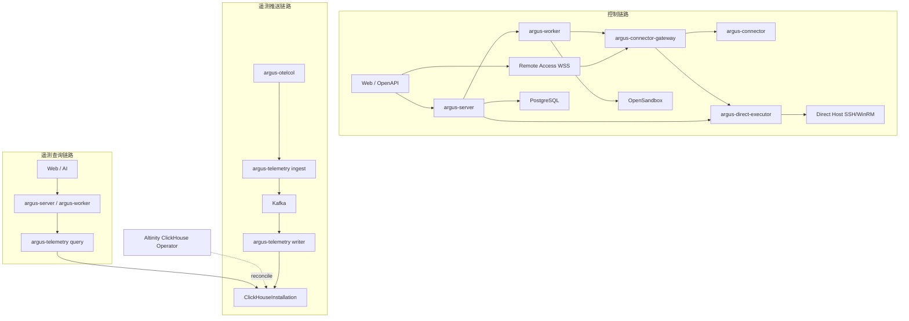
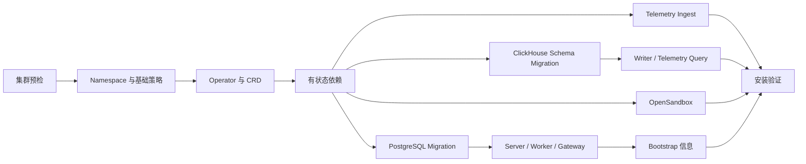

# 服务组件与 Kubernetes 一键部署

## Schema Version 3 查询门禁

`argus-telemetry query` 只在 ClickHouse Schema Version 3 就绪后启动。Schema v3 包含 metric series/samples、logs、traces、trace summary 和 span edges；部署按一次性替换处理，不保留旧 M7 查询表和协议。

`go run ./cmd/argus-dev e2e run --suite m10-query` 默认运行临时 Namespace 的真实 Collector → Kafka → Writer → ClickHouse → 单进程 Query 流程，并以 PromQL、KQL、SkyWalking GraphQL 验证查询、安全投影、租户表隔离、故障恢复和清理。`--unit-only` 只用于开发机快速门禁检查，不构成发布证据。

> 本文描述第一版目标部署架构。仓库已经具备可安装、可验证和可清理的 Evaluation 基座；M2-M7 的身份、资源/Connector、Agent、Card、Remote Access 和 Telemetry 均已接入 real API。实际完成度见[当前实现盘点与 Kubernetes 落地路线](./13-current-implementation-and-kubernetes-rollout.md)，PostgreSQL 环境决策见[PostgreSQL 部署决策](./14-postgresql-deployment-decision.md)。

## 1. 目标

Argus 第一版采用少量、清晰的可部署服务，不把内部领域模块过早拆成微服务。同时提供一个命令完成 Kubernetes 环境预检、Operator/CRD 安装、中间件创建、Argus 服务发布、数据库迁移和初始化信息输出。

目标：

- 默认完整安装包含 Argus、OpenSandbox、Kafka、ClickHouse、PostgreSQL、Redis 和 Artifact Store。
- ClickHouse 必须由 Altinity ClickHouse Operator 管理。
- 控制链路、遥测推送链路和遥测查询链路物理分离。
- 第一版所有中间件由安装器部署到同一 Kubernetes 集群，并通过 Namespace、ServiceAccount、NetworkPolicy 和资源配额隔离。
- 安装过程可重复执行、可观察、可分阶段恢复，不依赖一次 Helm 事务完成全部工作。
- Secret 不直接写入普通 Values 文件或命令行历史。

## 2. 服务组件

### 2.1 Argus 自研服务

第一版只维护四个服务端程序：

```text
cmd/
├── argus-server
├── argus-worker
├── argus-connector-gateway
└── argus-telemetry
```

部署为七类工作负载；Direct Executor 复用 `argus-worker` 程序，但使用独立 Deployment、队列、ServiceAccount、网络策略和固定公网出口：

| 工作负载                  | 类型                                               | 扩缩容依据                                    |
| ------------------------- | -------------------------------------------------- | --------------------------------------------- |
| `argus-server`            | Deployment                                         | HTTP 并发、延迟、CPU                          |
| `argus-worker`            | Deployment                                         | Run/Task 队列长度、模型并发                   |
| `argus-direct-executor`   | Deployment (`argus-worker --pool=direct-executor`) | 公网 SSH/WinRM 任务、远程会话并发、出口连接数 |
| `argus-connector-gateway` | Deployment                                         | 在线 Connector 数、远程会话数、连接数、带宽   |
| `argus-telemetry-ingest`  | Deployment                                         | OTLP 请求速率、Kafka Producer 延迟、CPU       |
| `argus-telemetry-query`   | Deployment                                         | 查询并发、延迟、ClickHouse 压力               |
| `argus-telemetry writer`  | Deployment                                         | Kafka Lag、ClickHouse 插入延迟                |

`argus-telemetry-ingest` 与 `argus-telemetry-query` 使用相同镜像、不同启动参数。它们必须拥有不同的 Service、ServiceAccount、NetworkPolicy、PodDisruptionBudget、HPA 和数据库凭证。

普通 Worker 在所有 Profile 中都保留 `agent`、`action`、`compaction`、`sandbox` 四条 PostgreSQL Task Queue 和对应 Processor；当前版本不提供定时无人值守任务。此次 Profile 差异只影响 Kubernetes Deployment 拓扑，不合并领域职责：

| Profile | 普通 Worker Deployment 拓扑 | 隔离与扩缩容边界 |
| ------- | ---------------------------- | ---------------- |
| Evaluation | 一个 `argus-worker --pool=default`，同时运行四条队列 | 四类任务共享一个 Pod 的资源与故障域，并使用四个 Pool 所需网络权限的并集 |
| Local Hardening | `argus-worker-{agent,action,compaction,sandbox}` 四个 Deployment | 各 Pool 可独立扩缩容并保持最小 NetworkPolicy |
| Production | `argus-worker-{agent,action,compaction,sandbox}` 四个 Deployment | 各 Pool 独立配置副本、PDB、HPA、拓扑分布和最小 NetworkPolicy |

Evaluation 合并 Worker 的默认资源为 `requests: 100m/256Mi`、`limits: 2 CPU/1Gi`。任一 Processor 发生导致进程退出的致命错误时，四类任务会随同一个 Worker Pod 一起重启；该取舍只适用于开发、演示和功能验证。`argus-direct-executor` 在所有 Profile 中始终保持独立 Deployment、队列和网络边界。

七类工作负载都支持横向扩展，但扩展条件不同：

| 工作负载                  | 横向扩展方式                                    | 必要条件                                                                           |
| ------------------------- | ----------------------------------------------- | ---------------------------------------------------------------------------------- |
| `argus-server`            | 任意副本处理 HTTP/Card Action                   | Session、Run、Pending Action、Token 和 Card Instance 不保存在 Pod 本地             |
| `argus-worker`            | PostgreSQL Task Lease 分工                      | Fence Token、幂等、外部副作用对账                                                  |
| `argus-direct-executor`   | 公网连接任务与人工会话分工                      | 固定出口、SSRF 防护、Host Key、短期 Credential/Session Ticket、无 Pod 本地唯一状态 |
| `argus-connector-gateway` | Connector/远程会话连接分布和跨 Gateway 内部转发 | PostgreSQL 命令队列、Redis Registry/Pub/Sub、connection_epoch、短期票据、录像外置、Drain |
| `argus-telemetry-ingest`  | 负载均衡分发 OTLP                               | Kafka ACK、分布式配额、凭证快速失效                                                |
| `argus-telemetry-query`   | 任意副本查询                                    | 无状态 Cursor、Enterprise/授权 Resource 条件强制注入、字段脱敏和查询预算           |
| `argus-telemetry writer`  | Kafka Consumer Group                            | Partition 数、Rebalance 和 Offset 门禁                                             |

具体状态所有权和扩缩容失败场景见[运行时状态、Redis 与横向扩展](./11-runtime-state-and-horizontal-scaling.md)。Migration、Bootstrap、系统 Card Catalog Sync 和 DLQ 重放不是普通横向扩展工作负载，必须使用 Job/Lease 或幂等数据库约束保证单一结果。`argus-card-catalog-sync` 只同步随镜像发布的不可变系统 Card Revision，普通 Server 启动不修改目录。

### 2.2 Kubernetes 内置平台依赖

| 组件        | 用途                                                                                     | 第一版安装方式                                                                                    |
| ----------- | ---------------------------------------------------------------------------------------- | ------------------------------------------------------------------------------------------------- |
| PostgreSQL  | 控制面元数据、RBAC、会话、Run、Pending Action、审计索引                                  | Kubernetes 内置；Evaluation 低副本，Production 使用持久卷和高可用拓扑，具体 Operator 选型形成 ADR |
| Redis       | 短期缓存、分布式锁、限流和轻量任务协调；不可保存唯一业务状态                             | Kubernetes 内置，按 Profile 配置持久化和高可用                                                    |
| MinIO       | Connector/Collector 安装包、远程会话录像、Sandbox Artifact、附件、导出物和集群内备份目标 | Kubernetes 内置的 S3 兼容 Artifact Store                                                          |
| OpenSandbox | 不可信代码、附件解析、临时分析和 交互卡片 构建                                           | Kubernetes 内置，使用独立 Namespace 和隔离 Runtime                                                |
| Kafka       | 遥测持久缓冲和写入解耦                                                                   | Strimzi Kafka Operator + KRaft                                                                    |
| ClickHouse  | Metrics、Logs、Traces 存储                                                               | Altinity ClickHouse Operator + ClickHouseInstallation + Keeper                                    |

第一版不提供外部 PostgreSQL、Redis、Artifact Store、OpenSandbox、Kafka 或 ClickHouse 模式。Evaluation 与 Production 使用相同的组件和协议边界，差异只体现在副本、容量、持久化、拓扑分布和隔离等级。外部托管中间件接入作为后续能力，不能进入第一版配置 Schema、发布矩阵或 E2E 分支。

安装器不应擅自安装或替换集群级 CNI、CSI/StorageClass、Ingress/Gateway Controller、LoadBalancer 实现、DNS 或证书 Issuer。这些能力与云厂商和集群发行版强相关；一键安装负责预检、选择已有实现并给出明确错误。Evaluation Profile 可以另提供针对 kind、k3s 等已知环境的配套脚本，但不能把它当作通用生产路径。

## 3. 三条隔离链路



隔离要求：

- Connector 仅连接 `argus-connector-gateway`，承载控制、Artifact 和独立的 Remote Session Stream，不发送遥测数据。
- Direct Executor 通过 DNS/IP 双重校验访问用户目标，允许自定义端口和未命中保护集合的用户私网；应用层拒绝集群、Argus、云元数据、环回和链路本地地址。NetworkPolicy 负责内部服务隔离；固定出口、NAT、出口审计和额外 CIDR 防火墙由用户自行部署的 Egress Gateway 或网络防火墙负责。
- `argus-server` 通过独立内部 CA 的 mTLS gRPC 向 Direct Executor 发送持久任务派发提示；PostgreSQL 队列是权威事实并负责断连恢复，RPC 不携带任意目标参数。
- Remote Access 入口固定使用外部 WSS `9445`，只接受 `argus-server` 签发的短期一次性会话票据；Gateway peer 使用内部 mTLS `9446`，Connector 控制继续使用 `9443`，Direct Executor RPC 使用 `9444`。
- Gateway peer 通过 Kubernetes API 获取 Ready owner Pod IP，ServiceAccount 只允许读取同 Namespace Pod；NetworkPolicy 必须允许 Kubernetes API Endpoint、DNS、Gateway peer `9446`、PostgreSQL、Redis、Direct Executor 和 ObjectStore。
- 录像按 asciicast v2 NDJSON 加密分片写 Artifact Store，不能依赖 Gateway Pod 本地磁盘；ObjectStore 连续不可用超过 30 秒时会话 fail closed。
- Collector 仅连接 `argus-telemetry-ingest`，不接收远程控制命令。
- Kubernetes Agent 与 Gateway 使用独立 Collector mTLS 身份；Gateway 下游 receiver 校验证书，Gateway 向 Ingest 转发自身数据时还必须匹配 Collector ID 与证书序列。Kubelet 采集只读挂载宿主证书链，并以最小 `nodes/stats` RBAC访问 Stats API。
- `argus-telemetry-query` 的三种查询 Engine 只使用 ClickHouse 只读账号；同一 Pod 内隔离的 `TenantSchemaManager` 使用独立 migration 身份执行受信租户表 DDL。Query 的 PostgreSQL 账号只读取 Enterprise 状态、维护 `enterprise_telemetry_tables` readiness，并向既有 tamper-evident audit chain 追加查询审计；不具有企业业务数据写权限。
- `argus-server` 在企业创建/启用/禁用事务提交后，只能通过内部 mTLS `EnsureTenantSchema`/`DropTenantSchema` RPC 驱动租户表 lifecycle，不持有 ClickHouse DDL 凭证。
- `argus-telemetry writer` 只持有 Kafka Consumer 和 ClickHouse Insert 权限。
- 控制面不能绕过 Query Service 向企业用户暴露 ClickHouse。
- 各链路使用独立域名、端口、证书、限流、HPA 和告警。

## 4. Kubernetes 命名空间与 Release

默认分为三个命名空间：

```text
argus-system         Argus 服务、Web、Migration、PostgreSQL、Redis、Artifact Store
argus-sandbox        OpenSandbox 控制/API 与 Kubernetes Runtime
argus-observability  Kafka、ClickHouse、argus-telemetry writer、遥测内部组件
```

Operator 可以安装在 `argus-observability`，也可以复用平台已有的集群级 Operator。命名空间拆分用于 RBAC、NetworkPolicy、Quota 和故障域隔离，不表示需要拆分仓库或增加业务服务。

建议 Release/资源所有权：

```text
argus-foundation          Namespace、ServiceAccount、RBAC、NetworkPolicy、Certificate
argus-data-operators      Altinity ClickHouse Operator、Strimzi Kafka Operator
argus-data                Kafka、ClickHouseInstallation、Keeper、PostgreSQL、Redis、Artifact Store
argus-sandbox             OpenSandbox
argus-platform            Web 与四个 Argus 程序
argus-telemetry-pipeline  argus-telemetry writer、Topic、Schema Migration
```

拆成多个 Release 后，某一阶段失败可以修复后继续，升级也不必同时滚动所有有状态服务。

## 5. 一键安装入口

面向普通部署者提供一个入口：

```powershell
argusctl install --config argus-install.yaml
```

Linux/macOS 使用同一子命令。`argusctl` 是安装编排器，不替代 Helm 和 Operator。它按顺序执行：



`port-forward` 暴露模式安装完成后使用 `argusctl tunnel --config <profile>` 启动本地地址：Enterprise `4173`、Platform `4174`、Card Runtime `4176`。Platform 在未初始化时显示首次初始化向导，初始化完成后同一地址只进入登录页；Card Runtime 是 Enterprise 自动加载的隔离 Origin，不是用户门户。浏览器可以使用 `localhost` 或 `127.0.0.1` 访问这些地址，两组 loopback Origin 都必须进入本地 Profile 的精确允许列表。Web 容器以当前页面同源访问 `/api/v1/`，由 Nginx 代理到集群内 `argus-server`；本地部署不得把前端编译到占位 API 域名，也不依赖浏览器 mock 数据。

每一步写入 `ArgusInstallation` 状态或安装状态 ConfigMap。再次执行相同命令时，从未完成阶段继续，并对配置变更生成计划。自动化/GitOps 环境也可以直接使用对应 Helm Release 和 CR，不强制使用 `argusctl`。

`argus-dev` 不进入正式部署边界。它是仓库开发与 E2E 编排器，在 Windows、Linux 和 macOS 上统一执行检查、契约生成、Web 构建、本地发布和能力诊断；完整 Kubernetes E2E 仍调用真实 `argusctl` 子进程完成 `preflight/plan/install/verify/uninstall`，不会绕过正式安装路径或直接调用其内部函数。测试 Fixture Chart 位于 `tests/e2e/helm/argus-e2e-fixtures`，不进入正式发布包。

```text
go run ./cmd/argus-dev doctor portable
go run ./cmd/argus-dev doctor e2e
go run ./cmd/argus-dev e2e run --suite m2
```

完整 E2E 要求可用容器引擎、Kubernetes Context、StorageClass、受支持节点架构、空闲端口和至少 25 GiB 主机磁盘。能力不足时 `doctor e2e` 与运行命令以退出码 2 明确失败，不静默跳过。

## 6. 安装配置

示例只表达配置边界，实际字段需要形成版本化 JSON Schema：

```yaml
apiVersion: install.argus.io/v1alpha1
kind: ArgusInstallConfig
metadata:
  name: argus
spec:
  profile: production
  domain: argus.example.com
  storageClass: fast-ssd

  security:
    platformMfaRequired: false

  network:
    mode: auto
    egress:
      expectedIPs: []
      verificationURL: ""

  images:
    registry: registry.example.com/argus
    pullSecretRef: argus-registry

  directExecutor:
    enabled: true
    egressMode: fixed-nat
    advertisedEgressAddresses:
      - 203.0.113.10
    allowedProtocols:
      - ssh
    denyPrivateAndPlatformNetworks: true

  postgresql:
    mode: bundled
    persistence:
      size: 200Gi
    highAvailability:
      enabled: true

  redis:
    mode: bundled
    persistence:
      size: 20Gi

  artifactStore:
    mode: bundled-minio
    persistence:
      size: 500Gi

  openSandbox:
    mode: bundled
    defaultProfiles:
      - shell-basic
      - python-analysis
      - node-card-builder
    runtimeClassName: gvisor
    networkPolicy: deny-by-default

  kafka:
    mode: bundled-strimzi
    replicas: 3
    persistence:
      sizePerBroker: 500Gi

  clickhouse:
    mode: bundled-altinity
    shards: 2
    replicas: 2
    persistence:
      sizePerReplica: 2Ti
    backup:
      enabled: true
      objectStoreSecretRef: argus-clickhouse-backup

  telemetry:
    publicOtlpGrpcHost: otlp.argus.example.com
    publicOtlpHttpHost: otlp-http.argus.example.com
    retention:
      logs: 30d
      metrics: 90d
      traces: 14d
```

所有密码、Token、私钥和 MinIO 凭证都由安装器生成 Kubernetes Secret 或通过 `SecretRef` 引用。安装器只把恢复说明和 Secret 名称写入终端，不在安装状态或普通日志输出明文。

安装包必须携带版本锁定清单，固定 Argus 镜像、OpenSandbox、Strimzi、Kafka、Altinity Operator、ClickHouse、OpenTelemetry Collector 及所有 Helm Chart/CRD 版本和镜像 Digest。安装器只接受经过兼容性测试的组合，不在安装时解析 `latest` 或任意浮动版本。

## 7. 分阶段安装

### 7.1 Preflight

安装前检查：

- Kubernetes 版本和 API 可用性。
- 至少一个默认或显式指定的 StorageClass。
- 动态 PVC、Volume 扩容与快照能力。
- Ingress/Gateway API、DNS 和证书方案。
- 节点 CPU、内存、可调度 Pod 数和磁盘容量。
- Pod Security、NetworkPolicy 和 LoadBalancer 能力。
- 集群中是否已有 cert-manager、Altinity/Strimzi Operator 及其兼容版本；兼容实例复用，缺失实例按版本锁安装。
- 镜像仓库以及显式配置的集群外备份目标连通性。
- Direct Executor 固定 NAT/Egress Gateway、声明出口地址与实际出口一致性，以及对私网、云元数据和平台内部地址的拒绝策略。
- CRD 冲突、命名空间配额和所需 ClusterRole 权限。

预检输出估算资源和不可逆影响；生产 Profile 在容量不足时应失败，而不是静默降级为单副本。

### 7.2 Foundation

创建 Namespace、ServiceAccount、RBAC、NetworkPolicy、ResourceQuota、LimitRange、证书和镜像拉取 Secret。默认网络策略全部拒绝，再逐条允许必要调用方向。

Connector PKI 的 Server Enrollment 与 Gateway Rotation 共用 namespaced CA Issuer，但使用独立 ServiceAccount。Gateway 只获得创建、读取和观察 CertificateRequest 所需的最小权限；Issuer、Namespace 或 generation 缺失时启动失败。兼容 cert-manager 的判定固定为同 major/minor 且 patch 不低于版本锁基线，避免以字符串完全相等误拒绝兼容补丁版本。

### 7.3 Operator 与 CRD

先安装并等待 Altinity ClickHouse Operator 就绪，再创建 ClickHouseInstallation。Helm 不保证 CRD、Operator Webhook 和 Custom Resource 在复杂依赖下同时可用，因此不能将它们视作一个原子 Release。

Kafka 第一版统一使用 Strimzi Kafka Operator 和 KRaft；Evaluation Profile 使用同一 Operator 的低副本拓扑，Production Profile 使用三副本及跨节点拓扑。安装器必须验证 Topic、ACL、认证、Broker 能力和可靠性参数，不能提供绕过 Strimzi 的外部 Kafka 分支。

### 7.4 有状态依赖

等待条件：

- PostgreSQL 主实例可写且 Migration 账号可连接。
- Redis 可用；清空 Redis 不会丢失唯一业务状态。
- Artifact Store Bucket、生命周期和加密策略已创建。
- `argus-data` 通过幂等 `argus-minio-bucket-init` Job 创建 `argus-remote-recordings`，安装器必须等待该 Job 完成后才能启动依赖 Object Store 的 Server 和 Connector Gateway。
- Kafka Controller/Broker 就绪，Topic 和 ACL 已配置。
- ClickHouseInstallation 所有 Shard/Replica 就绪，Keeper 达到法定数量。

### 7.5 OpenSandbox

完整安装包含 OpenSandbox 服务及 Kubernetes Runtime，并自动在 Argus 中创建一个平台 `SandboxBackend`。部署约束：

- 放入独立 Namespace 和 ServiceAccount。
- 默认拒绝外网、宿主文件系统、特权容器和生产 Secret。
- Sandbox 工作负载设置 CPU、内存、临时磁盘、PID、空闲和总生命周期限制。
- 只允许批准的镜像 Digest；镜像拉取权限与 Argus 主服务分开。
- Artifact 通过受控 S3 Bucket 交换，不共享 Argus Pod 文件系统。
- Sandbox 到 `argus-connector-gateway`、ClickHouse、PostgreSQL 和 Kubernetes API 的访问默认拒绝。

Production Profile 必须在同一 Kubernetes 集群内选择强化隔离，例如 gVisor/Kata RuntimeClass 或 OpenSandbox 后端原生微虚拟机。普通共享容器 Runtime 只能用于明确标记的 Evaluation 环境，安装器不能在生产配置中静默接受空 `runtimeClassName`。

若集群不允许运行 OpenSandbox 所需的隔离工作负载，Production Profile 预检必须失败并说明缺少的 RuntimeClass 或集群能力。Evaluation Profile 可以显式选择普通容器 Runtime，但必须显示安全降级，不得用于生产。

### 7.6 Schema Migration 与 Argus 服务

先运行 PostgreSQL Migration 和 ClickHouse Schema Migration，再按依赖安装 `argus-server`、`argus-worker`、`argus-connector-gateway`、两种 `argus-telemetry` 角色、Writer 和 Web。启动顺序依赖 Job Completion 与 Readiness，而非硬编码等待时间：

- `argus-server` 依赖 PostgreSQL Migration 完成。
- `argus-worker` 依赖 PostgreSQL 和任务协调组件；OpenSandbox 故障只应暂停 Sandbox 类任务，不能让其他 Agent/Tool Run 整体失去就绪状态。
- `argus-telemetry-ingest` 依赖 Kafka 可写，不依赖 ClickHouse 可写。
- `argus-telemetry writer` 依赖 Kafka 可读和 ClickHouse Schema 就绪。
- `argus-telemetry-query` 依赖 ClickHouse Schema 版本兼容。

PostgreSQL Migration 和 ClickHouse Migration 是独立 Job 和独立版本。Telemetry Ingest 依赖 Collector 身份控制数据、Redis 配额和 Kafka 可写，但不依赖 ClickHouse，因此可以在 ClickHouse Migration/Writer 尚未就绪时先接收并由 Kafka 缓冲数据；安装验证只有在 Writer 和 Query 全链路成功后才通过。`local-hardening` 为 Ingest、Writer、Query 使用独立表级最小权限 PostgreSQL Login。

M7 Evaluation 已验证 Ingest/Writer/Query Pod 删除、Redis 清空、Kafka backlog、DLQ replay 和 Collector 持久队列恢复。M8 本地范围增加 OpenBao、加密备份恢复和供应链证据；Production 多副本容量、跨节点故障和 Telemetry PKI 长周期轮换继续由 Production Validation 阻断。

## 8. ClickHouse 与 Altinity Operator

Altinity ClickHouse Operator 负责：

- `ClickHouseInstallation` 生命周期。
- Shard、Replica、Pod、Service 和 PVC。
- ClickHouse Keeper 拓扑。
- 配置变更与滚动维护。
- 节点故障后的期望状态恢复。

Argus 不把建表职责交给 Operator 或 ClickHouse Exporter。独立 `argus-schema-migration` Job 只负责数据库级基线和一次性移除旧共享表；Query Pod 内使用独立 migration 身份的 `TenantSchemaManager` 负责：

- 每个 Enterprise 的六张 Metrics/Logs/Traces 租户物理表及必要 Projection、Summary 和 Edge 派生表。
- 只保留租户内可信 `ResourceId`、`CollectorId` 等列；`EnterpriseId` 只用于可信表路由，不写入租户事实表。
- 统一的 MergeTree 引擎、时间分区、排序键、TTL 和 Schema Version。
- 企业创建/启用后的同步创建与严格校验、禁用后的同步删除，以及启动和周期对账恢复。

M10 采用按 Enterprise 的物理表隔离，表名只能由可信 UUID 生成；产品层只暴露 PromQL、Argus KQL 和固定只读 SkyWalking Trace GraphQL。跨企业查询在 Query Coordinator 和 mTLS Scope 层 fail closed。

`argus-telemetry writer` 必须设置 `create_schema: false`，也不持有 DDL 权限。本阶段明确不保留历史表和旧 Query 协议，部署按“停止旧链路 → 删除旧共享表 → 发布 Schema v3/新 Writer/新 Query”一次性切换。

第一版不提供绕过 Altinity Operator 的外部 ClickHouse 模式。所有 ClickHouse Schema Migration 必须面向安装器创建的 ClickHouseInstallation，并使用 `ON CLUSTER`、Replicated Local Table 和 Distributed Table 兼容未来扩分片。

## 9. Kafka 可靠性基线

生产默认：

```text
replication.factor >= 3
min.insync.replicas >= 2
producer acks = all
producer idempotence = true
unclean leader election = false
```

创建 Topic：

```text
otlp_logs
otlp_metrics
otlp_spans
otlp_logs_dlq
otlp_metrics_dlq
otlp_spans_dlq
```

Writer 的 Kafka Receiver 配置 `message_marking.after: true`、`on_error: false` 和 `on_permanent_error: false`，并通过集成测试验证只有 ClickHouse Pipeline 成功后才推进 Offset。链路提供至少一次语义，因此 Schema 和查询层必须实现既定的重复数据策略。Kafka Lag、最老消息年龄、阻塞 Partition、DLQ 速率和磁盘使用率是安装后必备告警。

永久失败不能靠自动提交 Offset 静默跳过。安装包需要带一个受控隔离/重放工具，记录 Topic、Partition、Offset、失败原因和 Payload 哈希。若锁定版本的标准 Kafka Receiver 无法同时满足延迟标记与隔离要求，则只替换 Writer 为最小自研消费者，Kafka、OTLP 和 ClickHouse Schema 边界保持不变。

## 10. 对外入口与网络策略

建议使用独立入口：

| 入口                               | 后端                      | 协议          | 用途                                                                 |
| ---------------------------------- | ------------------------- | ------------- | -------------------------------------------------------------------- |
| `argus.example.com`                | `argus-server`/Web        | HTTPS/WSS     | 用户、API、Card Host                                                 |
| `connector.argus.example.com`      | `argus-connector-gateway` | TLS 长连接    | Connector 控制链路                                                   |
| `remote.argus.example.com`         | `argus-connector-gateway` | HTTPS/WSS     | 经短期票据授权的 SSH PTY/HTTPS WinRS；与 Connector 入口分端口和限流  |
| `otlp.argus.example.com:4317`      | `argus-telemetry-ingest`  | OTLP/gRPC TLS | 遥测推送                                                             |
| `otlp-http.argus.example.com:4318` | `argus-telemetry-ingest`  | OTLP/HTTP TLS | 遥测推送                                                             |

`argus-direct-executor`、`argus-telemetry-query`、PostgreSQL、Redis、Kafka、ClickHouse、OpenSandbox Backend 和 Writer 都只暴露集群内 Service。即使部署在同一集群，也不能用一个 Ingress 路由混合 Connector、Remote Access 与 OTLP 流量；`remote.argus.example.com` 可以与 Connector Gateway 使用相同程序，但必须使用独立 Listener、证书策略、限流和 HPA 指标。

## 11. 初始化与超级管理员

安装器完成后生成或引用一次性 Setup Token，并只输出：

```text
包含 Token Fragment 的一次性 Platform 初始化 URL
Token 过期时间
```

部署者打开该链接设置平台超级管理员账号和密码。Platform 读取 Fragment 后立即清除地址栏，页面不显示 Token 输入框，也不持久化 Token；缺少链接时拒绝显示初始化表单。初始化完成后 Token 立即失效。安装器不能通过 Values 预置长期管理员明文密码，也不能自动创建默认弱密码。

平台超级管理员首次进入后可以：

- 检查内置 OpenSandbox Backend 健康。
- 启用批准的 Sandbox Image/Profile。
- 创建企业和企业管理员。
- 查看平台级 Kafka、ClickHouse 和摄入健康，但不能查看企业业务内容。

## 12. 高可用与容量 Profile

安装配置提供三个明确 Profile：

### 12.1 Evaluation

- 单副本 Argus 服务。
- 普通 Worker 使用一个 `argus-worker --pool=default` Deployment 运行四条队列；Direct Executor 仍独立部署。
- 单节点或低副本 PostgreSQL、Redis、Kafka 和 ClickHouse。
- 较小 PVC 和短 TTL。
- 仅用于开发、演示和功能验证，不承诺节点故障可用性。

### 12.2 Local Hardening

- 保持单节点、单副本规模，只面向 arm64 Docker Desktop；普通 Worker 仍使用四个拆分 Deployment，不沿用 Evaluation 的合并拓扑。
- 强制使用单节点 OpenBao Transit、独立 PostgreSQL Login 和本地加密备份恢复，并提供 TOTP/Step-up 能力；平台超级管理员 MFA 强制开关默认关闭。
- 允许共享容器 Sandbox Runtime，但明确输出安全降级。
- 完成状态为 `local_hardening_complete`，不产生生产 SLO、RPO 或 RTO。

### 12.3 Production

- `argus-server`、四个拆分的普通 Worker、Direct Executor、Connector Gateway、Telemetry Ingest/Query 至少 2 副本；Direct Executor 使用固定 NAT/Egress Gateway，扩容不能改变用户防火墙白名单地址。
- Pod Anti-Affinity/Topology Spread 和 PodDisruptionBudget。
- PostgreSQL 在集群内使用高可用拓扑和反亲和；具体 Operator 与备份实现按 ADR 固化。
- Kafka 至少 3 Broker，跨节点分布。
- ClickHouse 至少 2 Replica，Keeper 至少 3 节点；Shard 数由数据量决定。
- Sandbox、Kafka 和 ClickHouse 推荐使用独立 Node Pool、Taint/Toleration 与拓扑分布，避免不可信计算或磁盘压力拖垮控制面。
- 对象存储开启版本控制/生命周期；有状态 PVC 使用可扩容 StorageClass。
- HPA 不对有状态数据组件做无约束自动缩容。

安装器必须要求显式选择 Profile，不能把 Evaluation 或 Local Hardening 配置伪装成生产默认。Production 当前只允许 schema validate、lint 和 render，实际安装 fail closed。

## 13. 升级、回滚与备份

升级顺序：

1. 运行兼容性和容量预检。
2. 备份 PostgreSQL、ClickHouse 元数据/数据和关键 Secret。
3. 升级 Operator，确认其支持现有 CR。
4. 执行向前兼容 Schema Migration。
5. 滚动升级 Ingest/Writer/Query，再升级控制面服务。
6. 执行端到端验证。
7. 经过兼容窗口后清理旧 Schema 或配置。

回滚边界：

- 无状态 Deployment 可以回滚镜像和配置。
- 数据库迁移默认只承诺向前修复，不假设所有 DDL 可安全反向执行。
- Operator/CRD 降级必须遵循供应商兼容矩阵。
- Kafka 中保留足够时间的数据，允许修复 Writer 后重新消费。

备份至少覆盖：

- PostgreSQL 全量和 PITR/WAL。
- ClickHouse 到对象存储的周期备份与恢复演练。
- Artifact Store 版本与生命周期。
- 安装配置、CR、Schema Version 和加密主密钥的离线备份。
- Kafka 主要用于缓冲，不能替代 ClickHouse 长期备份。

## 14. 安装后验证

`argusctl verify` 执行：

基础设施探测必须使用当前部署的真实安全边界：Kafka 通过专用 `argus-installation-check` Topic、SCRAM 用户和隔离 Consumer Group 验证；PostgreSQL 使用事务内临时表；ClickHouse 使用临时验证表并在结束时删除；Telemetry Ingest/Query 的健康检查在 observability Namespace 内执行。验证器不得依赖旧数据库、旧表或匿名 Kafka 权限。

1. Web、API 和首次初始化状态检查。
2. PostgreSQL/Redis/Artifact Store 读写探测。
3. 创建并销毁一个受限 OpenSandbox Session。
4. Connector Gateway TLS 和长连接探测。
5. Remote Access WSS 短期票据握手、重放拒绝、SSH PTY/WinRS 模式、跨 Gateway `9446`、Drain 和录像 Artifact 写入探测。
6. Direct Executor 验证声明固定出口，并确认私网、环回、云元数据和平台内部地址被拒绝。
7. 向 Ingest 发送带测试 Enterprise/Resource/Collector 身份的 Metrics/Logs/Trace，并验证客户端伪造同名字段会被覆盖或拒绝。
8. 验证 Kafka Topic 收到数据、Writer 消费成功。
9. 通过 Query Service 查询到测试数据并验证企业隔离。
10. 验证 ClickHouseInstallation、Keeper、Kafka Lag 和所有 PDB/HPA 状态。

测试数据必须带专用 Installation Check 标识并按短 TTL 清理，不能混入真实企业资源。

## 15. 交付物建议

代码阶段建议形成：

```text
deploy/
├── schemas/argus-install-config.schema.json
├── helm/
│   ├── argus-foundation/
│   ├── argus-data-operators/
│   ├── argus-data/
│   ├── argus-sandbox/
│   ├── argus-platform/
│   └── argus-telemetry-pipeline/
├── profiles/
│   ├── evaluation.yaml
│   └── production.yaml
└── examples/
    ├── all-in-one.yaml
    ├── evaluation.yaml
    ├── production.yaml
    └── air-gapped.example.yaml
```

对应可执行入口位于 `cmd/argusctl`；跨平台仓库工具位于 `cmd/argus-dev`，两者职责独立。

当前完成联网 Kubernetes 的 `evaluation` 与 `local-hardening` Profile；`production` 只允许校验和渲染，实际安装保持 fail closed。`air-gapped.example.yaml` 只表达私有 Registry、镜像和 Artifact 配置边界，不代表已经支持完整离线安装。外部托管中间件、离线镜像 Bundle、跨集群灾备、多地域 Kafka/ClickHouse 和自动 StorageClass 安装作为后续能力。

### 15.1 卸载和数据保留

`argusctl uninstall` 必须先生成计划，不得默认删除 PVC、Bucket、CRD、备份或 Secret。推荐阶段：

```text
停止新入口和新任务
→ 等待/取消可安全终止的 Run
→ Drain Connector Gateway 和 Telemetry Ingest
→ 停止 Writer 并记录最终 Offset
→ 生成 PostgreSQL/ClickHouse/Artifact 备份
→ 删除无状态工作负载
→ 根据显式 retain/delete 策略处理有状态资源
→ 最后处理 Operator 和 CRD
```

Production 默认 `retainData=true`。删除 PVC、对象存储数据、企业加密主密钥或 CRD 必须使用单独的高危确认参数，并在终端展示准确资源清单和恢复边界。

## 网络安全能力说明

`argusctl` 默认使用 `spec.network.mode: auto`：自动部署可用的 Argus NetworkPolicy，探测 CNI 执行状态，并将 `enforced`、`unverified` 或 `unsupported` 写入安装状态。NetworkPolicy 只承担 Argus 内部服务隔离，不限制 Direct Executor 的用户目标端口。

Egress Gateway 不由 Argus 默认安装。用户可以自行使用 Cilium、Calico、Istio、云 NAT 或企业防火墙；`argusctl` 识别可选的出口 IP/验证 URL，Direct Executor 启动和运行期周期性复核。网关缺失或复核失败时，基础连接继续使用集群默认路由并告警；固定出口、统一审计和网关级防护不保证，运行期状态目前以日志/诊断为准。Direct Executor 始终拒绝集群、Argus、metadata、loopback 和 link-local 目标，但允许未命中保护集合的用户私网和自定义端口。

## 16. 参考

- [Altinity ClickHouse Operator](https://github.com/Altinity/clickhouse-operator)
- [Strimzi Kafka Operator](https://strimzi.io/docs/operators/latest/overview.html)
- [OpenTelemetry Kafka Receiver](https://github.com/open-telemetry/opentelemetry-collector-contrib/tree/main/receiver/kafkareceiver)
- [OpenTelemetry ClickHouse Exporter](https://github.com/open-telemetry/opentelemetry-collector-contrib/tree/main/exporter/clickhouseexporter)
