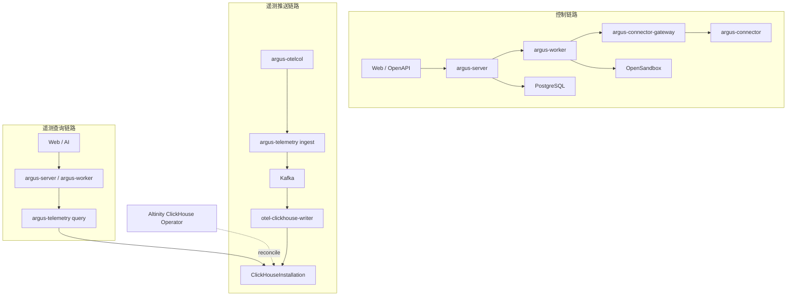
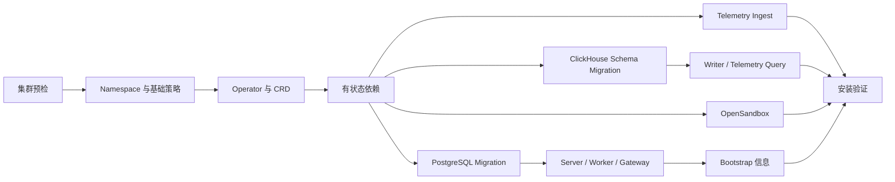

# 服务组件与 Kubernetes 一键部署

## 1. 目标

Argus 第一版采用少量、清晰的可部署服务，不把内部领域模块过早拆成微服务。同时提供一个命令完成 Kubernetes 环境预检、Operator/CRD 安装、中间件创建、Argus 服务发布、数据库迁移和初始化信息输出。

目标：

- 默认完整安装包含 Argus、OpenSandbox、Kafka、ClickHouse、PostgreSQL、Redis 和 Artifact Store。
- ClickHouse 必须由 Altinity ClickHouse Operator 管理。
- 控制链路、遥测推送链路和遥测查询链路物理分离。
- 支持内置依赖和外部托管依赖两种模式。
- 安装过程可重复执行、可观察、可分阶段恢复，不依赖一次 Helm 事务完成全部工作。
- Secret 不直接写入普通 Values 文件或命令行历史。

## 2. 服务组件

### 2.1 Argus 自研服务

第一版只维护四个服务端程序：

```text
cmd/
├── argus-server
├── argus-worker
├── argus-connector-gateway
└── argus-telemetry
```

部署为六类工作负载：

| 工作负载 | 类型 | 扩缩容依据 |
| --- | --- | --- |
| `argus-server` | Deployment | HTTP 并发、延迟、CPU |
| `argus-worker` | Deployment | Run/Task 队列长度、模型并发 |
| `argus-connector-gateway` | Deployment | 在线 Connector 数、连接数、带宽 |
| `argus-telemetry-ingest` | Deployment | OTLP 请求速率、Kafka Producer 延迟、CPU |
| `argus-telemetry-query` | Deployment | 查询并发、延迟、ClickHouse 压力 |
| `otel-clickhouse-writer` | Deployment | Kafka Lag、ClickHouse 插入延迟 |

`argus-telemetry-ingest` 与 `argus-telemetry-query` 使用相同镜像、不同启动参数。它们必须拥有不同的 Service、ServiceAccount、NetworkPolicy、PodDisruptionBudget、HPA 和数据库凭证。

六类工作负载都支持横向扩展，但扩展条件不同：

| 工作负载 | 横向扩展方式 | 必要条件 |
| --- | --- | --- |
| `argus-server` | 任意副本处理 HTTP/Card Action | Session、Run、Pending Action、Token 和 Card Instance 不保存在 Pod 本地 |
| `argus-worker` | PostgreSQL Task Lease 分工 | Fence Token、幂等、外部副作用对账 |
| `argus-connector-gateway` | 连接分布和跨 Gateway 内部转发 | Redis Session Registry、connection_epoch、Drain |
| `argus-telemetry-ingest` | 负载均衡分发 OTLP | Kafka ACK、分布式配额、凭证快速失效 |
| `argus-telemetry-query` | 任意副本查询 | 无状态 Cursor、企业条件强制注入、查询预算 |
| `otel-clickhouse-writer` | Kafka Consumer Group | Partition 数、Rebalance 和 Offset 门禁 |

具体状态所有权和扩缩容失败场景见[运行时状态、Redis 与横向扩展](./11-runtime-state-and-horizontal-scaling.md)。Migration、Bootstrap 和 DLQ 重放不是普通横向扩展工作负载，必须使用 Job/Lease 保证单一所有者。

### 2.2 平台依赖

| 组件 | 用途 | 默认完整安装 | 可使用外部服务 |
| --- | --- | --- | --- |
| PostgreSQL | 控制面元数据、RBAC、会话、Run、Pending Action、审计索引 | 是 | 是 |
| Redis | 短期缓存、分布式锁、限流和轻量任务协调；不可保存唯一业务状态 | 是 | 是 |
| S3 兼容 Artifact Store | Connector 安装包、Sandbox Artifact、附件和导出物 | 是 | 是 |
| OpenSandbox | 不可信代码、附件解析、临时分析和 Card Skill 构建 | 是 | 是 |
| Kafka | 遥测持久缓冲和写入解耦 | 是 | 是 |
| Strimzi Kafka Operator | Bundled Kafka 的 KRaft、Broker、Topic、用户和滚动维护 | Production 是 | 外部 Kafka 时否 |
| ClickHouse | Metrics、Logs、Traces 存储 | 是 | 是 |
| Altinity ClickHouse Operator | ClickHouseInstallation、Keeper、扩缩容和滚动维护 | 是 | 外部 ClickHouse 时否 |

生产环境推荐接入外部 PostgreSQL 和对象存储。`bundled` 模式主要用于单集群私有化交付和评估环境，但 Kafka 与 ClickHouse 仍应使用持久卷和高可用配置。

安装器不应擅自安装或替换集群级 CNI、CSI/StorageClass、Ingress/Gateway Controller、LoadBalancer 实现、DNS 或证书 Issuer。这些能力与云厂商和集群发行版强相关；一键安装负责预检、选择已有实现并给出明确错误。Evaluation Profile 可以另提供针对 kind、k3s 等已知环境的配套脚本，但不能把它当作通用生产路径。

## 3. 三条隔离链路



隔离要求：

- Connector 仅连接 `argus-connector-gateway`，不发送遥测数据。
- Collector 仅连接 `argus-telemetry-ingest`，不接收远程控制命令。
- `argus-telemetry-query` 只持有 ClickHouse 只读账号。
- `otel-clickhouse-writer` 只持有 Kafka Consumer 和 ClickHouse Insert 权限。
- 控制面不能绕过 Query Service 向企业用户暴露 ClickHouse。
- 各链路使用独立域名、端口、证书、限流、HPA 和告警。

## 4. Kubernetes 命名空间与 Release

默认分为三个命名空间：

```text
argus-system         Argus 服务、Web、Migration、PostgreSQL、Redis、Artifact Store
argus-sandbox        OpenSandbox 控制/API 与 Kubernetes Runtime
argus-observability  Kafka、ClickHouse、otel-clickhouse-writer、遥测内部组件
```

Operator 可以安装在 `argus-observability`，也可以复用平台已有的集群级 Operator。命名空间拆分用于 RBAC、NetworkPolicy、Quota 和故障域隔离，不表示需要拆分仓库或增加业务服务。

建议 Release/资源所有权：

```text
argus-foundation          Namespace、ServiceAccount、RBAC、NetworkPolicy、Certificate
argus-data-operators      Altinity ClickHouse Operator、Strimzi Kafka Operator
argus-data                Kafka、ClickHouseInstallation、Keeper、PostgreSQL、Redis、Artifact Store
argus-sandbox             OpenSandbox
argus-platform            Web 与四个 Argus 程序
argus-telemetry-pipeline  otel-clickhouse-writer、Topic、Schema Migration
```

拆成多个 Release 后，某一阶段失败可以修复后继续，升级也不必同时滚动所有有状态服务。

## 5. 一键安装入口

面向普通部署者提供一个入口：

```powershell
argusctl install --config argus-install.yaml
```

Linux/macOS 使用同一子命令。`argusctl` 是安装编排器，不替代 Helm 和 Operator。它按顺序执行：



每一步写入 `ArgusInstallation` 状态或安装状态 ConfigMap。再次执行相同命令时，从未完成阶段继续，并对配置变更生成计划。自动化/GitOps 环境也可以直接使用对应 Helm Release 和 CR，不强制使用 `argusctl`。

## 6. 安装配置

示例只表达配置边界，实际字段需要形成版本化 JSON Schema：

```yaml
apiVersion: install.argus.io/v1alpha1
kind: ArgusInstallConfig
metadata:
  name: argus
spec:
  profile: production
  domain: argus.example.com
  storageClass: fast-ssd

  images:
    registry: registry.example.com/argus
    pullSecretRef: argus-registry

  postgresql:
    mode: external
    secretRef: argus-postgresql

  redis:
    mode: bundled
    persistence:
      size: 20Gi

  artifactStore:
    mode: external-s3
    secretRef: argus-artifact-store

  openSandbox:
    mode: bundled
    defaultProfiles:
      - shell-basic
      - python-analysis
      - node-card-builder
    runtimeClassName: gvisor
    networkPolicy: deny-by-default

  kafka:
    mode: bundled
    replicas: 3
    persistence:
      sizePerBroker: 500Gi

  clickhouse:
    mode: bundled-altinity
    shards: 2
    replicas: 2
    persistence:
      sizePerReplica: 2Ti
    backup:
      enabled: true
      objectStoreSecretRef: argus-clickhouse-backup

  telemetry:
    publicOtlpGrpcHost: otlp.argus.example.com
    publicOtlpHttpHost: otlp-http.argus.example.com
    retention:
      logs: 30d
      metrics: 90d
      traces: 14d
```

所有密码、Token、私钥和对象存储凭证都通过 `SecretRef` 引用。安装器可以生成缺省 Secret，但只把恢复说明和 Secret 名称写入终端，不在安装状态或普通日志输出明文。

安装包必须携带版本锁定清单，固定 Argus 镜像、OpenSandbox、Strimzi、Kafka、Altinity Operator、ClickHouse、OpenTelemetry Collector 及所有 Helm Chart/CRD 版本和镜像 Digest。安装器只接受经过兼容性测试的组合，不在安装时解析 `latest` 或任意浮动版本。

## 7. 分阶段安装

### 7.1 Preflight

安装前检查：

- Kubernetes 版本和 API 可用性。
- 至少一个默认或显式指定的 StorageClass。
- 动态 PVC、Volume 扩容与快照能力。
- Ingress/Gateway API、DNS 和证书方案。
- 节点 CPU、内存、可调度 Pod 数和磁盘容量。
- Pod Security、NetworkPolicy 和 LoadBalancer 能力。
- 集群中是否已有 Altinity/Strimzi Operator 及其兼容版本。
- 镜像仓库、对象存储和外部依赖连通性。
- CRD 冲突、命名空间配额和所需 ClusterRole 权限。

预检输出估算资源和不可逆影响；生产 Profile 在容量不足时应失败，而不是静默降级为单副本。

### 7.2 Foundation

创建 Namespace、ServiceAccount、RBAC、NetworkPolicy、ResourceQuota、LimitRange、证书和镜像拉取 Secret。默认网络策略全部拒绝，再逐条允许必要调用方向。

### 7.3 Operator 与 CRD

先安装并等待 Altinity ClickHouse Operator 就绪，再创建 ClickHouseInstallation。Helm 不保证 CRD、Operator Webhook 和 Custom Resource 在复杂依赖下同时可用，因此不能将它们视作一个原子 Release。

Kafka 的 Production `bundled` 模式默认使用 Strimzi Kafka Operator 和 KRaft；Evaluation Profile 可以使用同一 Operator 的低副本拓扑。外部 Kafka 模式不安装 Strimzi，但仍需验证 Topic、ACL、认证、Broker 能力和可靠性参数。这样一键安装有明确的默认实现，同时 Kafka 对 Argus 暴露的协议边界不依赖 Operator。

### 7.4 有状态依赖

等待条件：

- PostgreSQL 主实例可写且 Migration 账号可连接。
- Redis 可用；清空 Redis 不会丢失唯一业务状态。
- Artifact Store Bucket、生命周期和加密策略已创建。
- Kafka Controller/Broker 就绪，Topic 和 ACL 已配置。
- ClickHouseInstallation 所有 Shard/Replica 就绪，Keeper 达到法定数量。

### 7.5 OpenSandbox

完整安装包含 OpenSandbox 服务及 Kubernetes Runtime，并自动在 Argus 中创建一个平台 `SandboxBackend`。部署约束：

- 放入独立 Namespace 和 ServiceAccount。
- 默认拒绝外网、宿主文件系统、特权容器和生产 Secret。
- Sandbox 工作负载设置 CPU、内存、临时磁盘、PID、空闲和总生命周期限制。
- 只允许批准的镜像 Digest；镜像拉取权限与 Argus 主服务分开。
- Artifact 通过受控 S3 Bucket 交换，不共享 Argus Pod 文件系统。
- Sandbox 到 `argus-connector-gateway`、ClickHouse、PostgreSQL 和 Kubernetes API 的访问默认拒绝。

Production Profile 必须选择强化隔离：例如 gVisor/Kata RuntimeClass、OpenSandbox 后端原生微虚拟机，或独立隔离集群。普通共享容器 Runtime 只能用于明确标记的 Evaluation 环境，安装器不能在生产配置中静默接受空 `runtimeClassName`。

若集群不允许运行 OpenSandbox 所需的隔离工作负载，可将 `openSandbox.mode` 设为 `external`，一键安装仍负责注册 Backend、测试连通性和创建默认 Profile。

### 7.6 Schema Migration 与 Argus 服务

先运行 PostgreSQL Migration 和 ClickHouse Schema Migration，再按依赖安装 `argus-server`、`argus-worker`、`argus-connector-gateway`、两种 `argus-telemetry` 角色、Writer 和 Web。启动顺序依赖 Job Completion 与 Readiness，而非硬编码等待时间：

- `argus-server` 依赖 PostgreSQL Migration 完成。
- `argus-worker` 依赖 PostgreSQL 和任务协调组件；OpenSandbox 故障只应暂停 Sandbox 类任务，不能让其他 Agent/Tool Run 整体失去就绪状态。
- `argus-telemetry-ingest` 依赖 Kafka 可写，不依赖 ClickHouse 可写。
- `otel-clickhouse-writer` 依赖 Kafka 可读和 ClickHouse Schema 就绪。
- `argus-telemetry-query` 依赖 ClickHouse Schema 版本兼容。

PostgreSQL Migration 和 ClickHouse Migration 是独立 Job 和独立版本。Telemetry Ingest 只依赖 Kafka 可写，可以在 ClickHouse Migration/Writer 尚未就绪时先接收并由 Kafka 缓冲数据；但安装验证只有在 Writer 和 Query 全链路成功后才通过。

## 8. ClickHouse 与 Altinity Operator

Altinity ClickHouse Operator 负责：

- `ClickHouseInstallation` 生命周期。
- Shard、Replica、Pod、Service 和 PVC。
- ClickHouse Keeper 拓扑。
- 配置变更与滚动维护。
- 节点故障后的期望状态恢复。

Argus 不把建表职责交给 Operator 或 ClickHouse Exporter。独立 `argus-schema-migration` Job 负责：

- `otel_logs`、`otel_metrics_*`、`otel_traces` 和索引表。
- 可信 `EnterpriseId`、`ResourceId`、`CollectorId` 物化列。
- Local/Distributed Table、分区、排序键、TTL 和 Schema Version。
- 兼容性检查、前向迁移和必要的数据回填任务。

`otel-clickhouse-writer` 必须设置 `create_schema: false`。升级顺序通常为“兼容 Schema → Writer → Query → 清理旧 Schema”，不能先删除旧列再升级读取方。

外部 ClickHouse 模式仍需验证集群拓扑、账号权限、Schema 版本和备份能力，但不安装 Altinity Operator。

## 9. Kafka 可靠性基线

生产默认：

```text
replication.factor >= 3
min.insync.replicas >= 2
producer acks = all
producer idempotence = true
unclean leader election = false
```

创建 Topic：

```text
otlp_logs
otlp_metrics
otlp_spans
otlp_logs_dlq
otlp_metrics_dlq
otlp_spans_dlq
```

Writer 的 Kafka Receiver 配置 `message_marking.after: true`、`on_error: false` 和 `on_permanent_error: false`，并通过集成测试验证只有 ClickHouse Pipeline 成功后才推进 Offset。链路提供至少一次语义，因此 Schema 和查询层必须实现既定的重复数据策略。Kafka Lag、最老消息年龄、阻塞 Partition、DLQ 速率和磁盘使用率是安装后必备告警。

永久失败不能靠自动提交 Offset 静默跳过。安装包需要带一个受控隔离/重放工具，记录 Topic、Partition、Offset、失败原因和 Payload 哈希。若锁定版本的标准 Kafka Receiver 无法同时满足延迟标记与隔离要求，则只替换 Writer 为最小自研消费者，Kafka、OTLP 和 ClickHouse Schema 边界保持不变。

## 10. 对外入口与网络策略

建议使用独立入口：

| 入口 | 后端 | 协议 | 用途 |
| --- | --- | --- | --- |
| `argus.example.com` | `argus-server`/Web | HTTPS/WSS | 用户、API、Card Host |
| `connector.argus.example.com` | `argus-connector-gateway` | TLS 长连接 | Connector 控制链路 |
| `otlp.argus.example.com:4317` | `argus-telemetry-ingest` | OTLP/gRPC TLS | 遥测推送 |
| `otlp-http.argus.example.com:4318` | `argus-telemetry-ingest` | OTLP/HTTP TLS | 遥测推送 |

`argus-telemetry-query`、PostgreSQL、Redis、Kafka、ClickHouse、OpenSandbox Backend 和 Writer 都只暴露集群内 Service。即使部署在同一集群，也不能用一个 Ingress 路由混合 Connector 与 OTLP 流量。

## 11. 初始化与超级管理员

安装器完成后生成或引用一次性 Setup Token，并只输出：

```text
初始化 URL
Setup Token 所在 Secret 名称
读取 Token 的 kubectl 命令
Token 过期时间
```

部署者使用 Token 打开初始化页，设置平台超级管理员账号和密码。初始化完成后 Token 立即失效。安装器不能通过 Values 预置长期管理员明文密码，也不能自动创建默认弱密码。

平台超级管理员首次进入后可以：

- 检查内置 OpenSandbox Backend 健康。
- 启用批准的 Sandbox Image/Profile。
- 创建企业和企业管理员。
- 查看平台级 Kafka、ClickHouse 和摄入健康，但不能查看企业业务内容。

## 12. 高可用与容量 Profile

建议提供两个明确 Profile：

### 12.1 Evaluation

- 单副本 Argus 服务。
- 单节点或低副本 PostgreSQL、Redis、Kafka 和 ClickHouse。
- 较小 PVC 和短 TTL。
- 仅用于开发、演示和功能验证，不承诺节点故障可用性。

### 12.2 Production

- `argus-server`、Worker、Connector Gateway、Telemetry Ingest/Query 至少 2 副本。
- Pod Anti-Affinity/Topology Spread 和 PodDisruptionBudget。
- PostgreSQL 高可用或外部托管实例。
- Kafka 至少 3 Broker，跨节点分布。
- ClickHouse 至少 2 Replica，Keeper 至少 3 节点；Shard 数由数据量决定。
- Sandbox、Kafka 和 ClickHouse 推荐使用独立 Node Pool、Taint/Toleration 与拓扑分布，避免不可信计算或磁盘压力拖垮控制面。
- 对象存储开启版本控制/生命周期；有状态 PVC 使用可扩容 StorageClass。
- HPA 不对有状态数据组件做无约束自动缩容。

安装器必须要求显式选择 Profile，不能把 Evaluation 配置伪装成生产默认。

## 13. 升级、回滚与备份

升级顺序：

1. 运行兼容性和容量预检。
2. 备份 PostgreSQL、ClickHouse 元数据/数据和关键 Secret。
3. 升级 Operator，确认其支持现有 CR。
4. 执行向前兼容 Schema Migration。
5. 滚动升级 Ingest/Writer/Query，再升级控制面服务。
6. 执行端到端验证。
7. 经过兼容窗口后清理旧 Schema 或配置。

回滚边界：

- 无状态 Deployment 可以回滚镜像和配置。
- 数据库迁移默认只承诺向前修复，不假设所有 DDL 可安全反向执行。
- Operator/CRD 降级必须遵循供应商兼容矩阵。
- Kafka 中保留足够时间的数据，允许修复 Writer 后重新消费。

备份至少覆盖：

- PostgreSQL 全量和 PITR/WAL。
- ClickHouse 到对象存储的周期备份与恢复演练。
- Artifact Store 版本与生命周期。
- 安装配置、CR、Schema Version 和加密主密钥的离线备份。
- Kafka 主要用于缓冲，不能替代 ClickHouse 长期备份。

## 14. 安装后验证

`argusctl verify` 执行：

1. Web、API 和首次初始化状态检查。
2. PostgreSQL/Redis/Artifact Store 读写探测。
3. 创建并销毁一个受限 OpenSandbox Session。
4. Connector Gateway TLS 和长连接探测。
5. 向 Ingest 发送带测试企业身份的 Metrics/Logs/Trace。
6. 验证 Kafka Topic 收到数据、Writer 消费成功。
7. 通过 Query Service 查询到测试数据并验证企业隔离。
8. 验证 ClickHouseInstallation、Keeper、Kafka Lag 和所有 PDB/HPA 状态。

测试数据必须带专用 Installation Check 标识并按短 TTL 清理，不能混入真实企业资源。

## 15. 交付物建议

代码阶段建议形成：

```text
deploy/
├── argusctl/
├── schemas/argus-install-config.schema.json
├── helm/
│   ├── argus-foundation/
│   ├── argus-data-operators/
│   ├── argus-data/
│   ├── argus-sandbox/
│   ├── argus-platform/
│   └── argus-telemetry-pipeline/
├── profiles/
│   ├── evaluation.yaml
│   └── production.yaml
└── examples/
    ├── all-in-one.yaml
    ├── external-databases.yaml
    └── air-gapped.example.yaml
```

第一版先完成联网 Kubernetes 的 `evaluation` 和 `production` Profile。`air-gapped.example.yaml` 只表达外部 Registry、Artifact 和依赖配置边界，不代表第一版已经支持完整离线安装。离线镜像 Bundle、跨集群灾备、多地域 Kafka/ClickHouse 和自动 StorageClass 安装作为后续能力。

### 15.1 卸载和数据保留

`argusctl uninstall` 必须先生成计划，不得默认删除 PVC、Bucket、CRD、备份或 Secret。推荐阶段：

```text
停止新入口和新任务
→ 等待/取消可安全终止的 Run
→ Drain Connector Gateway 和 Telemetry Ingest
→ 停止 Writer 并记录最终 Offset
→ 生成 PostgreSQL/ClickHouse/Artifact 备份
→ 删除无状态工作负载
→ 根据显式 retain/delete 策略处理有状态资源
→ 最后处理 Operator 和 CRD
```

Production 默认 `retainData=true`。删除 PVC、对象存储数据、企业加密主密钥或 CRD 必须使用单独的高危确认参数，并在终端展示准确资源清单和恢复边界。

## 16. 参考

- [Altinity ClickHouse Operator](https://github.com/Altinity/clickhouse-operator)
- [Strimzi Kafka Operator](https://strimzi.io/docs/operators/latest/overview.html)
- [OpenTelemetry Kafka Receiver](https://github.com/open-telemetry/opentelemetry-collector-contrib/tree/main/receiver/kafkareceiver)
- [OpenTelemetry ClickHouse Exporter](https://github.com/open-telemetry/opentelemetry-collector-contrib/tree/main/exporter/clickhouseexporter)
