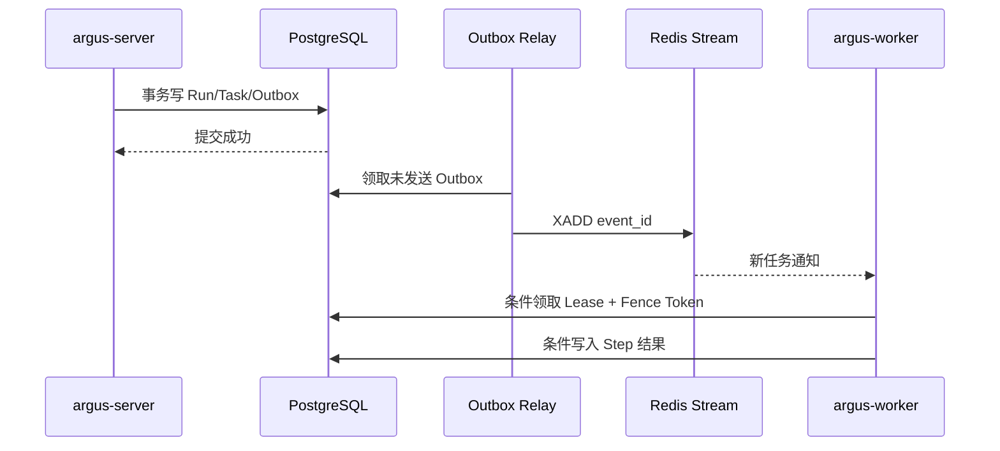
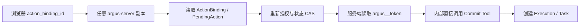

# 运行时状态、Redis 与横向扩展

## 1. 目标

本章固定 Argus 多副本运行时的状态所有权、任务领取、Redis 使用、服务路由和横向扩展边界。目标是任意无状态 Pod 重启、扩容或缩容时，不丢失唯一业务状态、不重复执行外部副作用，并允许从 PostgreSQL 恢复。

中间件自身的高可用和扩容不在本章讨论范围；本章只说明 Argus 服务如何正确使用 PostgreSQL、Redis、Kafka 和 ClickHouse。

## 2. 状态分类

| 状态 | 权威存储 | Redis 用途 | 恢复方式 |
| --- | --- | --- | --- |
| Run/Step/Task | PostgreSQL | 新任务通知、短期进度缓存 | Worker 扫描未完成 Task |
| PendingAction/Approval/Execution | PostgreSQL | 短期幂等窗口、状态通知 | 按数据库状态恢复 |
| Action Binding/私有 Token | PostgreSQL 加密记录或专用 Secret Store | 可选短 TTL 读取缓存 | 从权威记录恢复或要求重新 Preview |
| ConnectorCommand | PostgreSQL | 路由和进度通知 | 根据 Command 状态和 Connector 对账 |
| 在线 Connector Session | PostgreSQL 保存最后事实 | 带 TTL 的实时 Registry | Connector 心跳重建 |
| BastionScope/成员关系 | PostgreSQL | 可选列表和权限投影缓存 | 从数据库重建，不能随 Connector Session 消失 |
| Project/RoleBinding/RemoteAccessGrant/AuthorizationVersion | PostgreSQL | 权限投影、版本和失效通知 | 从数据库重建；旧票据、Binding 和查询按版本拒绝 |
| RemoteAccessSession/票据消费事实 | PostgreSQL 加密记录或专用 Secret Store | 在线路由、短 TTL 票据/JTI 和状态通知 | 从会话状态恢复；原一次性票据不恢复，必要时重新授权 |
| Remote Session Recording | Artifact Store + PostgreSQL 索引 | 不缓存正文 | 按 recording_ref 校验和读取；Gateway 本地临时分片必须上传后清理 |
| 登录 Session/撤销列表 | PostgreSQL 保存身份和撤销事实 | 热 Session、速率限制 | 重新认证或从数据库加载 |
| Tool Result/Card Instance | PostgreSQL/Artifact Store | 热数据缓存 | 按 result_ref/card_instance_id 读取 |
| Telemetry 摄入配额 | PostgreSQL 保存配置和结算 | 分布式计数器和快速撤销 | 重新加载配置，允许短窗口保守限流 |

## 3. Redis 的正确使用

Redis 可以用于状态转移相关的短期事务，但不能与 PostgreSQL 共同承担一个不可分割的业务提交。允许使用：

- `SET NX PX` 或 Lua：短期互斥、幂等窗口和 Leader Lease 加速。
- Redis Stream：Run Event、Connector Event 和 UI 更新通知。
- Pub/Sub：非可靠的低延迟唤醒。
- Hash/TTL：Connector Session Registry、权限投影、RemoteAccessSession 在线路由、票据 JTI 消费窗口和会话心跳加速；数据库仍保存状态事实。
- 原子计数器：限流、并发和短期预算预留。

禁止使用：

- 只在 Redis 保存 Pending Action、审批结果或任务完成状态。
- 把 Pub/Sub 消息当成任务已持久化的证据。
- 先改 Redis、后改 PostgreSQL，并假设两者一定同时成功。
- 只靠无 Fence Token 的 Redis Lock 防止旧 Worker 写回。

## 4. 状态转移事务

标准状态转移在 PostgreSQL 内完成：

```sql
BEGIN;

UPDATE run_tasks
SET status = 'running',
    lease_owner = :worker_id,
    lease_until = :lease_until,
    fence_token = fence_token + 1,
    updated_at = now()
WHERE id = :task_id
  AND status IN ('pending', 'retryable')
  AND (lease_until IS NULL OR lease_until < now())
RETURNING fence_token;

INSERT INTO outbox_events (...);

COMMIT;
```

Outbox Relay 再把事件写入 Redis Stream。Relay 在发送成功后标记 Outbox；重复发送由 `event_id` 去重。Redis 暂时不可用不会回滚已经成功的业务事务，消费者恢复后可以重新投递。



## 5. Worker 领取和恢复

每个 Task 保存：

```text
task_id / run_id / step_id
status
lease_owner / lease_until
fence_token
attempt
idempotency_key
not_before / expires_at
payload_ref
last_error
```

Worker 执行规则：

1. 领取 Task 时获取新的 Fence Token。
2. 所有进度和最终写回必须携带当前 Fence Token。
3. Lease 定期续约；旧 Worker 即使恢复，也不能用旧 Fence Token 写回。
4. 无外部副作用的计算 Step 可以在 Lease 过期后重新执行。
5. 有外部副作用的 Step 必须先查询 Execution 或 ConnectorCommand；只有证明未执行时才能重试。
6. Worker 关闭时停止领取新任务，尝试完成或释放安全可重试的任务。

## 6. Action Executor 和 Token

Action Executor 是 `argus-server` 内部模块，所有副本都可以接收 Card Action。它不依赖接收 Preview 的原 Server 副本：



Action Binding 和 Pending Action 的唯一状态位于 PostgreSQL；Redis 只缓存短时间读取结果。多副本同时收到双击请求时，数据库唯一约束和条件更新保证只创建一个 Execution。

## 7. 服务横向扩展结论

### 7.1 `argus-server`

可以横向扩展。

- HTTP Session 使用签名 Cookie/Token 或 Redis 热 Session，撤销和身份事实持久化。
- Conversation、Card Instance、Pending Action 和 Action Binding 不保存在 Pod 内存。
- WebSocket/SSE 可以连接任意副本；事件通过 Redis Stream/PubSub 或从数据库增量读取。
- Action Executor 使用数据库 CAS，因此不要求会话粘滞。
- 缩容前停止接收新连接，并给流式连接设置重连游标。

### 7.2 `argus-worker`

可以横向扩展。

- 使用 PostgreSQL Task Lease 和 Fence Token 分工。
- 按企业、部门、用户额度和任务类型设置公平调度。
- 模型请求和 Sandbox Session 与 Run ID 绑定，Worker 变化不改变状态归属。
- HPA 使用可运行 Task 数、最老 Task 年龄、模型并发和 CPU；不能只看 CPU。

### 7.3 Direct Executor Worker Pool

复用 `argus-worker` 程序但使用独立 Deployment、Task Queue、ServiceAccount、NetworkPolicy 和固定公网出口。

- 只领取 `direct_ssh/direct_winrm` 安装、命令和人工远程会话连接任务。
- 每次 DNS 解析和建连都重新校验最终 IP，拒绝私网、环回、链路本地、云元数据和 Argus 内部地址。
- Credential Package 和 Remote Access Ticket 短期绑定企业、用户、Host、用途和有效期，不能写 Pod 磁盘。
- 公网连接中断时 RemoteAccessSession 写入 `ConnectionLost`，不能在另一 Pod 静默恢复为同一 SSH TCP 会话；用户可在重新授权后创建新会话。
- HPA 使用待处理公网任务、活动会话、连接建立延迟、出口带宽和 CPU；固定 Egress 地址不随 Pod 数变化。

### 7.4 `argus-connector-gateway`

可以横向扩展，但长连接本身不能在 Pod 之间迁移。

- Connector 通过负载均衡连接任意 Gateway。
- Redis Session Registry 记录连接所有者，其他 Gateway 通过内部 mTLS RPC 转发命令。
- RemoteAccessSession 使用同一 Registry 找到 Connector 所在 Gateway，但终端逻辑流具有独立票据、优先级、并发和带宽限制。
- 会话录像连续上传 Artifact Store，并在 PostgreSQL 保存分片/完成索引；Pod 本地临时数据不是唯一副本。
- `connection_epoch` 防止旧连接和旧 Gateway 接收新命令。
- 扩容增加新连接承载能力；已有连接不会自动均衡，可通过受控重连逐步再分布。
- 缩容和升级必须 Drain，不得直接杀死大量正在执行命令或活动远程会话；超出 Drain 窗口的会话写入明确中断事实。
- HPA 使用在线 Connector、活动远程会话、每连接消息速率、带宽、事件循环延迟和内存。

### 7.5 `argus-telemetry-ingest`

可以横向扩展。

- 入口通过支持 gRPC/HTTP2 的 L4/L7 负载均衡分发。
- 实例不保存唯一摄入状态；成功写入 Kafka 前不向 Collector 确认成功。
- 企业/Project/资源凭证、配额和撤销状态使用本地短缓存加 Redis 快速失效，权威配置在 PostgreSQL。
- 分布式配额使用 Redis 原子计数或专用限流算法；Redis 故障时采用保守的实例配额，避免无限放行。
- HPA 使用请求/字节速率、Kafka Producer 延迟、背压和 CPU。

### 7.6 `argus-telemetry-query`

可以横向扩展。

- 所有实例使用 ClickHouse 只读账号并强制注入 EnterpriseId、授权 ProjectId/ResourceIds、Signal、字段投影与脱敏。
- 游标包含 `enterprise_id`、`project_id`、AuthorizationVersion、查询哈希和稳定排序位置，不依赖实例内存。
- 查询预算和并发按企业/Project 通过 Redis 协调，数据库保存权威策略。
- HPA 使用查询并发、P95 延迟、排队长度和 ClickHouse 拒绝率。

### 7.7 `otel-clickhouse-writer`

可以按 Kafka Consumer Group 横向扩展，但扩展上限受 Topic Partition 数限制。

- 同一 Partition 同时只由一个 Consumer 处理。
- 增减副本会发生 Rebalance，必须控制批次处理和 Offset 标记语义。
- HPA 主要使用 Kafka Lag、最老消息年龄和 ClickHouse 插入延迟。
- 需要保持同一 Trace/Metric Resource 的分区策略，不能为了均衡随意改变 Key。

## 8. 不能普通横向扩展的任务

以下任务使用 Job 或 Leader Lease，而不是多个副本同时执行：

| 任务 | 约束 |
| --- | --- |
| PostgreSQL/ClickHouse Migration | 一个版本同一时间只运行一个 |
| Bootstrap 初始化 | PlatformState 行锁和一次性 Setup Token |
| Operator/CRD 安装编排 | `argusctl` 阶段 Lease 和幂等资源检查 |
| 定时清理/过期任务 | 可分片，但同一对象只能一个 Lease Owner |
| DLQ 跳过/重放 | 显式审批、Partition/Offset Fence |
| 企业删除和密钥轮换 | 持久化 Workflow，按步骤幂等执行 |

## 9. 横向扩展失败场景验收

发布前至少验证：

1. 任意删除一个 Server Pod，Card Action 不丢失且不会重复 Commit。
2. Worker 在 Tool 成功后、写回前被杀死，系统能对账而不是盲目重试。
3. Redis 清空后，Run、Pending Action 和 Connector Command 不丢失，Connector Registry 能重建。
4. Connector Gateway Drain 时，新命令不会发往旧 connection_epoch。
5. Remote Access Gateway Drain/崩溃时活动会话得到明确中断状态，录像已上传分片不丢失，一次性票据不能重放。
6. Direct Executor 遭遇 DNS Rebinding、IPv4/IPv6 私网、云元数据或平台内部目标时拒绝连接；扩容后固定出口不变化。
7. Ingest Pod 扩缩容时 Collector 重试不造成未记录的数据静默丢失。
8. Writer Rebalance 时 Offset 只在 ClickHouse Pipeline 成功后推进。
9. Query 请求落到不同副本时，企业过滤和 Cursor 结果保持一致。
10. 双击确认、网络重试和两个 Server 副本并发处理只生成一个 Execution。
