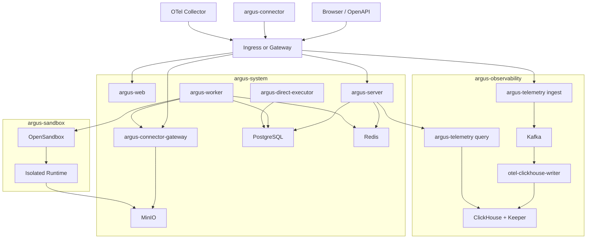

# 当前实现盘点与 Kubernetes 落地路线

## 1. 文档定位

本文连接三类信息：

- `docs/00` 至 `docs/12` 已确定的产品和架构约束。
- 仓库截至 2026-08-16 的实际代码状态。
- 从当前骨架推进到可安装、可升级、可验证的 Kubernetes 交付物的实施顺序。

本文不改变既有架构边界。规范性约束仍以[已决策事项与系统不变量](./00-decisions-and-invariants.md)为准，完整目标部署设计仍以[服务组件与 Kubernetes 一键部署](./10-service-components-and-kubernetes-deployment.md)为准。

## 2. 文档体系梳理

现有文档可以按五组阅读：

| 文档组 | 内容 | 解决的问题 |
| --- | --- | --- |
| `00`、`01` | 决策、不变量、产品定位、总体架构 | 哪些边界不能在实现中自行改变 |
| `02`、`03` | 企业身份、RoleBinding/DataScope、Connector、Host、Kubernetes、远程访问 | 谁可以通过哪条连接路径操作哪些资源 |
| `04`、`05`、`06` | Agent、MCP、Preview/Commit、Card、安全和 MVP | AI、浏览器、Card 与确定性执行如何隔离 |
| `07`、`08` | 初始化、双层管理门户、模型和 OpenSandbox | 平台域与企业域如何启动和治理 |
| `09`、`10`、`11`、`12` | 遥测、Kubernetes 部署、运行时状态、技术栈 | 服务如何部署、扩缩容、持久化和测试 |

需要始终一起理解的关键关系：

1. `enterprise_id` 是第一版唯一业务和安全隔离边界；第一版不实现 Project。
2. Host/Kubernetes 标签用于归类与 DataScope 选择；Bastion Scope 和 Telemetry Group 只表达网络或遥测拓扑，不能传播权限。
3. PostgreSQL 保存唯一业务状态；Redis 只做缓存、通知、限流和短期协调。
4. 所有变更操作使用 Preview/Confirm/Commit；模型和浏览器都不能接触私有提交 Token。
5. Connector 控制链路、OTLP 摄入链路、Telemetry Query 链路必须使用独立服务、凭证和扩缩容策略。
6. 第一版所有平台依赖均随 Argus 安装到同一 Kubernetes 集群，不提供外部托管中间件分支。

## 3. 仓库当前状态

### 3.1 总体结论

截至 2026-08-16，当前仓库已经完成 M0 契约冻结、M1 前端/API 基座和 M2 Evaluation 身份授权闭环。Setup、双 Audience 登录、企业生命周期、IAM、ServiceAccount/APIKey、审计和撤权均有真实 PostgreSQL/Redis 实现与临时 Kubernetes Namespace E2E；Host/Kubernetes、Agent、Connector 和 Telemetry 领域仍按 M3 以后里程碑推进。

| 范围 | 当前状态 | 可交付程度 |
| --- | --- | --- |
| 企业门户 | 企业登录/首次改密、用户、Department、Role、RoleBinding、DataScope、ServiceAccount/APIKey 和企业审计已接 real API | M2 身份/IAM 核心流程可真实使用；未进入 M2 的资源/Agent 页面稳定不可用 |
| 平台门户 | 平台登录/改密、企业生命周期、临时密码企业管理员和平台审计已接 real API | M2 平台管理核心流程可真实使用；Sandbox 治理归入 M4 |
| 初始化门户 | Setup Token、系统信息、平台超级管理员和永久锁定已接 real API | 全新安装可完成真实一次性初始化；不包含 OpenSandbox 配置步骤 |
| Card Runtime | 独立 Origin 构建、Manifest/内容哈希/CSP 校验、可执行 Card 文档、`window.argusCard` 和 MessagePort Bridge 已完成 | 浏览器安全运行基座可用；CardVersion 持久化与服务端 Binding 治理属于 M5 |
| API Client | 生成契约、领域 Port、版本化 mock、显式 real Adapter 和 HTTP/可恢复 SSE/WebSocket Transport已完成；M2 Path 已接入 | mock/real 显式选择且配置错误 fail closed；后续只按里程碑补领域 Path |
| `argus-server` | 已实现 M2 Setup、Identity、Platform、Enterprise IAM、Authorization、Machine Credential、Audit 和 Outbox Handler | Evaluation 身份授权控制面可用；资源、Agent、Connector 和 Telemetry 业务尚未实现 |
| Worker/Gateway/Telemetry/Connector | 进程入口和生命周期骨架已存在 | 尚无领域行为、Agent Loop 和协议实现 |
| `argusctl` | 已实现 preflight、plan、镜像、install、status、verify、tunnel、uninstall | 可安装和验证 Evaluation；Production 安装硬阻断 |
| OpenAPI/protobuf/migration | M0 契约门禁和 M2 Path/DTO 已完成；Goose + sqlc Migration 经真实 PostgreSQL 空库、重复、并发和重建测试 | M2 Schema 与身份/IAM 领域已落地；后续领域继续增量扩展 |
| Kubernetes 交付物 | Dockerfile、六个 Chart、Profile、Schema、版本锁和本地 Registry Loader 已存在；Web 镜像提供四个前端入口 | 可部署完整 Evaluation 基座 |

因此，现阶段可以声明“完整依赖和运行角色可部署”，但不能把前端 mock 流程、后端进程健康和“业务后端已完成”视为同一完成度。

### 3.2 前端应用

| 应用 | 主要职责 | 当前主要页面 |
| --- | --- | --- |
| `web/apps/setup` | 首次初始化 | Setup Token、系统信息、超级管理员、确认提交和永久锁定 |
| `web/apps/platform` | 平台超级管理员域 | 平台概览、企业、平台管理员、Sandbox、审计、账号 |
| `web/apps/enterprise` | 企业业务域 | Chatbox、主机、Kubernetes、任务、审批、组织权限、模型、Card、Secret、审计 |
| `web/apps/card-runtime` | 独立 Card Origin | CSP 下加载并运行已校验的 Card 文档，通过 MessagePort 与 Host 通信 |

三个门户都必须通过 `VITE_API_MODE=mock|real` 显式选择 API 模式。未知模式、real 缺少 `VITE_API_BASE_URL`、Enterprise real 缺少 `VITE_CARD_ORIGIN`，以及 Setup real 缺少 `VITE_PLATFORM_URL` 时都会停止启动，不会回退到 mock。M2 已在既有 Transport 上补齐 Setup、Identity、Platform、IAM、ServiceAccount/APIKey 和 Audit Path；未进入当前里程碑的领域操作继续稳定返回 `CLIENT_OPERATION_UNAVAILABLE`。

共享包目录已在 M1 按目标边界收敛；后续领域实现必须继续复用这些包，不能在业务应用内重新建立平行基座：

| 包 | 职责 |
| --- | --- |
| `@argus/ui` | 唯一通用组件库，承载 AppShell、UserMenu、认证状态页、表格、抽屉、图标按钮和通用表单反馈 |
| `@argus/design-tokens` | 主题语义 Token |
| `@argus/api-client` | 生成契约、领域 Port、mock/real Adapter、HTTP/SSE/WebSocket Transport 和未冻结临时类型 |
| `@argus/auth` | `unknown → checking → authenticated | anonymous | unavailable` 认证状态；localStorage 只保存非权威启动提示 |
| `@argus/card-host` | Manifest/RenderPlan 与内容哈希校验、精确 Origin 握手、MessagePort Bridge 和受控 Binding 调用 |
| `@argus/observability` | 前端遥测上下文和事件入口 |

前端 Playwright 同时支持 Enterprise、Platform、Setup 和 Card Runtime 四个 Origin。既有 mock 套件覆盖产品流程、Audience、Labels、Card Bridge/CSP 与 `zh-CN/en-US × light/dark` axe 门禁；M2 另有 real 模式用例覆盖 Setup 永久锁定、Platform 登录、Enterprise 登录/刷新恢复以及密码不进入 URL/storage。真实业务证据由 `make e2e-m2-k8s` 在临时 Namespace 中运行，不以 mock Playwright 替代。

M1 已清除 Project、Membership、旧 `tags` 和公开 PendingAction 私有字段。M2 真实写表单统一使用 React Hook Form + Zod，临时密码和 APIKey 原值只在结果界面显示一次，认证启动继续以 `auth.me()` 为权威。当前前端的剩余边界是由 M3 以后里程碑补充资源、Agent、Card 治理、远程访问和遥测 Path，并继续删除对应 provisional 类型。

Agent 运行时当前仍只有目录骨架：M0 已冻结 ConversationEvent、Run/Step/Task、ModelCall、ToolResultProjection、ContextSnapshot、Tool Metadata 和上下文预算契约，M1 前端 mock 已通过这些冻结 envelope 驱动页面 reducer，但尚无服务端持久化、Agent Loop、ContextAssembler 或 Compactor 实现。mock 的协议形状和断线恢复测试不能替代真实 Harness。目标实现见[Agent Harness 与上下文管理](./16-agent-harness-and-context-management.md)。

### 3.3 后端程序与运行角色

仓库维护六个 Go 入口，其中四个是服务端程序，另外两个分别运行在客户环境和部署者环境：

| 二进制 | 部署位置 | 目标职责 | 当前状态 |
| --- | --- | --- | --- |
| `argus-server` | `argus-system` | Web/API、身份、权限、领域服务、Action Executor | M2 Setup/Identity/IAM/Authorization/Machine/Audit 可用；Action 和资源域待后续里程碑 |
| `argus-worker` | `argus-system` | Agent、Tool Run、任务、Sandbox、安装执行 | 生命周期骨架 |
| `argus-connector-gateway` | `argus-system` | Connector 长连接、命令流、Artifact、Remote Access | 生命周期骨架 |
| `argus-telemetry` | `argus-observability` | `ingest` 写 Kafka；`query` 查 ClickHouse | 模式校验和生命周期骨架 |
| `argus-connector` | 受管主机/堡垒机 | 主动 mTLS 接入、命令和 Artifact/会话隧道 | 生命周期骨架，不部署在平台集群 |
| `argusctl` | 部署者工作站或 CI Runner | Preflight、Install、Upgrade、Verify、Uninstall | Evaluation 安装闭环已实现；独立 Upgrade 子命令待补 |

`argus-worker` 还需要以独立 Deployment 运行 Direct Executor Pool。它复用二进制，但不能复用普通 Worker 的队列、ServiceAccount、NetworkPolicy 或出口策略。

### 3.4 已交付部署基础与剩余边界

截至 2026-08-16 已交付：

- Backend/Web/安全修复 MinIO 多阶段 Dockerfile，ARM64 实际构建和 AMD64 OCI 构建路径。
- `ArgusInstallConfig v1alpha1` JSON Schema、Evaluation/Production Profile 和版本锁定清单。
- Foundation、Data Operators、Data、Sandbox、Platform、Telemetry Pipeline 六个 Helm Release。
- PostgreSQL、Redis、MinIO、OpenSandbox、Strimzi/Kafka、Altinity/ClickHouse、Keeper 和 OTel Writer 的实际 Evaluation 集成。
- `argusctl preflight/plan/images/install/status/verify/tunnel/uninstall` 与阶段状态 ConfigMap。
- M2 PostgreSQL Schema、独立 Goose Migration Job/advisory lock、按领域拆分的 sqlc 数据访问、Outbox Relay 和 Redis Stream 去重。
- Setup Token Secret/轮换、平台与企业双 Audience、Argon2id、Cookie/CSRF/Origin、临时密码首次改密和离线管理员重置。
- 企业生命周期、EnterpriseUser/Department 启停、默认 Department/七个内置 Role/默认空 DataScope、统一授权、签名游标、ServiceAccount/APIKey 和分域 hash-chain 审计。
- `make e2e-m2-k8s`：真实 Setup → Platform → Enterprise → IAM → APIKey → Audit → 撤权，Redis 停止和 Server 重启恢复，四 Origin real Playwright，以及成功/失败无条件清理。

仍未完成且不能由部署基座替代：

- Host/Kubernetes、Connector、Agent/Action、Card 服务端治理、Remote Access、OTLP 摄入和查询业务实现。
- OpenSandbox 平台治理 API；部署仍由 Helm 管理，该 API 在 M4 Agent/Sandbox 接入前补齐。
- SBOM、镜像签名、漏洞门禁、备份恢复和独立 Upgrade 工作流。
- Production PostgreSQL HA、OpenSandbox 强化 Runtime ADR和平台超级管理员 MFA/恢复/Step-up；这些未完成前 Production 安装保持硬阻断。

## 4. Kubernetes 目标拓扑

### 4.1 命名空间

沿用三个命名空间，不把中间件全部堆入一个故障域：

| Namespace | 资源 |
| --- | --- |
| `argus-system` | Web、Server、Worker、Direct Executor、Connector Gateway、PostgreSQL、Redis、MinIO、Migration/Bootstrap Job |
| `argus-sandbox` | OpenSandbox API/控制组件及隔离 Runtime 工作负载 |
| `argus-observability` | Strimzi、Kafka、Altinity Operator、ClickHouse/Keeper、Telemetry Ingest/Query、Writer、Schema Job |

生产环境建议将 Sandbox、Kafka、ClickHouse 调度到独立 Node Pool，并用 Taint/Toleration、Topology Spread 和资源配额降低相互影响。

### 4.2 工作负载



### 4.3 前端交付建议

三个 Vite 应用构建为静态资源，使用一个 `argus-web` 镜像和一个 Deployment。静态服务器按 Host 选择不同 SPA 根目录：

| Host | SPA | API 路由 |
| --- | --- | --- |
| `argus.example.com` | enterprise | `/api`、SSE/WSS 转发到 `argus-server` |
| `platform.argus.example.com` | platform | `/api` 转发到 `argus-server` 的平台 Audience |
| `setup.argus.example.com` | setup | 仅初始化状态和提交 API |

这样可以保持三个应用当前都从 `/` 启动，避免路径前缀与现有 Router 冲突。三个 Host 可以共享静态 Deployment，但认证 Cookie 必须使用精确 Host/Path 和不同 Audience，不能通过父域 Cookie 混合平台与企业身份。

如果后续决定将静态资源嵌入 `argus-server`，需要单独评估镜像发布耦合、缓存和三个身份域的路由规则；第一阶段不建议同时维护两种生产托管模式。

### 4.4 对外入口

| 入口 | 后端 | 暴露方式 | 关键要求 |
| --- | --- | --- | --- |
| Enterprise/Platform/Setup Web | `argus-web`、`argus-server` | HTTPS Ingress/Gateway | Cookie、CSRF、CSP、SSE/WSS |
| Connector | `argus-connector-gateway` | 独立 TLS/L4 或支持长连接的 Gateway | mTLS、Drain、连接指标 |
| Remote Access | `argus-connector-gateway` 独立 Listener | HTTPS/WSS | 一次性票据、录像、独立限流 |
| OTLP gRPC | `argus-telemetry-ingest:4317` | 支持 HTTP/2 的 L4/L7 入口 | 独立证书、认证、背压 |
| OTLP HTTP | `argus-telemetry-ingest:4318` | HTTPS | 独立限流和请求体限制 |

PostgreSQL、Redis、Kafka、ClickHouse、OpenSandbox、Telemetry Query、Writer 和 Direct Executor 不对集群外暴露 Service。

## 5. Release 与资源所有权

保持多 Release 编排，避免一个 Helm 事务同时管理 CRD、Operator、有状态服务和业务 Deployment：

| Release | 主要资源 | 前置条件 |
| --- | --- | --- |
| `argus-foundation` | Namespace、ServiceAccount、RBAC、Quota、LimitRange、NetworkPolicy、Certificate | 集群预检通过 |
| `argus-data-operators` | Strimzi、Altinity Operator 及锁定 CRD | Foundation |
| `argus-data` | PostgreSQL、Redis、MinIO、Kafka CR、ClickHouseInstallation/Keeper | Operator Ready、StorageClass Ready |
| `argus-sandbox` | OpenSandbox 和 Runtime 配置 | RuntimeClass 与 Artifact Store Ready |
| `argus-platform` | Web、Server、Worker、Direct Executor、Gateway、PostgreSQL Migration、Bootstrap | PostgreSQL Ready |
| `argus-telemetry-pipeline` | ClickHouse Migration、Ingest、Writer、Query、Topic/ACL | Kafka/ClickHouse Ready |

Operator 是集群级或共享能力时，`argusctl` 必须检测兼容版本和资源所有者，不得在卸载某个 Argus 实例时误删其他实例仍在使用的 CRD。

## 6. 安装顺序与门禁

推荐的确定性安装状态机：

1. **Preflight**：检查 Kubernetes/API、StorageClass、Ingress/Gateway、证书、DNS、NetworkPolicy、RuntimeClass、节点容量、固定 Egress 和 Operator 冲突。
2. **Foundation**：创建命名空间、最小 RBAC、默认拒绝网络策略、Quota、证书和镜像拉取 Secret。
3. **Operators**：安装或复用 Strimzi 与 Altinity，等待 CRD、Webhook 和 Controller Ready。
4. **Data**：创建 PostgreSQL、Redis、MinIO、Kafka、ClickHouse/Keeper，逐项执行读写和法定副本检查。
5. **Sandbox**：安装 OpenSandbox，验证隔离 Runtime、无生产 Secret、受控对象存储访问和默认拒绝外网。
6. **Schema**：先完成 PostgreSQL Migration；ClickHouse Migration 独立执行并记录 Schema Version。
7. **Control Plane**：发布 Web、Server、Worker、Direct Executor 和 Connector Gateway。
8. **Telemetry**：先发布 Ingest，再发布 Writer 和 Query；Ingest 只依赖 Kafka 可写，Writer/Query 依赖 ClickHouse Schema Ready。
9. **Bootstrap**：生成短期 Setup Token Secret，只输出 Secret 名称、读取命令、URL 和过期时间。
10. **Verify**：完成控制面、Sandbox、Connector、Direct Egress 和 OTLP 写入/查询的安装验证。

每一阶段必须幂等并写入安装状态。失败后再次执行应从未完成阶段恢复，而不是删除整个 Release 重装。

## 7. 配置、Secret 与持久化

### 7.1 配置分层

建议配置来源优先级为：

```text
版本化默认值
< Evaluation/Production Profile
< ArgusInstallConfig
< SecretRef/集群发现结果
```

普通 ConfigMap 只保存非敏感配置、端点、Feature Gate 和 Schema Version。数据库密码、Cookie/Token 签名密钥、Envelope Encryption 主密钥、mTLS CA、对象存储凭证和模型 Provider Secret 必须使用 SecretRef。

### 7.2 持久化边界

| 数据 | 权威存储 | 备份要求 |
| --- | --- | --- |
| 身份、RBAC、Run、Task、Action、审计索引 | PostgreSQL | 全量 + PITR/WAL + 恢复演练 |
| 热缓存、通知、限流 | Redis | 可重建；生产可为可用性启用持久化 |
| Artifact、录像、附件、备份目标 | MinIO | 版本控制、生命周期、跨故障域备份 |
| 遥测缓冲 | Kafka | 保留期覆盖 Writer 修复窗口，不替代长期备份 |
| Metrics/Logs/Traces | ClickHouse | 对象存储备份、Schema/数据恢复演练 |

默认升级和卸载不能删除 PVC、Bucket、备份、CRD 或主密钥。Production 默认 `retainData=true`。

## 8. 网络策略基线

所有命名空间先默认拒绝，再按调用关系放行：

- Web 只能访问 Server，不访问数据库和中间件。
- Server 可访问 PostgreSQL、Redis、Telemetry Query 和必要的内部 Gateway API。
- 普通 Worker 可访问 PostgreSQL、Redis、OpenSandbox、Gateway 和允许的模型端点。
- Direct Executor 只访问任务依赖和经校验的公网 SSH/WinRM；必须拒绝私网、环回、链路本地、云元数据、集群网段和平台内部地址。
- Connector Gateway 可访问 PostgreSQL、Redis、Artifact Store；Connector 和 Remote Listener 使用独立入口策略。
- Telemetry Ingest 只访问认证/配额所需控制数据和 Kafka，不直接写 ClickHouse。
- Writer 只消费 Kafka 并写 ClickHouse。
- Telemetry Query 只使用 ClickHouse 只读账号。
- Sandbox 默认只访问受控 Artifact Bucket 和明确批准的网络目标，不访问 Server 数据库、Gateway、ClickHouse 或 Kubernetes API。

Kubernetes NetworkPolicy 通常不能独立保证固定公网出口和 DNS Rebinding 防护。Direct Executor 还需要集群 Egress Gateway/NAT、防火墙和应用层目标复验共同约束。

## 9. Evaluation 与 Production

| 能力 | Evaluation | Production |
| --- | --- | --- |
| 用途 | 开发、演示、功能 E2E | 正式业务 |
| Argus 副本 | 每角色 1 个 | 无状态关键角色至少 2 个 |
| PostgreSQL | 单实例、较小 PVC | HA、反亲和、PITR；具体 Operator 待 ADR |
| Redis | 单实例 | HA/故障转移，仍不保存唯一事实 |
| Kafka | Strimzi 低副本 KRaft | 至少 3 Broker，`min.insync.replicas >= 2` |
| ClickHouse | 单 Shard/单 Replica 可接受 | 至少 2 Replica，Keeper 至少 3 个 |
| Sandbox | 可显式使用降级 Runtime | 必须使用批准的强化 Runtime |
| PDB/HPA | 可简化 | 按角色配置 PDB、HPA 和拓扑分布 |
| 数据保留 | 短 TTL | 按业务 SLO、成本和合规配置 |

Production Profile 目前仍受两个开放 ADR 阻塞：PostgreSQL HA/备份组件，以及 OpenSandbox 强化 Runtime 选型。未完成 ADR 前可以交付 Evaluation，但不能宣称 Production Profile 已定型。

## 10. Kubernetes E2E 方案

前端现有 Playwright E2E 继续作为快速 UI 门禁；新增全链路 E2E 使用唯一运行 ID 创建临时命名空间组：

```text
argus-e2e-<run-id>-system
argus-e2e-<run-id>-sandbox
argus-e2e-<run-id>-observability
```

推荐流程：

1. 获取集群级测试 Lease，防止多个重型 E2E 同时争抢资源。
2. 记录常驻 Argus 工作负载副本数；资源不足时只暂停常驻无状态服务，不删除数据组件。
3. 复用已安装且版本兼容的集群级 Operator；在临时 Namespace 创建独立 CR 和数据卷。
4. 使用 Evaluation Profile 安装完整依赖和 Argus 工作负载。
5. 运行 `argusctl verify`、后端契约/集成测试和三个门户的 Playwright 流程。
6. 验证初始化、平台/企业身份隔离、RoleBinding/DataScope、标签撤权、Preview/Commit、Connector、Sandbox、OTLP 写入/查询和 Pod 故障接管。
7. 导出失败日志、事件、Pod 状态和必要的脱敏 Artifact。
8. 无论成功失败都删除三个临时 Namespace，并等待 PVC/LoadBalancer 等资源收敛。
9. 按记录恢复常驻工作负载副本数并释放测试 Lease。

集群级 CRD/Operator 不属于临时 Namespace 的生命周期，测试清理不得删除它们。所有 E2E Secret、Bucket、Kafka Topic 和 ClickHouse 数据必须带 `run-id`，避免跨用例污染。

## 11. 实施路线

里程碑唯一口径为[端到端实现计划](./15-end-to-end-implementation-plan.md)和[分阶段任务文件](./plans/README.md)，不在本盘点文档维护另一套编号。

- M0 契约与文档冻结已完成，首次合并后成为后续 Breaking Check 基线。
- 下一步执行 M1 前端与 API 基座，把手写 DTO/Mock 迁移到生成契约并建立真实 Adapter 边界。
- M2 交付 Setup → Platform → Enterprise 身份授权垂直闭环；后续按 M3-M8 依次推进资源连接、Agent/Action、Card、远程访问、遥测和 Production 门禁。

## 12. 当前优先级结论

M0 已完成。当前最合理的下一交付目标是在现有可重复安装的 Evaluation 基座上完成“前端/API 基座 → 真实控制面垂直闭环”：

1. 按 M1 清理 Project/Membership/tags/PendingAction 私有字段等旧前端契约，建立显式 mock/real Adapter。
2. 以初始化、平台/企业身份、Department、RoleBinding/DataScope、Session 和审计替换第一批 mock。
3. 用真实 HTTP 客户端跑通三个门户，并在临时命名空间验证跨企业和范围外资源拒绝。
4. 再进入 Connector、执行、Card、Remote Access 和 Telemetry 的分阶段闭环。

详细顺序、任务拆分和阶段退出标准见[端到端实现计划](./15-end-to-end-implementation-plan.md)与[分阶段任务文件](./plans/README.md)。
