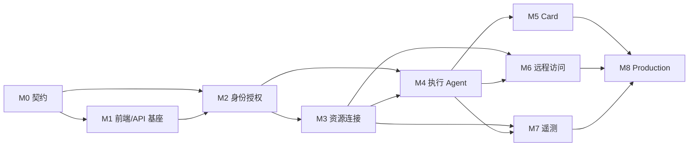

# Argus 端到端实现计划

## 1. 目标

本计划从当前“前端 mock 产品原型 + 后端进程骨架 + 可安装 Evaluation 基座”推进到可真实使用、可审计、可恢复、可在 Kubernetes 临时 Namespace 完成全链路验收的第一版产品。

最终闭环定义为：

```text
安装与初始化
→ 平台创建企业和初始管理员
→ 企业建立用户/部门、RoleBinding 和 DataScope
→ 接入带 labels 的 Host/Kubernetes 与 Connector
→ 用户或 Agent 在授权范围内查询/Preview
→ 用户确认、必要审批、确定性 Commit
→ Connector/Direct Executor 执行并审计
→ 人工远程访问使用独立授权和录像
→ Collector 推送可信遥测
→ Web/Agent/Card 通过同一 Query Service 获取裁剪结果
→ 故障恢复、撤权、备份和 E2E 验证通过
```

## 2. 固定范围

第一版必须遵守：

- `enterprise_id` 是唯一租户和安全隔离边界。
- EnterpriseUser 直接绑定唯一 `enterprise_id + department_id`；无 Membership、企业切换和通用用户 Group。
- 无 Project、`project_id`、Default Project、Project Selector 或 Project RoleBinding。
- Host/KubernetesCluster 使用 `labels: Record<string,string>` 归类；`argus.io/*` 为系统保留命名空间。
- RoleBinding 授予功能能力；DataScope 使用显式资源 ID 和/或受限标签选择器授权资源。
- 所有变更使用 Preview/Commit；私有 Token 和参数只在服务端保存。
- Card 使用 Manifest、CSP、MessageChannel/MessagePort 和 Binding ID。
- 人工 RemoteAccessSession 与 AI/Automation Execution 使用不同票据、接口、状态机和审计。
- 遥测可信身份为 `EnterpriseId + ResourceId + CollectorId`，查询强制应用授权资源范围。
- Agent Harness 第一版为 Provider-neutral 单 Agent 小内核；完整 ConversationEvent 不可变保存，上下文使用 Typed Checkpoint + ContextSnapshot + Recent Tail，可选 Provider Compaction 不成为事实来源。

第一版暂不实现：

- Project 和跨 Project 能力。
- 多企业 Membership、通用用户 Group、通用 ABAC/ReBAC。
- RDP/SFTP/通用端口转发。
- 任意 Collector YAML、任意策略 DSL、任意遥测 SQL。
- 外部托管中间件模式。
- 通用子 Agent、Agent 间消息、跨 Conversation 自动记忆和向量记忆库。

## 3. 实施原则

### 3.1 Contract First

每个领域按以下顺序推进：

1. 固化领域对象、状态机、不变量和错误码。
2. 固化 PostgreSQL Migration、OpenAPI/JSON Schema 或 protobuf。
3. 生成服务端接口与前端客户端类型。
4. 实现领域服务、Repository 和传输 Adapter。
5. 让 mock 与真实 Adapter 通过同一契约测试。
6. 接入前端和 Worker/Gateway。
7. 增加集成测试和 Kubernetes E2E。

禁止先让页面或 Handler 自定义临时字段，再反向猜测领域契约。

### 3.2 垂直闭环优先

每个里程碑至少交付一条用户可验证的真实路径，不只创建空模块。新功能进入真实路径后，相关 mock 只保留开发/演示用途，不能继续成为生产回退。

### 3.3 安全能力随功能同时交付

权限、审计、撤权、幂等、错误投影和失败恢复不是最后补充项。涉及远程访问、Card、Secret 或生产执行的 UI 在后端安全闭环未完成前保持禁用或不展示。

### 3.4 E2E 资源纪律

全链路测试使用唯一 Run ID 创建临时 Namespace；必要时记录并缩容常驻无状态服务。无论成功或失败都必须导出脱敏诊断信息、删除临时 Namespace/PVC/测试 Topic/Bucket，并恢复常驻服务副本数。

## 4. 里程碑总览

| 阶段 | 目标 | 关键退出结果 |
| --- | --- | --- |
| M0 | 契约冻结与文档收敛 | 身份、labels/DataScope、错误、流式、PendingAction、Card、Agent Event/ContextSnapshot 契约可生成且有 Breaking Check |
| M1 | 前端与 API 基座 | real/mock Adapter 分离，UI/Token/i18n/安全欠账收敛，前端不再暴露私有 PendingAction 参数 |
| M2 | 初始化、身份与授权闭环 | Setup、平台域、企业域、Department、RoleBinding/DataScope、Session、审计走真实 API |
| M3 | 资源与连接闭环 | 带 labels 的 Host/Kubernetes、Secret/Credential、Connector、Bastion Scope、Direct Executor 可真实管理 |
| M4 | 确定性执行闭环 | Outbox/Lease/Fence、Run、单 Agent Loop、上下文投影/压缩、Tool 权限/Schema 门禁、Preview/PendingAction/Approval/Execution 可恢复执行、AutomationRevision |
| M5 | Card 闭环 | 系统 Card 通过 CSP/MessagePort/Manifest/Binding 安全展示和触发动作，企业 Card 通过发布门禁 |
| M6 | 人工远程访问闭环 | Grant、短期票据、SSH PTY/HTTPS WinRS、加密录像、终止、撤权和审计完整 |
| M7 | 遥测闭环 | Collector、Ingest/Kafka/ClickHouse/Query、可信资源身份和统一数据裁剪贯通 |
| M8 | Production 门禁 | HA、备份恢复、供应链、容量、故障演练和完整 Kubernetes E2E 达标 |

详细任务见[分阶段任务文件](./plans/README.md)。

截至 2026-08-18，M0-M6 已按各自退出标准完成；下一实施阶段为 M7。M6 的最终临时集群验收运行号为 `20260818072400-79219`，脱敏证据位于 `artifacts/m6-e2e/20260818072400-79219`，结束后 Namespace、PVC 和 Lease 均为零残留。

## 5. 依赖关系



M1 与 M2 可以在 M0 契约稳定后部分并行，但真实页面接入必须以服务端契约和生成客户端为准。M5、M6、M7 可以在 M4 后并行开发，发布顺序仍按各自安全门禁决定。

## 6. 跨阶段工作流

### 6.1 契约与数据库

- OpenAPI 3.1 是浏览器和外部 API 权威协议。
- protobuf 是内部服务和 Connector 权威协议。
- JSON Schema 固化标签选择器、PendingAction 公共投影、Card Manifest/RenderPlan 和安装配置。
- PostgreSQL Migration 与领域对象同阶段提交；普通服务启动不得自动改 Schema。
- 所有协议在 CI 执行 lint、生成漂移和 Breaking Change 检查。

### 6.2 前端

- `@argus/api-client` 的 `./contracts` 子路径由 `openapi-typescript` 生成；M1 再把根接口拆为 contract、mock Adapter、HTTP Adapter、SSE Adapter 和 WebSocket Adapter。
- `@argus/ui` 是唯一通用组件库；业务应用不维护平行组件。
- 样式类名统一 `.argus-*`，颜色/字号/间距/圆角只用 Design Token。
- 每个业务模块维护独立 i18n 文件并在模块清单注册。
- 单文件接近 2000 行前主动拆分；Enterprise 大样式文件在 M1 完成拆分。
- 所有真实写表单在接入时使用 RHF/Zod；资源大列表再引入 Table/Virtual；遥测、终端分别在 M7/M6 引入 ECharts/xterm。

### 6.3 后端

- 领域模块按 `domain/service/repository/adapter` 组织，HTTP、MCP、Worker 只调用领域服务。
- PostgreSQL 保存事实；Redis 只做加速、通知、限流和短期协调。
- 事务状态变化与 Outbox 同事务提交。
- Worker/Connector/Execution 使用幂等键、Lease/Fence 和 ResultUnknown 对账。
- 所有企业资源查询先校验真实 `enterprise_id`，再应用 DataScope。
- Agent 使用不可变 ConversationEvent Ledger、结构化 RunCheckpoint 和派生 ContextSnapshot；大 ToolResult 先确定性投影，压缩不删除原始历史。`ModelCall` 保存调用与计费事实，`ModelUsage` 只作为聚合查询投影。
- ContextAssembler 与 ModelProvider Adapter 分离，默认生成 Provider-neutral 上下文；Provider 原生 Compaction 只作可选优化。

### 6.4 安全与审计

- Platform/Enterprise 使用不同 Session Audience、API 域和路由守卫。
- 浏览器生产认证使用 HttpOnly/Secure/SameSite Cookie 与 CSRF，不以 localStorage 保存权威 Session。
- Secret/APIKey/ServiceAccount 原值只显示一次，数据库保存哈希或 `secret_ref`。
- 所有授权变化和授权敏感标签变化递增 AuthorizationVersion。
- PendingAction 公共 DTO 与内部记录分离；浏览器、模型和 Card 永远看不到私有参数/Token。
- 每个阶段同步补齐审计事件、字段脱敏和审计查询权限。

## 7. 闭环验收场景

M8 结束时至少通过以下全链路场景：

1. 全新 Namespace 安装后用 Setup Token 创建平台超级管理员，Setup 永久锁定。
2. 平台管理员创建企业和初始管理员，但无法读取企业业务正文。
3. 企业管理员创建 Department、用户、RoleBinding 和基于 `environment=staging` 的 DataScope。
4. 接入带标签的堡垒机、内网 Host、公网 Direct Host 和 KubernetesCluster。
5. 范围内用户可以列表/详情/Tool 查询资源，范围外资源通过直接 ID、批量、游标、Card 和遥测查询均不可见。
6. 修改授权敏感标签使 Host 离开 DataScope，旧游标、PendingAction 和票据失效，活动订阅重新鉴权。
7. Agent 发起变更 Preview，可信 `run_id` 贯穿 PendingAction、Execution 和 Verify；浏览器只持有 ActionBinding，用户确认后 Action Executor 确定性 Commit，重复点击不产生重复副作用。
8. 长会话和大 ToolResult 触发确定性投影与 ContextSnapshot；原始事件仍可追溯，Worker 重启后能从相同切点恢复，摘要不能恢复已撤销权限。
9. 需要审批的生产动作不能由创建人自批；多策略必须全部满足；撤权后 Commit 失败；ResultUnknown 仅依据外部命令终态对账且不重放副作用；AutomationRun 固定使用创建时 Revision。
10. 系统 Card 使用 MessagePort 展示裁剪后的 Tool Result，伪造消息、Binding ID 或 Origin 被拒绝。
11. RemoteAccessGrant 只允许指定 Host/标签结果与 ManagedAccount；票据撤销、会话终止、录像和审计可验证。
12. Collector 伪造 Enterprise/Resource/Collector 身份被覆盖或拒绝，Metrics/Logs/Traces 只通过 Query Service 按资源范围返回。
13. 删除 Server/Worker/Gateway/Writer Pod、清空 Redis、制造 Kafka 积压和 ClickHouse Replica 故障后，事实状态可恢复且无重复危险执行。
14. 备份恢复到新 Namespace 后关键业务、审计索引和遥测查询符合恢复目标。
15. E2E 无论成功失败都清理临时 Namespace 和测试资源，并恢复被缩容的常驻服务。

## 8. 进度管理

每个里程碑任务文件是交付清单。开始里程碑时应：

1. 将任务拆成可独立合并的 Issue/PR，并保留任务 ID。
2. 标记依赖的 ADR、Schema 和上游里程碑。
3. 每个 PR 同时更新代码、契约、测试和受影响文档。
4. 只有任务文件中的退出标准全部满足，才标记里程碑完成。
5. 跨越已确定架构边界时先说明原因和影响，并更新 `docs/00` 与相关专题文档。

## 9. 当前建议起点

截至 2026-08-18，M0-M6 已完成：契约与生成门禁、显式 mock/real 前端基座、身份授权、资源/Connector、Agent/审批/确定性执行、Card 发布/渲染/Binding，以及人工 Remote Access 均已有代码、测试和临时 Kubernetes Namespace 证据。

下一步从 M7 开始：

- 在 M3 资源/Connector 与 M4 Execution 基座上实现 Collector Profile、CollectionClaim 和安装 Preview/Commit。
- 打通可信 Collector 身份、OTLP Ingest、Kafka、ClickHouse Writer 与统一 Query Service。
- 保持 Remote Access 与 Telemetry 的服务、凭证、端口和数据事实分离；Production MFA/Step-up、录像恢复和安全发布门禁继续由 M8 负责。

M1 完成后进入 M2，建立第一条真实 Setup → Platform → Enterprise 授权垂直闭环。这条路径是后续 Connector、Agent、Card、远程访问和遥测的共同根基。
