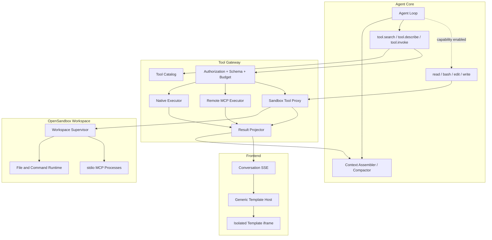

# Agent、Tool Discovery、Tool Template 与 OpenSandbox 重构架构

## 1. 背景

当前实现已经具备持久化 Run、模型调用、Tool Registry、Tool Result Projection、ContextSnapshot、PendingAction 和 OpenSandbox 生命周期管理，但运行时边界偏重：

- Agent 从完整 Registry 构造模型 Tool Catalog，再通过关键词和工具名启发式选择最多八个 Tool。
- 业务 Tool Schema 仍会随候选集进入每次模型请求；随着 Host、Kubernetes、Metrics、Trace、Log 和 Connector 工具增长，Schema Token 会持续增加。
- Provider 内部消息只有普通 `role + content`，ToolCall 和 ToolResult 被转换为文本消息，不能稳定利用原生 Tool Calling 上下文和供应商缓存。
- ContextProjection 已被计算，但当前模型请求仍直接使用组装前的消息；会话历史查询也以当前 Run 为边界，不能完整恢复跨 Run Conversation。
- Card 领域同时承担模板目录、AI 创建、版本、验证、选择、渲染计划、实例、Presentation、Slot 和 Binding，Agent 还包含 Card 命令和 `card.render` 特殊路径。
- 当前 OpenSandbox Adapter 只管理 Backend、Profile、配额和 Session 生命周期，没有文件操作、命令执行或 stdio 子进程桥接。

相关实现入口：

- [`internal/agent/loop.go`](../../internal/agent/loop.go)
- [`internal/agent/context.go`](../../internal/agent/context.go)
- [`internal/integration/modelprovider/provider.go`](../../internal/integration/modelprovider/provider.go)
- [`internal/card/`](../../internal/card/)
- [`internal/integration/opensandbox/client.go`](../../internal/integration/opensandbox/client.go)
- [`internal/sandbox/service.go`](../../internal/sandbox/service.go)

PlanV5 不在现有选择器、Card Binding 或 Sandbox Lifecycle Runner 上继续增加分支，而是重新确定四个边界：Agent Core、Tool Gateway、Presentation Runtime 和 Sandbox Runtime。

## 2. 目标与非目标

### 2.1 目标

1. Agent Core 保持单循环、小工具集和确定性上下文拼接。
2. 业务 Tool 通过分类搜索、详情查询和统一调用按需进入上下文。
3. Tool 定义、输入 Schema、执行器、模型投影和模板资产保持高内聚。
4. Agent 不参与模板选择、模板生成、模板绑定或前端渲染。
5. OpenSandbox 是可选执行能力，不成为 Agent 服务启动和就绪的硬依赖。
6. 四个基础文件/命令工具和 stdio MCP 始终在 OpenSandbox 中运行。
7. 保留授权、PendingAction、Approval、Execution、幂等和审计安全链路。
8. 上下文按事件顺序追加，并在完整 Turn 边界执行增量压缩。
9. 为后续 MCP 和通用 Skill 保留清晰扩展边界，不扩大 Agent Core。

### 2.2 非目标

- 本计划不建设面向企业用户的 MCP 配置入口或 MCP Marketplace。
- 本计划不建设模板编辑器、模板市场、模板组件目录或 Card Skill 创建功能。
- 本计划不允许模型下载并启动任意 MCP 包、任意命令或任意容器镜像。
- 本计划不引入多 Agent、子 Agent 调度、向量记忆或跨 Conversation 自动记忆。
- 本计划不实现 Skill Marketplace、企业 Skill 编辑器或自动模糊激活；只固定未来接入契约。
- 本计划不让模板绕过服务端 API、RBAC、数据授权或 PendingAction 状态机。
- 本计划不要求兼容旧 Card 数据、Card API 或浏览器 localStorage 状态。

## 3. 总体架构



Agent 只调用七个稳定名称。三个元工具把业务目录压缩成按需结果；四个基础工具提供 Pi 风格工作区能力，但只有当前 Run 的 Sandbox Capability Snapshot 为 `ready` 时才进入模型 Tool 列表。

## 4. Agent Core

### 4.1 Agent Loop

目标循环只保留：

```text
load conversation tail and active snapshot
→ assemble model messages and capability snapshot
→ call fixed model revision
→ persist assistant deltas and native tool calls
→ validate and execute visible core tool calls
→ persist native tool results
→ append results and continue / wait / finish
```

Agent Loop 不再包含：

- 业务 Tool 名称启发式选择。
- Card 命令分支、Card 草稿生成或 `card.render`。
- MCP 传输判断。
- Template 解析、Template Hash、展示选择或 iframe 协议。
- 直接访问 OpenSandbox Lifecycle API。
- Commit Tool 调用。

### 4.2 模型可见工具

始终可见：

| Tool            | 用途                                            | 副作用          |
| --------------- | ----------------------------------------------- | --------------- |
| `tool.search`   | 在一个明确分类中检索可用业务工具                | 无              |
| `tool.describe` | 获取一个工具的描述、输入 Schema、风险和结果语义 | 无              |
| `tool.invoke`   | 调用已经确定的业务工具                          | 取决于目标 Tool |

条件可见：

| Tool    | 用途                            | 执行位置    |
| ------- | ------------------------------- | ----------- |
| `read`  | 读取当前 Sandbox Workspace 文件 | OpenSandbox |
| `bash`  | 在 Workspace 中运行受限命令     | OpenSandbox |
| `edit`  | 对已存在文件执行精确编辑        | OpenSandbox |
| `write` | 创建或覆盖 Workspace 文件       | OpenSandbox |

当 OpenSandbox 未配置、Capability Probe 失败、企业没有配额或找不到允许的 `agent_workspace` Profile 时，四个基础工具不进入本 Run 的模型 Tool 列表。Agent 不因此失败，也不得回退到 Worker 宿主环境。

### 4.3 上下文拼接

模型请求顺序固定为：

```text
system instructions
→ stable core tool schemas
→ optional active context snapshot
→ uncompressed conversation tail
→ current user message
→ subsequent assistant tool calls and tool results
```

要求：

1. ToolCall 和 ToolResult 使用 Provider-neutral 原生消息类型，不转换成虚构的 assistant/user 文本。
2. 同一 Tool Batch 的调用和结果保持成组，Compaction 不能从中间切分。
3. `tool.search`、`tool.describe` 和 `tool.invoke` 的结果按实际调用顺序追加，不重排成目录快照。
4. 模型上下文只保存 Tool Result 的模型安全投影，Template 源码和完整 UI 数据不进入上下文。
5. 每条用户消息可以创建独立 Run，但 ContextAssembler 必须按 `conversation_id` 读取跨 Run 事件尾部。
6. 旧摘要只覆盖其明确的 Event Range；最近完整 Turn 和未完成动作永不被旧摘要替代。
7. 显式激活的 Skill Instruction 作为带版本和 Hash 的独立上下文块保留，不被 Narrative Summary 改写。

### 4.4 Compaction

Compaction 采用 Pi 风格的增量摘要与尾部保留，但 PostgreSQL Event Ledger 继续作为权威历史：

```text
previous snapshot summary
+ newly compacted complete turns
→ new narrative summary
+ server-generated active facts
+ recent complete tail
```

服务端事实只包含模型继续工作需要的内容，例如活动 `action_ref`、Execution 状态、目标资源引用和最近稳定错误；不在 Agent Harness 中维护复杂的模型计划状态机。PendingAction、Approval 和 Execution 仍从各自领域表重建，模型摘要不能覆盖。

## 5. Tool Catalog 与发现协议

### 5.1 分类与执行器正交

`category` 是面向模型的业务分类，`executor` 是服务端执行路径，两者不得合并。

第一批分类：

```text
host
k8s
metric
trace
log
connector
workflow
```

新分类必须进入版本化枚举和契约测试，不能由单个 Tool 返回任意字符串。

执行器：

```text
native
remote_mcp_http
sandbox_builtin
sandbox_stdio_mcp
```

例如 `metric/query_range` 可以是 `native`，未来也可以切换为 `remote_mcp_http`，模型发现协议不变。

### 5.2 Tool Manifest

每个 Tool 使用代码内版本化 Manifest 注册：

```yaml
category: metric
name: query_range
version: 1
title: 查询指标时间序列
description: 按已授权资源和时间范围查询指标
keywords: [metric, timeseries, error-rate]
executor: native
risk: read
input_schema: {}
output_schema: {}
model_projection: metric.query_range/v1
required_permissions: [telemetry.metric.read]
availability: always
presentation:
  runtime: argus-template/v1
  asset: templates/query-range.html
  version: 1
```

Tool 身份是规范化的 `category + name`。分类与名称创建后不可改变语义；不兼容输入或输出变更增加 Manifest Version。

Manifest 不向模型暴露 executor 内部地址、命令、Secret、镜像、Profile 或网络配置。

### 5.3 `tool.search`

输入：

```json
{
  "category": "metric",
  "query": "错误率 时间序列",
  "limit": 10,
  "cursor": ""
}
```

约束：

- `category` 必填且必须是已知枚举。
- `query` 可以为空；为空表示列出分类内最相关的一页。
- `limit` 默认 10，最大 20。
- 只返回当前企业、用户权限和本 Run Capability Snapshot 可用的 Tool。
- 搜索匹配 Manifest 的名称、标题、描述和关键词，不搜索完整 Schema 或模板源码。
- 排序必须确定性，相同目录版本和输入产生相同结果与 Hash。

输出只包含发现所需摘要：

```json
{
  "category": "metric",
  "items": [
    {
      "name": "query_range",
      "title": "查询指标时间序列",
      "summary": "按资源和时间范围查询指标",
      "risk": "read",
      "requires_confirmation": false,
      "version": 1
    }
  ],
  "next_cursor": null,
  "catalog_revision": "..."
}
```

### 5.4 `tool.describe`

输入固定为：

```json
{
  "category": "metric",
  "name": "query_range"
}
```

返回标题、完整描述、输入 JSON Schema、输出语义、风险、权限前件、是否可能产生 PendingAction、版本和示例。它不返回模板源码、executor 地址或 Secret。

同一个 `category + name + version + authorization/capability snapshot` 必须产生确定性描述，便于模型上下文缓存和审计。

### 5.5 `tool.invoke`

输入固定为：

```json
{
  "category": "metric",
  "name": "query_range",
  "arguments": {
    "metric": "http.server.request.error_rate",
    "from": "2026-08-31T00:00:00Z",
    "to": "2026-08-31T01:00:00Z"
  }
}
```

Tool Gateway 必须重新执行：

1. 分类和名称精确匹配。
2. Tool 版本和启用状态检查。
3. Capability Snapshot 与 executor 可用性检查。
4. 用户、ServiceAccount、企业、功能权限和 explicit resource authorization。
5. 输入 Schema、时间范围、分页、资源数量和预算校验。
6. 风险、Preview/Commit 和 PendingAction 策略。
7. 幂等键、超时、取消和并发限制。
8. 完整结果持久化、模型投影和界面投影生成。

`tool.describe` 不是授权票据。即使模型刚获取过详情，`tool.invoke` 仍必须重新校验当前权限和资源版本。

Agent 行为协议要求对当前 Run 中尚未描述过的 Tool 先调用 `tool.describe` 再调用 `tool.invoke`。这用于避免模型猜测参数，不构成安全凭据；Gateway 不依赖这段调用历史授权执行。

## 6. Tool Result Envelope

### 6.1 双投影

一次调用只产生一个权威 ToolCall，但返回两个受众投影：

```json
{
  "tool_call_id": "tc_01...",
  "tool": {
    "category": "metric",
    "name": "query_range",
    "version": 1
  },
  "status": "succeeded",
  "model_result": {
    "summary": "payment 服务错误率在 00:35 后升高",
    "data": {
      "peak": 0.083,
      "baseline": 0.012
    },
    "resource_refs": ["service/payment"],
    "result_ref": "tr_01...",
    "partial": false
  },
  "presentation": {
    "template": {
      "media_type": "text/html",
      "runtime": "argus-template/v1",
      "version": "1",
      "sha256": "...",
      "source": "<html>...</html>"
    },
    "data": {
      "series": []
    },
    "action_refs": []
  },
  "error": null
}
```

处理规则：

- `model_result` 进入 Agent ToolResult Message 和后续 Compaction。
- `presentation` 通过 `tool_presentation` 会话事件/SSE 投影给前端。
- Template 源码不进入模型消息、摘要、模型可见 Artifact 内容或日志。
- 完整原始结果按既有 Tool Result Store/Artifact 机制保存一次，并关联同一 `tool_call_id`。
- 历史会话渲染读取当次保存的 Template Artifact 和 Hash，不读取 Tool 当前版本重新解释旧数据。

### 6.2 大小边界

第一版基线：

| 内容                     | 上限    | 超限处理                             |
| ------------------------ | ------- | ------------------------------------ |
| 完整 Tool Result         | 4 MiB   | 保存 Artifact，正文只留 `result_ref` |
| Model Result Projection  | 64 KiB  | 确定性裁剪并标记 `partial`           |
| Template 未压缩源码      | 256 KiB | Tool 发布门禁失败                    |
| Presentation Inline Data | 1 MiB   | 使用分页、采样或 `result_ref`        |
| iframe Bridge 单条消息   | 1 MiB   | 拒绝并返回稳定错误                   |

后续允许前端按 `sha256` 缓存相同模板；缓存只是传输优化，Tool 仍是模板唯一来源，不建立模板 Catalog。

## 7. Tool 自带模板

### 7.1 所有权

Native Tool 将模板作为同一代码包内的只读资产，例如：

```text
internal/tools/metric/queryrange/
├── manifest.go
├── handler.go
├── projector.go
├── templates/query-range.html
└── contract_test.go
```

Go Tool 可以使用 `go:embed` 将模板编译进发布物。Tool 注册时校验 Manifest、Template Hash、Runtime Version、大小和 CSP 能力；调用成功后把模板与展示数据写入 Presentation Projection。

MCP Tool 不能由 Argus 平台另行绑定模板。若 stdio/Remote MCP 希望提供富展示，MCP Server 必须在自己的 Tool Result 中返回版本化的 Argus Presentation Extension，包含内联 Template、Hash、Runtime Version 和 Data；Tool Gateway 将其视为不可信输入并执行相同校验。未返回该扩展的 MCP Tool 只展示文本/结构化 Tool Trace。这样模板仍属于提供该 Tool 的实现，不会在 Argus 中形成第二套模板目录。

Tool 不需要模板时可以只返回 `model_result`，前端使用普通文本 Tool Trace。模板不是 Tool 成功的必要条件；模板构建失败不能改变已经成功的只读查询结果，但必须记录 `presentation_status=failed`。对于 Preview/确认类结果，若模板是唯一正式确认界面，则模板生成失败必须阻止进入可确认状态并返回稳定错误。

### 7.2 Template Host

前端只保留一个通用 `ToolPresentationFrame` 和一个隔离 Runtime：

```text
Conversation Message
→ ToolPresentationFrame
→ isolated iframe / independent Origin
→ template source + presentation data + safe context
```

Template Host 负责：

- 校验 Runtime Version、Hash、大小和消息 Schema。
- 创建 sandbox iframe 和最小 CSP。
- 注入 `locale`、`color_scheme` 和 Argus design tokens。
- 通过一次性 nonce 和 `MessageChannel` 传输数据。
- 处理自动高度、销毁、错误占位和可访问性基线。
- 允许固定、版本化的安全动作消息。

Template Host 不负责：

- 查找、选择、编辑或保存业务模板。
- 识别某个 Tool 的字段语义。
- 把 Tool 数据映射到 Slot。
- 根据用户意图挑选卡片。
- 允许模板按名称调用任意 Tool 或 HTTP API。

它是安全渲染 ABI，不是模板组件库。

### 7.3 动作桥接

模板只能获得服务端生成的公开引用：

```text
action_ref
result_ref
optional open_resource_ref
```

第一版 Bridge 动作白名单：

```text
resize
open_resource
open_result
confirm_action
cancel_action
```

`confirm_action` 和 `cancel_action` 只携带 `action_ref + request_id`，由宿主调用固定 PendingAction API。模板不能提交 Commit 参数、Tool 名称、Profile、Secret 或任意请求 URL。

查询刷新第一版不开放通用 `tools/call` Bridge。需要重新查询时，由用户在会话中触发新 Tool Call，或者未来增加服务端签发的窄作用域 `refresh_ref`。

## 8. PendingAction 与写操作

PlanV5 删除 Card Action Binding，但保留两阶段操作：

```text
tool.invoke(*.preview)
→ Preview Tool 冻结计划和私有一次性 Token
→ Tool Result 返回 model_result + 自带确认 template + action_ref
→ 用户在 Template 或固定宿主控件中确认
→ PendingAction / Approval / Execution
→ Action Executor 调用隐藏 Commit Tool
```

安全不变量不变：

- Commit Tool 永不进入三个元工具的可发现目录。
- `argus__token`、冻结参数和生产凭据不进入浏览器、模板或模型上下文。
- Template 只展示公开 Preview 数据，不是授权或执行主体。
- 用户确认后不再启动模型推理。
- Approval 不能补齐缺失的基础权限。
- Execution 幂等、ResultUnknown 对账和一次性结果领取继续使用现有服务端状态机。

## 9. OpenSandbox 可选能力

### 9.1 Capability Snapshot

每个 Run 启动时生成并持久化能力快照：

```json
{
  "sandbox": {
    "status": "ready",
    "backend_revision": 3,
    "profile_revision": 7,
    "workspace_kind": "agent_workspace"
  },
  "remote_mcp": [],
  "catalog_revision": "..."
}
```

状态：

```text
ready
not_configured
unhealthy
profile_unavailable
quota_unavailable
```

只有 `ready` 暴露四个基础工具，并允许 `tool.search` 返回 `sandbox_stdio_mcp` 工具。其余状态是正常能力降级，不影响 Agent Worker Readiness。

运行中 Sandbox 故障时，已发出的调用返回 `SANDBOX_UNAVAILABLE`；同一次 ModelCall 的 Tool Schema 不在流式处理中途变化。下一次恢复或新 Run 重新生成快照。

### 9.2 Workspace 生命周期

四个基础工具和 stdio MCP 必须共享同一个 Workspace。建议使用：

```text
enterprise_id + conversation_id + workspace_revision
```

Workspace 使用空闲 TTL 和总生命周期限制。新 Run 可以重新附着同一活动 Workspace；过期后创建新 Revision。需要跨 Workspace 保留的文件必须显式保存为 Artifact，Sandbox 临时磁盘不是权威状态。

### 9.3 Sandbox Tool Proxy

现有 OpenSandbox Lifecycle Client 需要扩展或配套一个执行代理，至少支持：

```text
ensure workspace
exec command
read file
write file
apply edit
start supervised process
send stdin / receive stdout-stderr
cancel process
list and terminate processes
upload/download controlled artifact
```

所有调用必须有 `enterprise_id`、`conversation_id`、`run_id`、`tool_call_id`、Workspace Revision、超时和预算。路径以 Workspace Root 为根，拒绝逃逸、宿主挂载、设备文件和未经批准的网络。

## 10. MCP 边界

### 10.1 stdio MCP

stdio MCP 只能在 OpenSandbox 中由 Supervisor 启动：

```text
Agent
→ tool.invoke
→ Tool Gateway
→ Sandbox Tool Proxy
→ Workspace Supervisor
→ configured stdio MCP child process
```

平台配置保存不可变命令、参数、镜像 Digest、环境变量引用、允许分类和工具映射。模型不能提供命令、包名、下载 URL、镜像或 Secret。

Supervisor 负责：

- MCP initialize、capability negotiation 和 `tools/list`。
- JSON-RPC newline framing，stdout 只接受合法 MCP 消息。
- stderr 独立限量记录，不混入协议流。
- 超时、取消、并发、输出上限、崩溃重启和进程回收。
- 将上游 MCP Tool 映射到 Argus `category + name`，并通过 Tool Gateway 再做权限和结果投影。
- MCP Server 如需富展示，由自身 Tool Result 返回 Presentation Extension；Argus 不为其配置或选择平台模板。

没有 OpenSandbox 时，stdio MCP 配置可以保留为平台配置事实，但不会出现在 Agent 可发现目录中。

### 10.2 Remote MCP

本计划只保留 Adapter 边界，不提供企业工作台配置入口。后续接入时：

- 服务端 Tool Gateway 作为 MCP Client 调用远程 Streamable HTTP Endpoint。
- SSE 是 Streamable HTTP 可选的消息承载方式；旧双端点 HTTP+SSE 只作为明确启用的兼容模式。
- Endpoint、TLS、认证、租户映射、Origin/SSRF 防护和允许工具由平台配置。
- 浏览器和模板不直接连接远程 MCP。
- 远程 MCP Result 同样先转成 Argus Tool Result Envelope，再分别生成模型和界面投影。
- 远程 MCP 没有返回受支持的 Presentation Extension 时只渲染普通 Tool Trace，不查询平台模板目录。

### 10.3 Skill 扩展边界

后续通用 Skill 不增加新的模型 Tool，也不拥有执行器或模板。Skill 是服务端解析并显式激活的版本化上下文包：

```yaml
name: telemetry_incident_analysis
version: 1
description: 按指标、日志和 Trace 证据分析故障
activation: explicit
instructions: skills/telemetry-incident-analysis.md
allowed_categories: [metric, log, trace, k8s]
```

约束：

- 用户通过明确 `/skill`、产品命令或受信业务入口激活；第一版不让模型在全量 Skill Catalog 中模糊自选。
- ContextAssembler 只加载本 Run 激活的 Skill Instruction，并保存 Skill Version/Hash；不把全部 Skill 注入 System Prompt。
- Skill 只能指导模型调用同一组 `tool.search/describe/invoke`，不能直接调用隐藏 Commit Tool。
- Skill 不能携带 Template、DOM 代码、Secret、Endpoint、Sandbox Profile 或任意可执行命令。
- Skill 需要可执行逻辑时，逻辑必须成为受 Tool Gateway 管理的 Tool；需要展示时由目标 Tool 返回自己的 Template。
- Skill Instruction 是不可信扩展上下文，优先级低于系统安全策略，不能改变权限、预算、Tool Visibility 或 PendingAction 规则。

PlanV5 只固化 `SkillManifest + ActiveSkillContext` 接口和 Context Hash，不建设 Skill 管理 UI、市场或远程安装。

## 11. 安全边界

### 11.1 模板

- 默认 `connect-src 'none'`，禁止模板直接访问网络。
- 使用独立 Origin 或严格 sandbox iframe；禁止读取宿主 DOM、Cookie、localStorage 和 API Client。
- 脚本只允许模板发布物内的受控内容，禁止动态代码下载和 `eval`。
- Host 与 iframe 通过精确 Origin、nonce、单调序号、大小限制和版本化消息通信。
- 模板错误只影响本次展示，不得改写 Tool Result、PendingAction 或模型上下文。

### 11.2 Sandbox

- 禁止 Worker 宿主执行 fallback。
- 默认无生产 Secret、无宿主文件系统、无 Connector/RemoteAccessTicket、无 Kubernetes API。
- 网络默认 `none`；stdio MCP 只有在 Manifest 明确需要且平台 Profile 允许时使用受限 egress。
- CPU、内存、临时磁盘、PID、进程数、命令时长、输出和 Workspace TTL 全部受限。
- 所有镜像使用批准 Digest，模型不能选择 Profile 或扩大权限。

### 11.3 Tool Gateway

- `tool.search` 的隐藏不等于授权；每次 `describe` 和 `invoke` 都重新投影。
- 搜索结果不得泄漏用户无权知道的资源、工具或连接配置。
- Tool 输入和远端结果都是不可信数据，不能升级为 System Instruction。
- 变更 Tool 继续强制 Preview/Commit，Commit 仅允许 Action Executor 内部身份。

## 12. 可观测性

每次 ModelCall 和 ToolCall 至少记录：

- 核心 Tool Schema Revision、Capability Snapshot Hash、Catalog Revision。
- Search/Describe/Invoke 分类、目标 Tool Version、搜索命中数和描述缓存命中。
- executor、排队、执行、投影和 Presentation 构建耗时。
- 原始结果、模型投影、Presentation Data 和 Template 字节数。
- Sandbox Workspace、Profile Revision、进程退出码和资源用量；日志不得包含文件正文或 Secret。
- Remote/stdio MCP 初始化、会话、协议错误和取消原因。
- Template Runtime Version、Hash、加载/渲染失败和 Bridge 拒绝原因。
- Compaction 前后 Token，以及 search/describe/invoke 结果占用。

## 13. 删除和迁移范围

### 13.1 后端

删除或重构：

- `internal/card/*`
- `internal/agent/card_command.go` 及测试
- `card.render` 注册和 Agent 特殊选择逻辑
- Card HTTP Handler、OpenAPI generation、Schema 和生成代码
- Card Catalog、CardVersion、CardInstance、CardPresentation、Slot、Binding、Demo、Validation 数据访问
- Card Runtime 专用 Runtime Task 和系统目录同步

保留：

- PendingAction、Approval、Execution、Action Executor 和一次性 Token。
- Tool Result Store、Artifact、ConversationEvent 和 SSE。
- iframe 安全握手中可复用的通用实现，但重命名并删除 Card/Slot/Binding 语义。

### 13.2 前端

删除：

- 交互卡片设置页和路由。
- 会话 `/创建交互卡片` 命令。
- 内置/企业 Card 列表、预览、Demo 和 Binding UI。
- Card API Client、Mock 数据和 localStorage 状态。
- `CardPresentation`、Slot/Binding 协议和 Card 选择逻辑。

替换：

- `sandbox-card-frame` 替换为通用 `ToolPresentationFrame`。
- `@argus/card-host` 和 `web/apps/card-runtime` 收敛为无业务模板目录的 Presentation Host/Runtime；也可以在引用迁移完成后按新的包名重建。
- Pending Action 卡片改为消费 Tool Result 的 `presentation + action_ref`，后端状态查询继续使用正式 API。

### 13.3 数据库和契约

项目未发布，不保留 Card 数据兼容层：

- 从权威 Schema 中删除 Card Catalog、Version、Instance、Presentation、Slot 和 Binding 表及查询。
- 删除 Card API/OpenAPI/JSON Schema/Bridge Rules 和生成代码。
- Tool Result/Conversation Event 增加 Presentation Artifact、Template Hash/Version、Projection Status 和受众字段。
- Run/ModelCall 保存 Capability Snapshot Hash 与核心 Tool Schema Revision。
- 干净数据库和临时 E2E Namespace 从新基线创建，不提供 Card 数据迁移或双读。

## 14. 故障语义

| 条件                 | 行为                               | 稳定错误                    |
| -------------------- | ---------------------------------- | --------------------------- |
| 未知 Tool 分类       | 元工具拒绝，不模糊猜测             | `TOOL_CATEGORY_UNKNOWN`     |
| Tool 不存在或不可见  | 不泄漏存在性                       | `TOOL_NOT_FOUND`            |
| 参数不符合 Schema    | 不执行目标 Tool                    | `TOOL_INPUT_INVALID`        |
| Tool 权限撤销        | 重新校验并拒绝                     | `TOOL_FORBIDDEN`            |
| OpenSandbox 未配置   | 排除相关工具，Agent 继续           | 无 Run 级错误               |
| Sandbox 运行中不可用 | 当前调用失败，后续刷新能力         | `SANDBOX_UNAVAILABLE`       |
| stdio MCP 协议损坏   | 终止子进程，不污染 Agent           | `MCP_PROTOCOL_ERROR`        |
| Remote MCP 超时      | ToolCall 可重试性由风险决定        | `MCP_UPSTREAM_TIMEOUT`      |
| Template 构建失败    | 查询可降级文本；确认类 fail closed | `TOOL_PRESENTATION_FAILED`  |
| Template Host 拒绝   | 显示安全错误占位                   | `TEMPLATE_RUNTIME_REJECTED` |

错误响应必须经过安全投影，不回显命令、Endpoint、Secret、内部网络、模板源码或上游未裁剪错误正文。

## 15. 验收标准

1. 无 OpenSandbox 的安装中，Agent 可以完成普通对话、Tool Search/Describe 和 Native Tool Invoke，四个基础工具和 stdio MCP 不出现在模型或搜索结果中。
2. OpenSandbox 可用时，四个基础工具共享同一 Workspace，`write → read → bash → edit` 在多轮对话中保持一致文件状态。
3. 业务 Catalog 增长到至少 500 个模拟 Tool 时，模型初始 Tool Schema 仍只有三个或七个核心工具。
4. Tool Search、Describe 和 Invoke 结果以原生 ToolResult 顺序进入下一轮，并能命中稳定上下文前缀缓存。
5. Template 源码在模型请求、Compaction 输入、摘要和 Tool Trace 文本中均不可检出。
6. 指标、日志、Trace、Host、Kubernetes 和 Connector 至少各有一个 Tool 自带模板真实渲染。
7. Template 无法访问主应用 DOM、Cookie、localStorage、任意网络或任意 Tool。
8. Preview Tool 的模板可以确认/取消公开 `action_ref`，但浏览器和模板无法获得私有 Commit Token 或冻结参数。
9. OpenSandbox 故障、配额耗尽和 Profile 缺失不影响 Agent/Native Tool Worker Readiness。
10. stdio MCP 只能在 Sandbox 进程树中出现，Worker 宿主进程扫描不存在对应子进程。
11. 删除所有 Card Skill、Card API、Card 管理页面、Card 表和 `card.render` 后，前后端构建、契约生成和 E2E 全部通过。
12. 完整 Kubernetes E2E 使用临时 Namespace，结束后删除 Namespace、Sandbox Workspace、进程、Artifact Fixture、PVC 和 Lease。

## 16. 需要同步更新的主文档

实施完成时至少更新：

- `docs/README.md`
- `docs/00-decisions-and-invariants.md`
- `docs/01-product-and-architecture.md`
- `docs/04-agent-mcp-and-action-workflow.md`
- `docs/05-interactive-cards-and-interactive-ui.md`（删除或改写为 Tool Presentation Runtime）
- `docs/06-security-and-mvp-roadmap.md`
- `docs/08-model-and-sandbox-management.md`
- `docs/10-service-components-and-kubernetes-deployment.md`
- `docs/12-technology-stack-and-code-structure.md`
- `docs/13-current-implementation-and-kubernetes-rollout.md`
- `docs/15-end-to-end-implementation-plan.md`
- `docs/16-agent-harness-and-context-management.md`
- `docs/plans/M4-action-agent-workflow.md`
- M5 Card 相关计划和完成状态

PlanV5 完成后，旧文档不能继续宣称 Tool 只返回数据、Card Skill 负责选择渲染、用户可以创建交互卡片或完整安装必须具备 OpenSandbox 才能运行 Agent。
