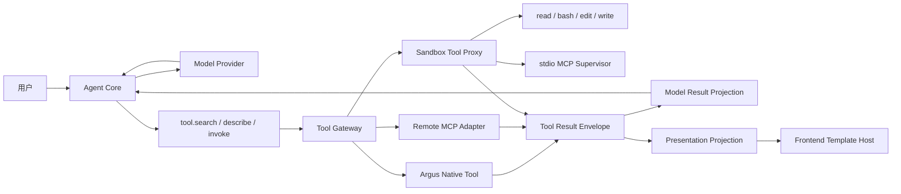

# PlanV5：小内核 Agent、分层 Tool Gateway 与 Tool 自带模板

## 目标

PlanV5 重构当前工作台 Agent、Tool 发现机制和 Card Skill。最终目标是让 Agent Harness 保持接近 Pi Agent 的小内核，只负责模型循环、七个稳定工具的调度以及上下文压缩；业务工具、MCP 传输、OpenSandbox 执行和界面渲染分别由独立边界承担。

最终模型可见工具固定为两组：

```text
始终存在
├── tool.search
├── tool.describe
└── tool.invoke

OpenSandbox 可用时存在
├── read
├── bash
├── edit
└── write
```

`host`、`k8s`、`metric`、`trace`、`log`、`connector` 等业务工具不再完整注入模型 Tool Schema。模型先按分类检索，再按 `category + tool_name` 获取详情，最后通过统一调用工具执行。Tool 调用产生的模型安全投影按发生顺序追加到上下文，完整结果和界面投影保存在服务端并通过会话事件投影给前端。

每个 Tool 自己保存并发布展示模板。平台不再维护模板组件库、Card Skill、Card Catalog、Card 列表、Card Slot、Card Binding、`card.render` 或用户在会话中创建卡片的功能。Agent 不读取、选择或生成渲染模板。

后续通用 Skill 作为显式激活、版本化的上下文包接入，不向 Agent 一次性注册额外工具。Skill 只能指导模型使用同一组 `tool.search/describe/invoke`，不能携带渲染模板、直接执行代码或绕过 Tool Gateway。

## 最终运行链路



## 文档

| 文件                                                                               | 内容                                                                                       |
| ---------------------------------------------------------------------------------- | ------------------------------------------------------------------------------------------ |
| [01-agent-tool-template-architecture.md](./01-agent-tool-template-architecture.md) | 总体架构、协议、上下文、Tool Manifest、Template Host、安全边界、OpenSandbox 和迁移删除范围 |
| [task-01-agent-core-and-context.md](./task-01-agent-core-and-context.md)           | Agent Loop、原生 Tool 消息、跨 Run 上下文和 Compaction 重构                                |
| [task-02-tool-discovery-and-gateway.md](./task-02-tool-discovery-and-gateway.md)   | 三个元工具、分类目录、统一 Tool Gateway、权限和结果投影                                    |
| [task-03-tool-owned-template-runtime.md](./task-03-tool-owned-template-runtime.md) | Tool 自带模板、Template Host、SSE 投影、动作桥接和首批工具迁移                             |
| [task-04-opensandbox-and-mcp.md](./task-04-opensandbox-and-mcp.md)                 | 可选 OpenSandbox、四个基础工具、Sandbox Tool Proxy、stdio MCP 和远程 MCP 边界              |
| [task-05-card-removal-and-cleanup.md](./task-05-card-removal-and-cleanup.md)       | 删除 Card Skill、Card 领域、前后端入口、契约、数据库对象和旧运行路径                       |
| [task-06-e2e-and-documentation.md](./task-06-e2e-and-documentation.md)             | 单元、契约、浏览器、临时 Kubernetes Namespace E2E、故障降级和主文档收口                    |

## 架构边界变化

PlanV5 明确替换以下既有架构：

1. 删除把完整 Tool Catalog 注入模型后再按英文关键词筛选最多八个 Tool 的路径。
2. 删除 Card Skill、`card.render`、Render Plan、Card Selection、Card Catalog、Card Version、Card Instance、Card Presentation、Data/Query/Action Slot 与 Binding。
3. 删除企业用户在会话中创建 Card Skill、自定义卡片列表和内置卡片列表的产品功能。
4. Tool 从“只返回业务数据、由平台卡片系统选择展示方式”调整为“返回模型投影，并可附带由 Tool 自己拥有的界面投影”。
5. OpenSandbox 从完整安装的硬依赖调整为 Agent 的可选能力；未配置或不可用时只排除依赖它的工具，Agent 和其余 Tool 继续运行。
6. stdio MCP 只能作为 OpenSandbox 内的受控子进程运行；禁止在 `argus-worker` 或宿主文件系统直接启动。
7. 远程 MCP 通过服务端 Tool Gateway 使用 Streamable HTTP 调用；旧 HTTP+SSE 仅作为后续兼容适配，不成为业务分类。
8. `category` 与 `executor` 正交：分类决定发现范围，执行器决定 Native、远程 MCP 或 Sandbox stdio 调用路径。

这会改变 `docs/00`、`01`、`04`、`05`、`06`、`08`、`10`、`12`、`13`、`15`、`16` 及 M4/M5 计划中已经确定的 Agent、Card 和 OpenSandbox 边界。Task 06 必须同步更新这些主文档，不能让 PlanV5 与旧基线长期并存。

## 核心不变量

1. Agent Core 不理解具体业务 Tool、MCP 传输或模板内容。
2. 模型始终只看到三个元工具，以及能力快照允许时的四个 Sandbox 基础工具。
3. `tool.search` 和 `tool.describe` 必须显式提供分类；`tool.invoke` 必须同时提供分类、名称和参数。
4. Tool Template 源码永不进入模型上下文、Compaction 摘要或可被模型重新解释的正文。
5. Tool Result 的模型投影和界面投影使用同一个 `tool_call_id`，但按受众分别传递和持久化。
6. 前端只有一个通用 Template Host；业务模板由 Tool 持有，不存在独立模板注册、选择、编辑或绑定系统。
7. 模板运行在隔离 iframe/Origin 中，默认无网络、无宿主 DOM、无 Cookie、无任意 Tool 调用能力。
8. PendingAction、Approval、Execution、幂等、审计和私有 Commit Token 仍由后端状态机负责，模板只能使用公开且不可伪造的 `action_ref`。
9. OpenSandbox 不可用时禁止回退到 Worker 宿主 shell 或文件系统。
10. stdio MCP 的命令、镜像、参数和 Secret 由平台配置；模型和 Tool 参数不能指定任意可执行文件。
11. Conversation Event 保持只追加；Compaction 只改变模型投影，不删除权威历史。
12. PostgreSQL 保存 ToolCall、完整结果引用、能力快照和动作状态；Redis 与 Sandbox 本地状态都不能成为唯一事实来源。
13. Skill 是按需激活的上下文扩展，不是新的 Tool Registry、执行器或模板系统；可执行能力仍必须注册成 Tool。

## 实施顺序

1. 先完成 Task 01，修正 Agent Loop 和上下文边界，使后续 Tool 调用使用原生 ToolCall/ToolResult 语义。
2. 完成 Task 02，建立三个元工具和统一 Tool Gateway，并迁移现有业务 Tool Manifest。
3. 完成 Task 03，让查询和 Preview Tool 返回 Tool 自带模板，前端使用统一 Template Host 渲染。
4. 完成 Task 04，扩展 OpenSandbox 执行能力，按能力快照提供四个基础工具和 stdio MCP。
5. 确认所有正式会话路径不再依赖 Card 领域后执行 Task 05 的直接删除，不保留兼容 API 或双渲染路径。
6. Task 06 运行完整 E2E、故障注入和文档收口，关闭旧 Card/OpenSandbox 强依赖描述。

## 计划状态

截至 2026-08-31，本目录是已讨论确认的目标架构和实施计划，尚未代表代码已完成。项目仍处于开发阶段，实施可以直接删除旧 Card 数据结构、接口和前端入口，不要求兼容历史 Card 数据；但必须保留 PendingAction、Approval、Execution、审计和授权安全边界。
